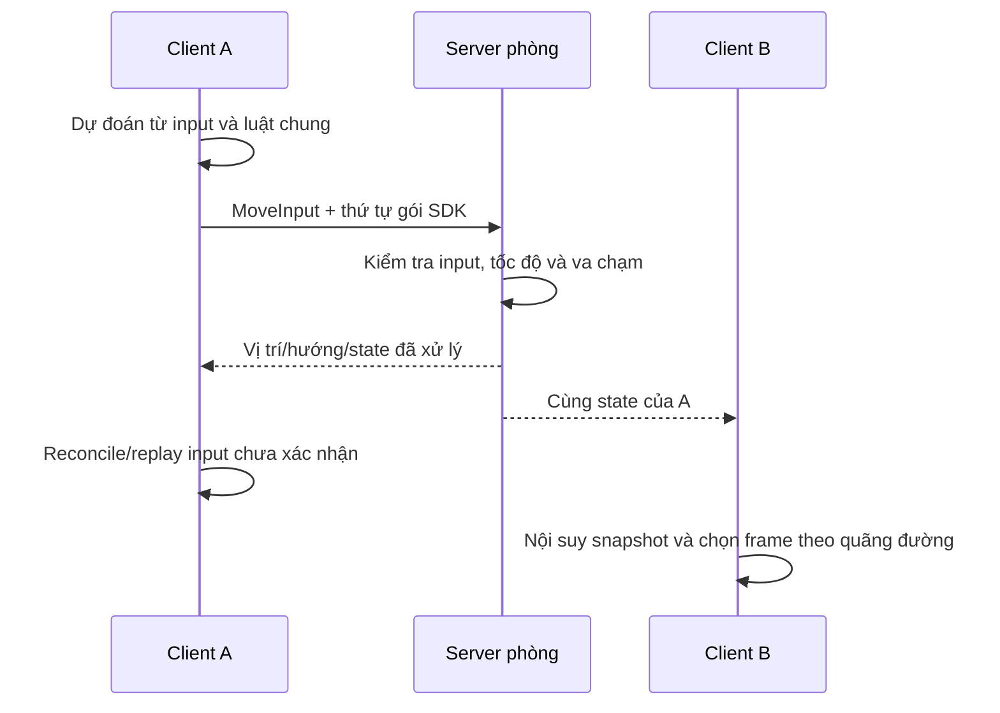

# Backend tối thiểu — sân môn phái online

**Phiên bản:** 0.2, ngày 07/10/2026.  
**Quyết định:** người phát triển đồng ý preview trước, nối backend tối thiểu sớm; dùng **TypeScript + Node.js + Colyseus**. Cơ sở dữ liệu và đăng nhập sẽ được chọn ở mốc tiến trình lâu dài.  
**Trạng thái:** bản thử có đồng bộ di chuyển, hai mẫu đệ tử, vào/rời phòng và kết nối lại.  
**Hướng dẫn:** [PREVIEW-RUNBOOK.md](PREVIEW-RUNBOOK.md); nguồn [server](../server/src/).

## 1. Phạm vi bàn giao

Hai client web vào cùng phòng `sect_courtyard` có thể nhìn thấy nhau đi lại trên nền sân có sẵn. Tạo hình người chơi dùng avatar đệ tử, không đóng vai Vương Lâm. Ba NPC trọng tâm chỉ được chọn trong preview ART; tạo hình sớm không thay điều kiện xuất hiện theo truyện.

Phiên tạm có tên, mẫu hình, vị trí, hướng, trạng thái đi/dừng và nhãn kết nối. State phòng nằm trong bộ nhớ; dừng server làm mất state. Bản thử chưa có tài khoản bền vững, tài nguyên, nhiệm vụ, tu luyện, chiến đấu, vật phẩm hoặc lưu tiến trình.

Map và trụ fixture giúp kiểm tra nền móng kỹ thuật; chưa là bố cục môn phái gameplay được duyệt. Đụng vật cản của map được xử lý; người chơi chưa chặn nhau. Camera, FPS animation và zoom là hiển thị tại client.

## 2. Luồng di chuyển

Server là nơi thay đổi state phòng; client gửi yêu cầu, nhận thay đổi và dựng hình. Đây là cách sử dụng state synchronization của [Colyseus](https://docs.colyseus.io/state).

## 3. Hợp đồng bản thử

| Mục | Luật đã triển khai |
| --- | --- |
| Join | Tên tối đa 24 ký tự sau chuẩn hóa; loại ký tự điều khiển và < > &; chỉ dùng hai ID avatar được phép |
| Input | Schema MoveInput gồm moveX/moveY; SDK gửi trên WebSocket reliable; không gửi vị trí/tốc độ. Axis không hữu hạn hoặc ngoài [-1,1] được đổi cả hai về 0 tại server |
| Thứ tự | SDK quản lý input và ack; server tiêu thụ từng input theo thứ tự. JSON input cũ không còn được dùng để di chuyển |
| Tính vị trí | Mỗi tick xử lý tối đa một input; tốc độ server 80 px/s, chuẩn hóa đường chéo, dùng collider đất bán kính 8 px |
| Va chạm | Biên sân và các rect fixture trong shared/world.ts; chia bước không quá 4 px để tránh xuyên vật cản |
| Nhịp | Fixed tick/input 30 Hz; patch 50 ms; client dùng đúng bước thời gian server cung cấp |
| Input vắng mặt | Hết input trong hàng đợi thì dừng đi; một tick chỉ áp dụng một input, không cộng tốc độ theo số gói gửi |
| Giới hạn thử | 20 client/phòng, tối đa 90 message/s/client, payload WebSocket tối đa 8 KiB, buffer 64 input/client |
| Hiển thị người điều khiển | Client prediction, server reconcile/replay bằng cùng applyMovement; sửa lệch hiển thị trong 35 ms |
| Hiển thị người khác | Nội suy giữa snapshot với buffer 100 ms; dùng distance hiển thị cho pha chân |
| Drop | Dừng nhân vật, đặt connected=false và giữ chỗ 15 giây |
| Reconnect | SDK thử lại cùng phiên; server giữ vị trí/hướng và xóa thao tác đang giữ |
| Leave | Rời chủ động hoặc hết thời gian reconnect xóa nhân vật khỏi phòng |
| State | `players` theo session ID; name/avatarId/x/y/direction/moving/connected/ack và tick phòng |

Các giới hạn là cấu hình bản thử, chưa phải năng lực được đo. Khi phòng đầy, `joinOrCreate` có thể tạo phòng khác; chưa có một thế giới liền mạch hoặc phân vùng server sản xuất. `ack` ghi số input đã tiêu thụ; reconciler dùng ack gốc của SDK. Prediction dùng [Colyseus Predict/reconciler](https://docs.colyseus.io/netcode/client-prediction), không thay quyền quyết định state của server.

## 4. Tiến trình sau bản thử

1. Duyệt cảm giác chuyển động, tỷ lệ pixel/map và bộ animation bằng preview chung.
2. Đặc tả tài khoản/phiên, hồ sơ đệ tử và cơ sở dữ liệu; xác định cách khôi phục sau reload/server restart.
3. Biên tập tuyến P tách E của Vương Lâm, rồi triển khai vòng tài nguyên/tu luyện trên server.
4. Bổ sung nhiệm vụ/chiến đấu theo phạm vi A → B đã cập nhật; đo tải trước khi quyết định phân vùng hoặc tối ưu sâu.

Ngôn ngữ C++ không là yêu cầu của bản thử. Nếu phép đo sau này xác định phần tính toán nặng, có thể tối ưu phần đó hoặc tách dịch vụ. Nền tảng tài khoản/lưu/time/command của game đầy đủ vẫn cần [hợp đồng online](ONLINE-DIRECTION.md); state phòng trong bộ nhớ không thay lưu tiến trình.
