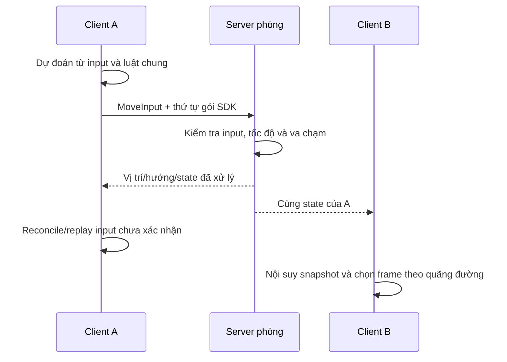

# Backend tối thiểu — sân môn phái online

**Phiên bản tài liệu:** 0.3, ngày 08/10/2026 · **Runtime:** 0.12.0.\
**Quyết định:** dùng **TypeScript + Node.js + Colyseus**. Bước hồ sơ hiện dùng SQLite local; đăng nhập/DB sản xuất còn cần đặc tả.\
**Trạng thái:** room Hằng Nhạc có nền/9 blocker owner, hồ sơ khách riêng bộ ba, lưu/khôi phục và R01 luyện thử. Phòng fixture giữ kiểm hồi quy RAM.\
**Hướng dẫn:** [PREVIEW-RUNBOOK.md](PREVIEW-RUNBOOK.md); nguồn [server](../server/src/).

## 1. Phạm vi bàn giao

Client [Hằng Nhạc](HANG-NHAC-RUNTIME.md) vào room `hang_nhac`, điều khiển Vương Lâm/Tư Đồ Nam/Lý Mộ Uyển từ hồ sơ khách riêng. Room `sect_courtyard` vẫn nhận hai avatar đệ tử để kiểm fixture cũ. [Hợp đồng hồ sơ/R01](HANG-NHAC-R01-RUNTIME.md) ghi luồng lưu, token, lease và baseline thuật của GDD 0.28.

State phòng gồm người, cast, projectile và mục tiêu luyện, nằm trong RAM; SQLite lưu riêng vị trí/hướng/map/HP/MP/quyền R01/cooldown/counter và tiến trình HN01–HN02/thổ nạp/vật tư của hồ sơ Hằng Nhạc. [Bước mở đầu môn phái](HANG-NHAC-SECT-RUNTIME.md) dùng lệnh `sect:command`, state riêng `sect:state`, ledger transaction và schema 2 tương thích save cũ. Restart đọc bản lưu, không tiếp tục cast/projectile hoặc tính thời gian vắng mặt. Chưa có đăng nhập sản xuất, HN03–HN12, combat farm hoặc pháp khí. Fixture không token vẫn là phiên tạm và không nhận tiến trình nhiệm vụ.

Room Hằng Nhạc dùng release owner; Editor/client/server gọi cùng phép kiểm polygon trong `shared/navigation.ts`, prediction/server dùng `applyR01Movement` để thêm khóa cast/đường Phong vào bước đi. Nền 3072 × 2048, 9 blocker và Spawn (1616,992) giữ nguyên. Map/trụ fixture cũ vẫn dùng `shared/world.ts`. Người chơi chưa chặn nhau; nhà/mái còn baked. ART cũ đã [xóa](MAP-ASSETS-RESET.md).

## 2. Luồng di chuyển

Server là nơi thay đổi state phòng; client gửi yêu cầu, nhận thay đổi và dựng hình. Đây là cách sử dụng state synchronization của [Colyseus](https://docs.colyseus.io/state).

## 3. Hợp đồng bản thử

| Mục | Luật đã triển khai |
| --- | --- |
| Join | Tên tối đa 24 ký tự sau chuẩn hóa; loại ký tự điều khiển và < > &. Hằng Nhạc nhận ba ID chibi và yêu cầu đúng mapVersion; phòng fixture nhận hai avatar đệ tử |
| Input | Schema MoveInput gồm moveX/moveY; SDK gửi trên WebSocket reliable; không gửi vị trí/tốc độ. Axis không hữu hạn hoặc ngoài [-1,1] được đổi cả hai về 0 tại server |
| Thứ tự | SDK quản lý input và ack; server tiêu thụ từng input theo thứ tự. JSON input cũ không còn được dùng để di chuyển |
| Tính vị trí | Mỗi tick xử lý tối đa một input; tốc độ server 80 px/s, chuẩn hóa đường chéo, dùng collider đất bán kính 8 px |
| Va chạm | Hằng Nhạc: biên world/9 polygon owner từ cùng release. Fixture: rect trong shared/world.ts. Chia bước không quá 4 px để tránh xuyên vật cản |
| Nhịp | Fixed tick/input 30 Hz; patch 50 ms; client dùng đúng bước thời gian server cung cấp |
| Input vắng mặt | Hết input trong hàng đợi thì dừng đi; một tick chỉ áp dụng một input, không cộng tốc độ theo số gói gửi |
| Giới hạn thử | 20 client/phòng, tối đa 90 message/s/client, payload WebSocket tối đa 8 KiB, buffer 64 input/client |
| Hiển thị người điều khiển | Client prediction, server reconcile/replay bằng cùng bước di chuyển của room; sửa lệch hiển thị trong 35 ms |
| Hiển thị người khác | Nội suy giữa snapshot với buffer 100 ms; dùng distance hiển thị cho pha chân |
| Drop | Dừng nhân vật, hủy cast đang thi triển, lưu hồ sơ Hằng Nhạc, đặt connected=false và giữ chỗ 15 giây |
| Reconnect | SDK thử lại cùng phiên; server giữ vị trí/hướng và xóa thao tác đang giữ |
| Leave | Lưu hồ sơ, giải phóng lease, xóa entity/target/projectile cá nhân; fixture chỉ xóa entity |
| State | `players` theo session ID, profile ID/resources/cooldown/cast/ack; `targets`, `projectiles`, tick/serverTime và mapId/mapVersion |

`POST /api/profile-session` tạo hoặc đọc tài khoản khách bằng Bearer token; `GET /api/profiles` đọc ba hồ sơ của chính token. API chỉ cho Origin localhost; không nhận profile JSON do trình duyệt ghi. WebSocket kiểm token/avatar/lease; client gửi `skill:cast`, `training:start`, `profile:save`, server phát `skill:result/event`, `training:result`, `profile:saved`. Chi phí/lệnh accepted commit nguyên tử; chi tiết [bước 2](HANG-NHAC-R01-RUNTIME.md). Token-free join chỉ giữ fixture kiểm di chuyển, không tạo save.

Các giới hạn là cấu hình bản thử, chưa phải năng lực được đo. Khi phòng đầy, `joinOrCreate` có thể tạo phòng khác; chưa có một thế giới liền mạch hoặc phân vùng server sản xuất. `ack` ghi số input đã tiêu thụ; reconciler dùng ack gốc của SDK. Prediction dùng [Colyseus Predict/reconciler](https://docs.colyseus.io/netcode/client-prediction), không thay quyền quyết định state của server.

## 4. Tiến trình sau bản thử

1. Nền Hằng Nhạc/collider dùng chung đã tích hợp và kiểm online. Giữ cỡ 1× và quyền bố trí navigation của chủ dự án; làm part che khi luồng di chuyển cần.
2. Triển khai chuyển map farm/phiên khảo nghiệm khi có map đích và điều kiện; hiện chưa có portal.
3. Hồ sơ khách/lưu/R01 đã có. Đặc tả đăng nhập sản xuất, nhiều server, slot/phần dùng chung còn mở.
4. Tiếp tục tương tác NPC/hướng dẫn/HN01–HN12, tu luyện/hồi phục và khảo nghiệm theo GDD. Không kế thừa tuyến đệ tử P hoặc mốc kết thúc tầng 1 cũ.
5. Đo tải/crowd và khả năng vận hành trước khi quyết định phân vùng server hoặc tối ưu sâu. Giới hạn 20 client/phòng thử không là kết quả đo công suất MMO.

Ngôn ngữ C++ không là yêu cầu của bản thử. Nền tảng tài khoản/lưu/time/command đầy đủ vẫn cần [hợp đồng online](ONLINE-DIRECTION.md); SQLite khách một tiến trình chưa chứng minh vận hành MMO.
