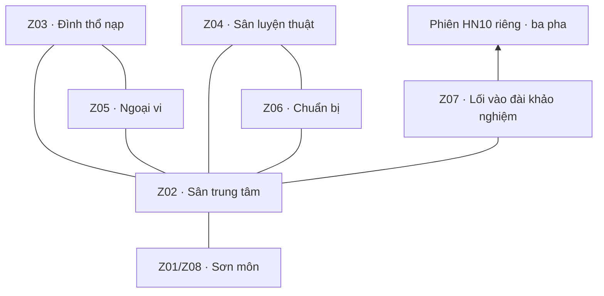

# Hằng Nhạc — map và bố cục v0.1

**Ngày:** 08/10/2026 · **Trạng thái:** đề xuất bố cục HN-Z01–Z08 giữ làm tham chiếu, chưa là kế hoạch map mới hoặc map vận hành. ART Hằng Nhạc v1/v2/v3 và hai bản thử vùng đi đã [xóa](MAP-ASSETS-RESET.md); chờ chỉ dẫn mới của chủ dự án.

**Tham chiếu:** [GDD](GDD.md), [trải nghiệm nhập môn](HANG-NHAC-NGUNG-KHI-SPEC.md), [gameplay R01](NGUNG-KHI-GAMEPLAY-SPEC.md), [khảo nghiệm](HANG-NHAC-ENCOUNTERS-TRIAL.md), [tọa độ nguồn](design/world/hang-nhac-layout-v1/layout.json).

**Quyết định hiện hành sau đề xuất này, 08/10/2026:** chủ dự án chọn concept mới làm khu môn phái, nối map ngoại vi farm riêng và phiên khảo nghiệm riêng. Các nhánh/tọa độ Z05 bên dưới chỉ mô tả đề xuất cũ, không là kế hoạch đặt tuyến farm vào scene môn phái. Concept giữ tỷ lệ vật thể/nhân vật đã chọn ở nền 2×; không khóa kích thước world theo bảng v0.1.

## 1. Mục tiêu lần thiết kế này

Mục tiêu của đề xuất v0.1 là làm rõ cấu trúc không gian trước đặc tả vận hành: người chơi biết đi đâu, sân đủ chỗ nhìn skill, có vòng quay về chuẩn bị và nhận ra điểm kết thúc nhập môn. Sau yêu cầu xóa ART và hai bản thử vùng đi, đề xuất này chỉ giữ để tham chiếu khi chủ dự án đưa kế hoạch map mới.

Tám mã chức năng HN-Z01–Z08 được giữ. Z01 và Z08 dùng cùng sơn môn, tạo bảy địa điểm vật lý. Hằng Nhạc chung là chuyển thể cho ba nhân vật; các vị trí/kiến trúc mới không được giới thiệu là địa lý nguyên tác đã xác minh.

Không thay runtime, camera đang chạy, ART nhân vật hoặc gói VFX đã bàn giao. JSON bên cạnh là nguồn thiết kế để giữ sơ đồ và bảng tọa độ nhất quán; không là schema máy chủ hoặc dữ liệu map đã tích hợp.

Đề xuất này được tạo sau reset thư viện legacy, từng thay vai trò định hướng của vùng nhập môn 3840 × 2560/Q01–Q10 và các kế hoạch MP01–MP07/MAP03 cũ. Sau đợt xóa ART Hằng Nhạc, các vị trí tương tác, polygon/footprint và điều kiện nhiệm vụ ở đây vẫn chưa được duyệt để vận hành; không dùng để tự dựng lại map.

## 2. Bố cục được đề xuất

Sân trung tâm là nơi trở về. Trục nam–bắc nối sơn môn, sân và đài khảo nghiệm. Nhánh tây dành cho thổ nạp/ngoại vi; nhánh đông dành cho luyện thuật/chuẩn bị. Hai vòng ngắn giúp đi từ hoạt động này sang hoạt động kế tiếp mà không phải luôn quay về giữa sân.

Sơ đồ trên mô tả kết nối; hướng và khoảng cách nằm trong nguồn tọa độ. Trục qua chính điện có hành lang mở; chính điện dùng hai khối bên đường, không đặt một collider mái/nhà chắn kín lối đi bắc.

## 3. Khung và tỷ lệ thử

| Thành phần | Đề xuất để xem bố cục | Ý nghĩa |
| --- | --- | --- |
| Mặt đất khu chung | 2400 × 1800 world px | Phạm vi blockout thử, chưa khóa diện tích map |
| Khung kiểm tra | 960 × 640 world px | Kiểm tra tỷ lệ và lượng thông tin trên màn hình; không phải toàn map |
| Nhân vật | Body cao tối đa 80 world px | Giữ hợp đồng VFX hiện hành; không đồng nhất chiều cao body với ô frame |
| Đường sơn môn–sân | Rộng 220 world px | Đường đón người chơi, NPC đứng ở mép |
| Trục sân–khảo nghiệm | Rộng 200 world px | Nhận diện điểm đến; không combat trên bậc thang |
| Nhánh thường | Rộng 160–200 world px | Có khoảng tránh người/đạo cụ; chưa chốt sức chứa crowd |
| Đường vòng | Rộng 140 world px | Đi lại an toàn, không đặt bài né bắt buộc ở đây |

Mọi tọa độ là mặt đất, x sang phải, y xuống dưới. Độ cao sườn núi/bậc thang do ART biểu đạt; sơ đồ không thêm cơ chế nhảy, bay, rơi vực hoặc tầng va chạm 3D. Việc camera bám người và clamp mép map chỉ được thử bằng khung xem trong sơ đồ, chưa quyết định runtime.

Runtime/editor hiện giữ frame 64 × 96, chân (32,88), collider chân 8 px và tốc độ thử 80 px/s. VFX R01 dùng canvas 96 × 96/body 80/chân (48,88); các giá trị body trong đề xuất này là thước tham chiếu, chưa thay hợp đồng runtime hoặc khóa thông số map mới.

## 4. Bảy địa điểm, tám chức năng

| Mã | Khu | Khung mặt đất x/y/w/h | Neo tương tác x/y | Nhiệm vụ | Tổ chức không gian |
| --- | --- | --- | --- | --- | --- |
| Z01 | Sơn môn, tiếp dẫn | 1000 / 1440 / 400 / 300 | 1200 / 1580 | HN01 | Lối vào chung, NPC đứng lệch trục |
| Z02 | Sân môn phái | 820 / 800 / 760 / 440 | 1200 / 1020 | HN01, HN11 | Giữ khoảng giữa thoáng; bảng việc/NPC ở rìa |
| Z03 | Đình thổ nạp | 160 / 520 / 540 / 440 | 430 / 760 | HN02, HN07 | Đình và thông phía sau, vị trí người ngồi ở nền trống |
| Z04 | Sân luyện thuật | 1740 / 660 / 540 / 480 | 1960 / 960 | HN03, HN04, HN07, HN09 | Điểm vào chung; bài bắt buộc tách phiên nhỏ |
| Z05 | Ngoại vi/hậu sơn | 160 / 1220 / 540 / 400 | 430 / 1410 | HN05, HN06 | Đường khám phá chung; encounter bắt buộc đề xuất phiên riêng |
| Z06 | Chuẩn bị/luyện hóa | 1740 / 1220 / 500 / 280 | 1980 / 1360 | HN06, HN08, HN09 | Gần sân luyện; bàn ở rìa, có chỗ đứng tương tác |
| Z07 | Lối vào khảo nghiệm | 960 / 100 / 480 / 280 | 1200 / 260 | HN10 | Lối vào và điểm chuẩn bị, không phải diện tích trận đấu |
| Z08 | Sơn môn, xuất hành | Cùng Z01 | Cùng Z01 | HN12 | Cổng theo tiến trình cá nhân, không mở toàn server |

Khung khu là diện tích quy hoạch, chưa phải collider hình chữ nhật toàn khu. Neo là điểm đứng/tương tác dự kiến, không là tâm vật cản. NPC, trigger và điểm hồi sinh sẽ được đặt cụ thể sau khi duyệt bố cục.

## 5. Tuyến trải nghiệm trên map

| Nhóm | Đường đi gợi ý | Mục đích |
| --- | --- | --- |
| HN01 | Sơn môn → sân | Làm quen, thấy người chơi, nhìn các hướng đi |
| HN02–04 | Sân → thổ nạp → sân luyện | Chuẩn bị, vận dụng ba skill vốn có; không khóa nút skill theo cửa khu |
| HN05–06 | Sân → ngoại vi → đoạn riêng | Trận đầu, thu vật tư và nhận diện nhân vật |
| HN07 | Thổ nạp ↔ sân luyện | Hiểu bình cảnh rồi kiểm chứng bằng hành động |
| HN08–09 | Chuẩn bị ↔ sân luyện | Luyện hóa, phối hợp và ổn định vận hành |
| HN10 | Sân → đài khảo nghiệm → phiên riêng | Tổng hợp ba pha đã đặc tả |
| HN11–12 | Trở về sân → sơn môn | Tổng kết rồi chủ động xuất hành |

Vòng tây nối ngoại vi về thổ nạp. Đường có từ đầu trong khu chung; sau HN05 chỉ làm nổi hướng quay về, không dựng/mở tường vật lý khác nhau cho từng tài khoản. Vòng đông nối chuẩn bị với sân luyện để thử vật phẩm thuận tiện.

Quyền vào bài học/khảo nghiệm được xét tại điểm tương tác theo tiến trình cá nhân. Người chưa tới nhiệm vụ vẫn nhìn thấy địa điểm; không tự chạy nhiệm vụ hoặc đột phá chỉ vì đi qua. Mục tiêu hiện tại chỉ đường tới một điểm rõ, không phủ đồng thời tất cả biểu tượng nhiệm vụ.

## 6. Combat và phiên riêng

Sân chung tập trung di chuyển, gặp người và tương tác. Các bài học cần đọc báo đòn dùng phiên nhỏ được gọi từ Z04. HN05 gọi trận cá nhân từ Z05 theo đề xuất encounter hiện hành; tuyến khám phá bên ngoài vẫn có thể là khu chung. Nội dung farm/tổ đội về sau không mặc định chuyển hết thành phiên riêng.

HN10 dùng khung riêng 960 × 640, vùng chân đi được x=120…840, y=140…540. Vị trí đầu player (280,400), đối thủ (620,320), không có vật cản trong vùng trận. Ba pha dùng lại cùng arena, dọn toàn bộ đòn cũ giữa pha và đổi đối thủ; không cần ba sân hoặc ba background.

Footprint Z07 chỉ là lối vào ở khu chung. Không nhét arena 960 × 640 vào hình 480 × 280, không thu nhân vật/skill để vừa hình quy hoạch đó.

Tại Z04, khung xem tỷ lệ minh họa chiều cao body 80, đường Kiếm Khí 360 và bước Phong 160 theo baseline đề xuất. Cự ly chọn Lôi 280 được giữ trong nguồn dữ liệu; không vẽ thêm vòng lớn che sân. Các nét này không giả lập cast, hitbox, miễn nhiễm hoặc damage. Hình body chỉ là thước đo, không phải sprite mới của Vương Lâm.

## 7. Ba đoạn cá nhân

- **Vương Lâm:** điểm quan sát dấu thuật ở rìa Z05, neo (550,1300). Mục tiêu là quan sát rồi thử vận dụng, không cấp thần thức/cấm chế cao cấp.
- **Tư Đồ Nam:** điểm ổn định linh thể cạnh đình Z03, neo (550,650). Lời dẫn là hồi phục khả năng hiện diện/thi triển, không học lại kiến thức sơ cấp.
- **Lý Mộ Uyển:** bàn nhận biết dược liệu tại Z06, neo (2110,1280). Chuẩn bị cho trận của chính mình; không yêu cầu người chơi khác để hoàn thành.

Ba nhánh dùng lại không gian và nền chiến đấu, chưa mở ba vùng nghề/cây skill khác nhau. Tên hoạt động và đạo cụ là chuyển thể cần biên tập trước ART.

## 8. Chỉ dẫn mỹ thuật tham chiếu

ART Hằng Nhạc v1/v2/v3, các nguồn/prompt/trang duyệt và hai bản thử vùng đi đã xóa theo yêu cầu mới nhất ngày 08/10/2026. [Biên bản](data/hang-nhac-art-removal-2026-10-08.json) lưu danh sách file đã dọn. Mốc chấp nhận mỹ thuật v3 trước đó là lịch sử của bộ đã xóa; không còn là nguồn sản xuất hiện hành.

Các gợi ý dưới đây thuộc đề xuất bố cục v0.1. Chờ kế hoạch và tham chiếu mới của chủ dự án trước khi tạo ART, tách lớp hoặc thiết kế vùng đi.

Điểm nhấn xa: chính điện hai bên trục, đài khảo nghiệm phía bắc, mây/vực ở ngoài vùng đi được. Điểm nhấn gần: đình và thông của Z03, giá kiếm của Z04, bàn dược liệu/luyện hóa của Z06, dấu cổng của Z01/Z08. Không dùng glow dày làm biển chỉ dẫn toàn map.

Nền di chuyển dùng khối màu lớn, texture vừa phải. Đường không bị nhập vào mái/đá trang trí. Đối chiếu ba nhân vật và VFX ở tỷ lệ thật trên nền trước khi hoàn thiện màu sắc. Mái/tán cây là lớp tiền cảnh riêng; khi che người phải có giải pháp nhìn thấy người, được thiết kế sau theo renderer thực tế.

Tách lớp source dự kiến: nền mặt đất; đạo cụ thấp; vật cao/tiền cảnh; vùng đi được; collider; điểm tương tác/spawn; trang trí ngoài biên. Không vẽ nhân vật, tên người chơi, UI hoặc VFX cố định vào nền.

Chưa khóa số ảnh nền, kích thước atlas, chunk streaming hoặc ngân sách crowd. Bảy địa điểm không yêu cầu bảy tranh riêng. Cách ghép khu chung và phiên luyện/khảo nghiệm sẽ được xét lại theo kế hoạch map mới; các ảnh sân Hằng Nhạc cũ đã xóa.

## 9. Kiểm tra trước khi duyệt map

1. Từ sơn môn nhận ra sân và trục chính; từ sân phân biệt được lối tây, đông và bắc.
2. Bảy địa điểm kết nối; điểm tương tác không nằm trong collider hoặc sau vật trang trí không thể đi tới.
3. Khoảng đi bộ quay lại không gây lặp đường dài; chỉ chốt thời gian sau khi thử với tốc độ/camera runtime thực tế.
4. Body và tín hiệu quan trọng không bị mái/cây/UI che ở khung 960 × 640 và màn hẹp.
5. Sân phiên có đường né bằng đi bộ kể cả khi Phong/hộ thân chưa hồi; kiểm tra mép arena với AI, không chỉ nhìn hình.
6. Ba nhân vật dùng cùng bộ R01 hoàn thành được tuyến; không bắt một nhánh vào không gian riêng của người khác.
7. Thấy người chơi khác ở sân nhưng bài luyện/khảo nghiệm cá nhân không bị skill của người ngoài tác động.
8. Người chưa hoàn thành vẫn thấy sơn môn; xuất hành chỉ được xác nhận theo hồ sơ đủ điều kiện.

Các kiểm tra hình học trong nguồn chỉ xác nhận khung/neo/kết nối sơ đồ; chưa là navmesh, kiểm tra va chạm runtime hoặc playtest crowd/combat.

**Đã kiểm tra bản xem ngày 08/10/2026:** lựa chọn đủ tám khu, bảy địa điểm/hai chức năng chung sơn môn, tám đường nối, chuyển giữa tổng thể/khung tỷ lệ/arena. Xem bằng trình duyệt ở màn 320, 736 và 1024 px không có lỗi script, tràn ngang hoặc chữ sơ đồ đè nhau trong chế độ tổng thể. Kiểm tra nguồn xác nhận neo trong khung khu, đường nối tới đúng neo và tất cả khu liên thông; các kết quả này không thay chơi thử trên map thật.

## 10. Điểm cần chốt tiếp

Chờ chủ dự án cung cấp kế hoạch map mới sau khi đã xóa ART v1/v2/v3 và hai walk study. Khi có kế hoạch, đối chiếu lại nhu cầu không gian, tham chiếu hình ảnh và hợp đồng tỷ lệ trước khi sản xuất. Không tiếp tục tách prop hoặc dựng vùng đi từ bộ đã xóa.

Các giá trị 2400 × 1800, chiều rộng đường và tọa độ trong đề xuất này giữ để tham chiếu, chưa khóa kế hoạch map mới hoặc thay quyết định runtime.
