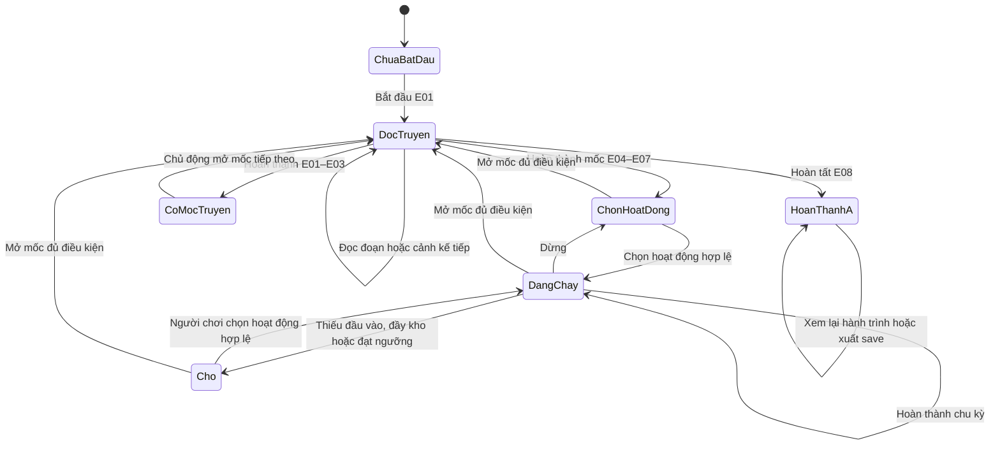

# Đặc tả hệ thống MVP A

> **Tham chiếu trước RPG-A:** đặc tả idle/tầng 1 bên dưới giữ lịch sử. Phạm vi hiện tại dùng [MVP mới](MVP-RPG-A.md), [nhiệm vụ](STARTER-STORY.md), [map](STARTER-REGION-MAP.md) và [dữ liệu](data/mvp-rpg-content.json); không lấy luật kết thúc/480 tu vi/save cục bộ dưới đây nghiệm thu bản MMORPG.

> **Tham chiếu v0.6, chờ điều chỉnh online.** Người phát triển đã chọn nhiều người chơi và đệ tử riêng. Quy tắc dành cho Vương Lâm, save cục bộ, nhập JSON và quyền ghi theo tab bên dưới chưa là đặc tả máy chủ hiện tại. [ONLINE-DIRECTION.md](ONLINE-DIRECTION.md) xác định điều chỉnh; [CHARACTERS.md](CHARACTERS.md) xác định vai và tạo hình. Phải tách tuyến đệ tử/chính truyện trước triển khai; bộ số liệu vẫn là giả thuyết cân bằng.

**Phiên bản:** 0.2, ngày 06/10/2026.  
**Trạng thái:** đặc tả thiết kế; chưa có bộ mô phỏng hoặc prototype.  
**Phạm vi:** E01–E08, phàm nhân → Ngưng Khí tầng 1, thuộc lộ trình A → B đã chọn.  
**Tham chiếu:** [GDD](GDD.md), [UX](UX-MVP-A.md), [catalog](data/mvp-content-catalog.json), [save minh họa](data/mvp-save-example.json).

Tài liệu này chi tiết hóa luật game đã đề xuất. Khi sửa luật, cập nhật cả GDD, catalog và trường hợp nghiệm thu tương ứng. Nguồn nguyên tác nằm trong GDD, kế hoạch map và asset; các quy tắc thời gian, số lượng và trạng thái dưới đây là thiết kế game.

## 1. Mục tiêu của bản A

Người chơi hiểu chuỗi nước → linh dịch → tu vi, nhận biết tác dụng hạt châu và chủ động hoàn thành lần đột phá đầu. Nội dung sử dụng 9 địa điểm, 10 cảnh, 3 gặp gỡ theo truyện và 4 hoạt động đã có trong catalog.

| Thành phần | Vai trò cần kiểm chứng | Kết quả quan sát được |
| --- | --- | --- |
| Truyện | Mở khả năng và giải thích trở ngại | Biết vì sao chưa có tu vi trước E06 |
| Tài nguyên | Tạo công đoạn chuẩn bị | Phân biệt nước thường và linh dịch |
| Hạt châu | Cho cách tu luyện hiệu quả hơn | Biết mộng cảnh vẫn cần nguồn linh khí bên ngoài |
| Lựa chọn hoạt động | Điều chỉnh mục tiêu ngắn hạn | Biết lúc cần tích trữ, luyện thường hoặc dùng tự động |
| Map | Gắn tiến trình với địa điểm | Xem một node không làm đổi hoạt động |
| Save/offline | Cho phép ngắt phiên chơi | Quay lại đúng tiến trình và biết lý do hoạt động dừng |

## 2. Trạng thái của một lượt chơi



Mốc đủ điều kiện là một thuộc tính của trạng thái, có thể cùng tồn tại với hoạt động đang chạy. Game hiện nút tiếp tục nhưng giữ hoạt động cho đến khi người chơi mở cảnh. Đọc lại lịch sử là chế độ xem; không đi qua các bước áp dụng mốc ở sơ đồ.

## 3. Hợp đồng của hoạt động

### 3.1. Chọn, chạy và dừng

| Thao tác/trạng thái | Hành vi thiết kế |
| --- | --- |
| Chọn hoạt động thủ công mới | Xử lý thời gian tới lúc bấm; hủy phần chu kỳ dở; tắt tự động; bắt đầu nếu hợp lệ |
| Bấm hoạt động đang chạy | Không khởi động lại và không hủy tiến độ |
| Dừng | Xử lý thời gian tới lúc bấm; hủy phần chu kỳ dở; giữ lựa chọn, chuyển sang dừng chủ động |
| Tiếp tục sau khi dừng | Kiểm tra điều kiện; bắt đầu chu kỳ mới từ 0 |
| Bật tự động | Yêu cầu E07; xử lý thời gian; hủy chu kỳ dở; chọn theo ưu tiên của GDD |
| Tắt tự động | Dừng; giữ tài nguyên; chờ chọn hoạt động thủ công |
| Thiếu tài nguyên/đầy kho | Chờ với tiến độ 0; giữ cấu hình hoạt động; thời gian chờ không tích thành chu kỳ |
| Mở map, hồ sơ, hành trang hoặc lịch sử | Giữ hoạt động và tiến độ |
| Mở mốc truyện mới | Dừng hoạt động, hủy chu kỳ dở; đọc truyện chủ động |
| Đọc xong mốc | Giữ trạng thái dừng; người chơi chọn hoạt động hoặc tự động để tiếp tục |

Mỗi lần xử lý lệnh phải mô phỏng thời gian trước rồi mới đổi trạng thái. Nếu một chu kỳ vừa đủ 10 giây đúng lúc bấm, nhận kết quả của chu kỳ đó trước khi đổi hoạt động hoặc mở truyện.

### 3.2. Kiểm tra một chu kỳ

1. Kiểm tra quyền chơi của tab, mốc mở hoạt động, trạng thái đọc truyện và kết thúc A.
2. Xác định nhánh tác dụng và địa điểm hợp lệ. Trong catalog, `conditionalOutputs` và `locationRules` chọn **nhánh đầu tiên thỏa điều kiện**, không cộng mọi nhánh.
3. Kiểm tra đủ đầu vào và chỗ chứa. Nước/linh dịch phải chứa được toàn bộ đầu ra; tu vi dùng quy tắc chặn ngưỡng.
4. Chạy đủ thời gian còn thiếu. Trước đó chưa trừ chi phí hay nhận kết quả.
5. Kiểm tra lại điều kiện rồi áp dụng chi phí, kết quả và bộ đếm trong cùng một thay đổi trạng thái.
6. Đặt tiến độ chu kỳ về 0; đánh giá mục tiêu, trạng thái chờ và chu kỳ tiếp theo.

Trước E06, `ACT-PRACTICE` chỉ tăng `breathingCycles` đến 3 và không sinh tu vi. Sau E06, chọn nhánh +1 tu vi; bộ đếm luyện thử giữ nguyên để phục vụ lịch sử và kiểm tra save.

### 3.3. Các lý do chờ

| Mã thiết kế | Điều kiện | Hướng xử lý trên giao diện |
| --- | --- | --- |
| `USER_STOPPED` | Người chơi dừng hoặc vừa đọc xong mốc | Chọn/tiếp tục hoạt động |
| `NEED_WATER` | Ủ nước với dưới 2 nước | Lấy nước; hiển thị lượng còn thiếu |
| `NEED_SPIRIT_WATER` | Mộng cảnh với 0 linh dịch | Chuẩn bị linh dịch hoặc bật tự động |
| `WATER_CAPACITY` | Không còn chỗ cho +2 nước | Chọn ủ nước |
| `SPIRIT_CAPACITY` | Linh dịch đã đạt 30 | Dùng cho mốc hoặc mộng cảnh đã mở |
| `PRACTICE_GATE` | Đủ 3 lần luyện thử, chưa E06 | Chuẩn bị 6 linh dịch để đọc mốc tiếp theo |
| `BREAKTHROUGH_READY` | E07 hoàn thành và tu vi 480 | Đột phá chủ động |
| `STORY_ACTIVE` | Đang đọc một mốc mới | Đọc tiếp; hoạt động giữ dừng |
| `CONTENT_COMPLETE` | E08 hoàn thành | Xem lại hoặc xuất save |
| `READ_ONLY_TAB` | Tab không có quyền ghi | Xem tiến trình hoặc chuyển quyền chơi |

Mã phục vụ đặc tả; người chơi thấy lời giải thích tiếng Việt. Hoạt động chưa mở có lý do khóa riêng, không được bắt đầu rồi mới báo chờ.

## 4. Điều kiện, chi phí và tác dụng của mốc

### 4.1. Bảng điều kiện

Mỗi mốc yêu cầu mốc trước hoàn thành. `minimumCounters` và `minimumResources` là điều kiện; `cost` là lượng trừ khi hoàn thành. Bộ đếm không bị trừ.

| Mốc | Cảnh theo thứ tự | Điều kiện thêm | Chi phí hoàn thành | Khả năng/tác dụng |
| --- | --- | --- | --- | --- |
| E01 | E01-VILLAGE | Không | Không | Giới thiệu gia đình và cơ hội tu tiên |
| E02 | E02-EXAM | Không | Không | Khảo nghiệm cố định; ghi ENC-003 |
| E03 | E03-TRAIL → E03-CAVE | Không | Không | Ghi ENC-001/002; nhận hạt châu, 5 đám mây |
| E04 | E04-DORM → E04-SPRING | Không | Không | Nhận bầu nước; mở lấy/ủ nước; áo xám, châu 7 đám mây |
| E05 | E05-GARDEN | `drawCycles ≥ 6`, `infuseCycles ≥ 3`, linh dịch ≥1 | 1 linh dịch | Nhận công pháp/túi; mở luyện thử; áo đỏ |
| E06 | E06-ROOM | `breathingCycles = 3`, linh dịch ≥6 | 6 linh dịch | Giữ được tu vi khi luyện thường; châu 9 đám mây |
| E07 | E07-DREAM | Linh dịch ≥6 | 6 linh dịch | Mở mộng cảnh/tự động; châu chuyển sang có dấu/chữ |
| E08 | E08-BREAKTHROUGH | Tu vi =480 | Không | Ngưng Khí tầng 1; kết thúc A |

Các chi phí là cách trừu tượng hóa của game. Văn bản truyện không mô tả chúng như giá mua cơ duyên hoặc lượng dùng chính xác trong nguyên tác.

### 4.2. Đọc cảnh và áp dụng mốc

1. Người chơi bấm nút mở mốc; xử lý thời gian tới lúc bấm rồi kiểm tra điều kiện.
2. Khi hợp lệ, dừng hoạt động và mở cảnh đầu. Việc mở cảnh chỉ ghi trạng thái đọc/tiết lộ địa điểm; **chưa trừ chi phí hoặc mở khả năng của mốc**.
3. `Tiếp tục` chuyển từng đoạn. Hoàn thành cảnh trung gian ghi cảnh/gặp gỡ tương ứng, rồi mở cảnh kế tiếp.
4. Đoạn cuối của cảnh cuối hiện nút hoàn thành cùng chi phí và khả năng nhận được. Kiểm tra lại điều kiện khi bấm.
5. Cùng một thay đổi trạng thái: trừ chi phí, ghi cảnh/gặp gỡ cuối, đánh dấu mốc hoàn thành và áp dụng tác dụng. Lưu trạng thái trước khi chạy hiệu ứng.
6. Xóa cảnh đang đọc; trở về khu vực Tu luyện hoặc màn kết thúc A. Hoạt động giữ dừng chủ động.

Tải lại ở giữa cảnh giữ đúng cảnh/đoạn; tải lại sau khi hoàn thành không áp dụng lại mốc. Nút hoàn thành đã xử lý trở thành thao tác xem; không trừ tài nguyên lần hai.

Trong lúc đọc mốc mới, hoạt động dừng cả online lẫn offline. Thu gọn cảnh để xem giao diện vẫn giữ trạng thái này và nút `Đọc tiếp`. Đọc lại cảnh đã hoàn thành không dừng hoạt động. Không có bỏ qua mốc chưa hoàn thành; các đoạn ngắn cho phép đọc theo nhịp riêng.

### 4.3. Quy tắc của ba gặp gỡ

Gặp gỡ hoàn thành khi người chơi kết thúc cảnh chứa nó. ENC-001 có thể đã hoàn thành trong khi E03-CAVE vẫn đang đọc. Chỉ E03 hoàn thành mới cấp hạt châu; không có phần thưởng riêng từ cảnh hổ hay lực hút.

ENC-003 kết thúc bằng diễn biến không vượt qua khảo nghiệm. ENC-001 là thoát hiểm, ENC-002 là nguy hiểm môi trường. Không thêm nút tấn công, HP, kết quả ngẫu nhiên hay loot cho các cảnh A.

### 4.4. Đột phá và kết thúc

`Đột phá` mở E08-BREAKTHROUGH khi đủ điều kiện. Nút cuối `Hoàn tất đột phá` áp dụng E08 một lần, đổi cảnh giới rồi hiện kết quả. Nếu đóng trang trước nút cuối, nhân vật vẫn là phàm nhân và khôi phục cảnh đang đọc.

Sau E08: giữ 480 tu vi để xem kết quả bản A, dừng mọi hoạt động, giữ tài nguyên còn lại và cho xem lại nội dung/địa điểm đã biết. Tiến trình tầng tiếp theo sẽ được thiết kế trong B.

## 5. Địa điểm, hồ sơ và vật phẩm

| Dữ liệu | Mốc tiết lộ/nhận | Luật sử dụng |
| --- | --- | --- |
| Địa điểm | Khi mở `revealSceneId` lần đầu | Ghi vào tập địa điểm đã biết; hoạt động vẫn cần mốc hoàn thành |
| Hồ sơ nhân vật | Khi mở cảnh giới thiệu trong `characterEntries` | Chỉ hiện kiến thức tại giai đoạn A; chân dung P2 dùng thẻ tên khi chưa có hình |
| Hạt châu | E03 hoàn thành | Độc nhất; hình dạng suy ra từ mốc hoàn thành |
| Bầu nước | E04 hoàn thành | Đạo cụ truyện/UI; không cộng sức chứa hay tạo thêm tiền tệ |
| Công pháp nhập môn | E05 hoàn thành | Giải thích hoạt động luyện thử/thường; không có cấp nâng sách ở A |
| Túi trữ vật | E05 hoàn thành | Vật phẩm truyện; sức chứa ba tài nguyên giữ theo cấu hình |

Quy tắc vật phẩm là thiết kế tương tác của A; bản biên tập vẫn phải chuẩn hóa cách nhận và tên theo nguồn truyện đã chọn. Mỗi vật phẩm có một bản; không bán, vứt, trang bị lại hoặc nhận thêm qua xem lịch sử.

`viewedLocationId` thuộc chế độ xem. `activityLocationId` suy ra từ hoạt động và mốc. `currentStorySceneId` thuộc tiến trình đọc. Ba giá trị có thể khác nhau.

Map lịch sử giữ tên và cảnh đã hoàn thành. MAP-005 hết hoạt động sau E05; MAP-007 hết hoạt động sau E06; MAP-006/008/009 dừng sau E08. Các điều kiện `untilEvent` có nghĩa là mốc đó **đã hoàn thành**, không phải vừa bắt đầu đọc.

Hạt châu dùng hình 5 → 7 → 9 đám mây theo E03/E04/E06. Lớp 10 đám mây chỉ là chuyển tiếp trong E07; trạng thái sau E07 là có dấu/chữ và không còn mây. Xem lại E07 dùng lớp minh họa của cảnh, không ghi đè hình dạng hiện tại của vật phẩm.

## 6. Nhịp tài nguyên và ước tính thời gian

Các ước tính không cộng thời gian đọc truyện, chọn hoạt động hoặc chờ chủ động.

| Đoạn | Khối lượng tối thiểu từ trạng thái đã nêu | Thời gian chạy hoạt động |
| --- | --- | --- |
| Sau E04 đến hoàn thành E05, khởi đầu kho trống | 6 lấy nước + 3 ủ nước; trả 1 linh dịch, còn 6 nước/2 linh dịch | 90 giây |
| Từ đó đến E06 | 3 luyện thử + 1 lấy nước + 4 ủ nước; trả 6 linh dịch, kho về 0 | 80 giây |
| Từ đó đến E07 | 6 lấy nước + 6 ủ nước; trả 6 linh dịch, kho về 0 | 120 giây |
| Sau E07 từ kho trống đến đủ đột phá, dùng tự động | 48 lấy nước + 48 ủ nước + 48 mộng cảnh | 1.440 giây / 24 phút |

Như vậy, đường tài nguyên tối thiểu đến đủ đột phá là **28 phút 50 giây**. Giả thuyết 30–45 phút của GDD dành thêm thời gian đọc và thao tác; chưa có dữ liệu chơi thử để xác nhận.

### 6.1. Ước tính tự động sau E07

Với `C` là tu vi, `S` là linh dịch, `W` là nước hiện có:

```text
dreamCycles = ceil((480 - C) / 10)
infuseCycles = max(0, dreamCycles - S)
drawCycles = ceil(max(0, 2 * infuseCycles - W) / 2)
remainingSeconds = 10 * (dreamCycles + infuseCycles + drawCycles)
```

Nếu chu kỳ tự động hiện tại đang chạy hợp lệ, trừ phần tiến độ của chu kỳ đó. Đạt 480 thì thời gian còn lại bằng 0. Chỉ dùng công thức khi không có cảnh mới đang đọc, A chưa kết thúc và tự động đang chạy; các giới hạn của bản A đã được tính trong số chu kỳ này.

Ở chế độ thủ công, hiển thị thời gian/sản lượng của hoạt động hiện tại. Nếu linh dịch không đủ để đạt 480 bằng mộng cảnh, ghi số chu kỳ hiện có thể chạy rồi hướng dẫn chuẩn bị thêm; không hiện thời gian đột phá như thể tài nguyên vô hạn.

## 7. Dữ liệu lưu và quy tắc phục hồi

### 7.1. Hợp đồng save đề xuất

File [save minh họa](data/mvp-save-example.json) là snapshot hợp lệ về mặt thiết kế sau E07, trước khi bật tự động; không phải save được sinh bởi game đã chạy.

| Trường | Giá trị/ý nghĩa |
| --- | --- |
| `schemaVersion` | `mvp-a-save-1`; khác schema của catalog nội dung |
| `contentVersion` | Phiên bản nội dung hỗ trợ; ví dụ `mvp-a-0.4` |
| `runId`, `revision` | Định danh lượt chơi và số lần ghi; phục vụ bản sao và phát hiện ghi cũ |
| `lastProcessedAt` | Mốc thời gian UTC bằng mili giây; cập nhật cả khi đang dừng/đọc truyện |
| `realmId`, `realmLayer` | Phàm nhân/0 trước E08; Ngưng Khí/1 sau E08 |
| `resources` | Ba số nguyên trong giới hạn kho và tu vi |
| `counters` | Bộ đếm lấy/ủ không âm; luyện thử từ 0 đến 3 |
| `activity` | Chế độ, lựa chọn thủ công, hoạt động của chu kỳ, tiến độ và dừng chủ động |
| `story` | Mốc hoàn thành, cảnh đã mở/hoàn thành, mốc/cảnh đang đọc và chỉ số đoạn |
| `knownLocationIds`, `viewedLocationId` | Những node đã biết và node đang xem; node đang xem có thể để trống |
| `completedEncounterIds` | Gặp gỡ của cảnh đã hoàn thành; không tự cấp tác dụng |
| `settings` | Cỡ chữ, âm thanh nếu có và giảm chuyển động |

Hạt châu, trang phục, trạng thái giữ được tu vi, khả năng đã mở, vật phẩm sở hữu và kết thúc A được **suy ra từ mốc/cảnh**. Không lưu thêm các cờ độc lập có thể mâu thuẫn với mốc truyện. Địa điểm hoạt động, mục tiêu, thời gian ước tính và lý do chờ cũng được tính lại.

Trong `activity`: `mode` là `manual` hoặc `auto`; tự động chỉ hợp lệ sau E07. `selectedActivityId` dùng cho thủ công, có thể để trống khi chưa chọn hoạt động; luôn để trống ở tự động. `cycleActivityId` là chu kỳ thực sự đang chạy; khi dừng/chờ/đọc truyện/kết thúc thì để trống và tiến độ bằng 0. Tiến độ hợp lệ từ 0 đến dưới 10 giây.

### 7.2. Điều kiện nhận save

| Nhóm kiểm tra | Điều kiện |
| --- | --- |
| Phiên bản | Biết schema và phiên bản nội dung; nếu chưa có chuyển đổi phù hợp thì báo không hỗ trợ |
| Số liệu | Giá trị hữu hạn; tài nguyên/counter nguyên và trong giới hạn; mốc thời gian/revision không âm |
| Mốc | Các mốc hoàn thành là một đoạn liên tiếp bắt đầu E01; không bỏ E06 để có E07 |
| Cảnh | Thứ tự cảnh/đoạn hợp lệ; mốc hoàn thành có đủ cảnh; cảnh đang đọc thuộc mốc tiếp theo chưa hoàn thành |
| Điều kiện mốc đang đọc | Đủ bộ đếm/tài nguyên vào mốc; chưa trừ chi phí và chưa có tác dụng của mốc đó |
| Gặp gỡ/node | ID tồn tại; gặp gỡ chỉ hoàn thành khi cảnh tương ứng hoàn thành; node đã biết khớp các cảnh đã mở |
| Hoạt động | Đã mở theo mốc; đúng chế độ; dừng/đọc truyện/chờ/kết thúc không có tiến độ dở |
| Tu vi/cảnh giới | Trước E06 tu vi bằng 0; sau E08 là Ngưng Khí/1 và 480 tu vi; trước E08 là phàm nhân/0 |

Kiểm tra toàn bộ bản nhập trước khi thay trạng thái đang chơi. Bản nhập không hợp lệ giữ nguyên save hiện tại và nêu lỗi cụ thể bằng ngôn ngữ người chơi.

File hợp lệ mở phần so sánh trước khi người chơi xác nhận thay. Việc xem trước chưa thay dữ liệu hoặc xử lý offline của file; bản hiện tại giữ hoạt động theo trạng thái vốn có. Xác nhận kiểm tra lại quyền chơi và chỉ thay thành công khi ghi được bản nhập. Sau đó phục hồi/xử lý thời gian theo luật A; không cộng offline của bản cũ vào bản nhập. Nếu ghi thất bại, giữ bản đang chơi. Nhãn và luồng chi tiết ở [UX-SCREENS-AND-STATES, mục 4](UX-SCREENS-AND-STATES.md#4-cài-đặt-và-bản-lưu).

### 7.3. Ghi và mở lại

- Lưu sau thao tác đổi/dừng hoạt động, đổi đoạn truyện, hoàn thành chu kỳ, hoàn thành mốc và xử lý offline; khi đang chạy lưu bổ sung mỗi 5 giây nếu trạng thái thay đổi.
- Giữ một bản chính và một bản hợp lệ trước đó. Bản sao không được ghi đè bằng dữ liệu vừa thất bại kiểm tra.
- Mở lại: kiểm tra bản chính, phục hồi bản sao khi cần, nhận quyền chơi, xử lý thời gian và lưu kết quả trước khi hiện tổng kết.
- Cảnh đang đọc được khôi phục; hoạt động của cảnh mới vẫn dừng. Đọc lại lịch sử chỉ là chế độ xem và không lưu như cảnh chủ động.
- Hoàn thành mốc là một thay đổi chứa đủ chi phí/tác dụng/dấu hoàn thành. Không có save hợp lệ ở trạng thái đã trừ tài nguyên nhưng chưa đánh dấu mốc.

Quy tắc lưu trên đây là yêu cầu hành vi. Công nghệ giao diện và cơ chế lưu cụ thể vẫn để bước chọn công nghệ quyết định.

## 8. Offline và tab đang chơi

Dùng bộ xử lý thời gian của mục 9 GDD; cùng trạng thái và cùng thời lượng phải cho cùng kết quả hoạt động. Chỉ mô phỏng tối đa 28.800 giây. Nếu dừng sớm, ghi `lastProcessedAt` tới thời điểm hiện tại để không bù phần đã bỏ qua.

Tổng kết gồm: thời gian vắng mặt, thời gian nằm trong giới hạn, thời gian có hoạt động, thay đổi ròng của ba tài nguyên, nơi hoạt động và lý do dừng. Tự động qua nhiều địa điểm có thể tóm tắt thành chuỗi suối → phòng chuẩn bị → mộng cảnh. Tài nguyên dùng rồi nhận trong chuỗi không được trình bày như loot miễn phí.

Trong cảnh mới, dừng chủ động hoặc sau E08: thời gian có hoạt động bằng 0. Mốc thời gian vẫn cập nhật khi mở lại. Kho đầy có thể khiến chỉ vài phút của quãng vắng mặt tạo tài nguyên.

Chỉ một tab được xử lý thời gian/ghi trạng thái. Tab chỉ xem không xuất hiện các thao tác đổi hoạt động, hoàn thành mốc, nhập hoặc bắt đầu lượt mới. Khi chuyển quyền chơi, tab cũ ngừng ghi trước khi tab mới xử lý thời gian từ snapshot mới nhất. `revision` hỗ trợ kiểm tra nhưng không thay thế cơ chế cấp quyền này.

Tab chỉ xem có thể xuất snapshot hợp lệ mới nhất đã lưu; xuất không tạo thêm tiến trình. Tab đang chơi xuất trạng thái hợp lệ hiện tại sau xử lý thời gian; nếu lỗi ghi, cho xuất trạng thái đang giữ trên trang và ghi rõ chưa lưu được. Các trạng thái được minh họa trong [bảng lưu/offline](design/system-states.svg).

## 9. Kiểm tra thiết kế trước prototype

Các mục dưới đây là trường hợp nghiệm thu cần dùng khi có prototype, chưa phải kiểm thử game đã thực hiện.

| ID | Tình huống | Kết quả cần có |
| --- | --- | --- |
| A-SYS-01 | Đủ điều kiện E05, mở cảnh rồi đóng trang | Chưa trừ linh dịch; mở lại đúng đoạn; hoạt động dừng |
| A-SYS-02 | Đọc xong E05 rồi bấm lại nút hoàn thành | Chỉ trừ 1 linh dịch một lần; chỉ mở công pháp một lần |
| A-SYS-03 | Hoàn thành E03-TRAIL, đóng ở E03-CAVE | ENC-001 đã xong; chưa sở hữu châu; không tự xong ENC-002 |
| A-SYS-04 | Đúng giây thứ 10, bấm đổi hoạt động | Nhận chu kỳ vừa hoàn thành, bắt đầu hoạt động mới từ 0 |
| A-SYS-05 | Bấm hoạt động đang chạy ở giây thứ 7 | Giữ 7 giây; không tính như đổi hoạt động |
| A-SYS-06 | Sau E06, chạy `ACT-PRACTICE` | Chỉ +1 tu vi; không chạy thêm nhánh luyện thử |
| A-SYS-07 | Mở E08 rồi đóng trước nút cuối | Vẫn phàm nhân, 480 tu vi; đọc tiếp để hoàn tất |
| A-SYS-08 | E08 hoàn thành, mở lại hoặc đổi node | Giữ Ngưng Khí/1; hoạt động dừng; lịch sử xem được |
| A-SYS-09 | Mở lại trong cảnh mới hoặc lúc dừng chủ động | Không có tài nguyên offline; không nhận lại quãng đó lần sau |
| A-SYS-10 | E07 hoàn thành, auto từ kho trống | Ước tính 24 phút; bộ mô phỏng đạt 480 sau đúng 144 chu kỳ |
| A-SYS-11 | Nhập save có E07 nhưng thiếu E06 | Giữ tiến trình hiện tại; nêu lỗi thứ tự hành trình |
| A-SYS-12 | Nhập save có cảnh đang đọc và chu kỳ đang chạy | Từ chối trạng thái mâu thuẫn; không tự trừ thêm chi phí |

## 10. Chuẩn bị để nối sang B

Giữ ID E01–E08, MAP-001…009, hoạt động, vật phẩm và hồ sơ đã có. Save ghi E08 đã hoàn thành để B có thể xác định điểm nối. Khi có B, cần thiết kế chuyển phiên bản save và điều kiện kết thúc theo gói nội dung đang hỗ trợ.

Công việc GDD tiếp theo của B là điều kiện tầng 2–3, mục tiêu luyện thuật, chi phí cạnh tranh với tu luyện, dữ liệu trận đấu và kết quả cốt truyện đã đối chiếu. Những số liệu đó không được suy ra chỉ bằng cách nhân hệ số của A.
