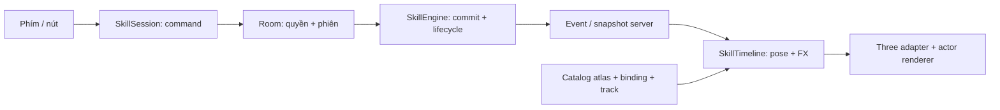

# Skill core — gameplay, animation và VFX

**09/10/2026 · TypeScript · _MMO.** Ba thuật R01 đã nối động tác cho cả ba nhân vật, bốn hướng. [Chơi trong Hằng Nhạc](http://127.0.0.1:5173/hang-nhac.html), [xem pose riêng](design/characters/core-cast-v1/index.html), [nguồn ART](design/characters/core-cast-v1/README.md). Đây là nền mở rộng skill; chưa triển khai R02–R05 hoặc combat trên map farm.

## Trách nhiệm

| Module | Sở hữu | Không quyết định |
| --- | --- | --- |
| `shared/skills/definitions.ts` | ID và thông số gameplay, mechanic, chính sách hướng, quyền ngắt, cooldown, phím tắt | Frame, texture |
| `shared/skills/aim.ts` | Chuẩn hóa vector, hướng đứng và hướng tới mục tiêu tại lúc nhận cast | Input thiết bị, frame |
| `contracts.ts`, `commands.ts` | Hợp đồng command/event/state, sanitizer và khóa biên nhận | Render |
| `engine.ts` | Một cast/actor, chi phí, cooldown, commit trước phát thuật, lifecycle, projectile/hit | UI, Three.js, ART |
| `behaviors.ts` | Luật riêng của projectile, targeted strike và dash | Lưu hồ sơ, vòng render |
| `movement.ts` | Khóa/lướt và va chạm dùng chung client/server | Damage |
| `presentation.ts` | Mô hình thuần: server clock + facts → pose/FX descriptors | Input, damage, chi phí, save |
| `client/src/skills/session.ts` | HUD, phím/nút, aim/target, gửi lệnh và phản hồi | Khởi động animation dự đoán |
| `client/src/skills/aim.ts` | Ưu tiên hướng di chuyển/ngắm, giữ hướng khi dừng, reset theo hồ sơ | Đổi hướng cast đã được server nhận |
| `assets.ts` | Catalog, tải atlas theo avatar, kiểm kích thước, alpha mask, lỗi tải | Luật skill |
| `three-presentation.ts` | Descriptor → sprite, UV, pool FX, marker luyện | Physics |
| `client/src/render/sprite-frame.ts` | Quad riêng, UV và vùng vẽ hợp lệ của frame; dùng chung cho thân/FX/bóng | Timing, damage, sửa bitmap ART |
| `client/src/render/renderer.ts` | Pose ưu tiên hơn locomotion, cùng điểm chân, depth/occlusion | Khi nào skill trúng |
| `server/src/HangNhacRoom.ts` | Quyền skill, phiên, schema sync, lưu và vận hành engine | Số frame ART |

`shared/r01.ts` và `client/src/r01-presentation.ts` là facade tương thích cho code/test cũ. Không thêm mechanic hoặc render vào facade.

## Nhịp thi triển

### Điều khiển hướng

Khi chưa có input ngắm, dùng hướng đang đứng của nhân vật/hồ sơ đã nạp. WASD, phím mũi tên và nút di chuyển mobile cập nhật cùng một `SkillAim`; dừng lại giữ hướng cuối. Input chéo chuẩn hóa về vector đơn vị; pose dùng bốn hướng đã có, VFX/projectile/dash vẫn dùng góc vector.

Chạm map là ngắm chủ động. Hướng này không bị input đang giữ ghi đè ở frame sau; đổi hướng di chuyển hoặc thả rồi nhấn lại sẽ lấy hướng di chuyển mới. HUD hiện mũi tên hướng Kiếm/Phong và nguồn chọn hướng. Đổi nhân vật hoặc vào room mới reset ý định ngắm, dùng hướng hồ sơ đó; blur/modal xóa input giữ nhưng không tự đổi hướng.

Definition khai báo `aim: 'direction'` cho Kiếm/Phong và `aim: 'target'` cho Lôi. Lôi lấy vector từ vị trí actor đến mục tiêu được chọn **trên server lúc chấp nhận cast**, độc lập với hướng ngắm trước đó. Mục tiêu không hợp lệ bị từ chối trước đổi hướng/chi phí/animation; mục tiêu trùng vị trí dùng hướng ngắm hữu hạn làm fallback. Hướng cast được lưu vào `castAimX/Y` và event, không đổi theo input mới hoặc mục tiêu di chuyển sau khi nhận. Snapshot điểm đánh Lôi ở release giữ nguyên luật hiện hành.

Đây là cập nhật điều khiển và chính sách skill; không tạo lại ART, không đổi hold/frame/socket hoặc geometry map. Client chỉ gửi ý định, animation/VFX vẫn chờ facts server.

Lệnh cast mới kèm `inputSeq` của tick di chuyển kế tiếp. Room đợi tick đó được consume rồi gọi engine với input thực đang giữ; không gửi thêm bước physics ngoài nhịp 30 Hz. Điều này tránh Kiếm/Lôi tự hủy khi nhấn hướng đi và skill trong cùng frame. Hàng chờ tối đa 8 lệnh/actor; sequence được phép nằm trong buffer 64 input và tick kế tiếp. Hết hạn sau 3 giây không tới input yêu cầu thì từ chối trước chi phí, đủ để consume buffer ở 30 Hz. Drop/leave/dispose xóa lệnh chờ; không replay qua reconnect. Lệnh cũ thiếu `inputSeq` vẫn tương thích; khóa biên nhận cũ giữ nguyên, lệnh mới có sequence trong khóa. Biên nhận đã lưu được kiểm trước hàng chờ để retry không phụ thuộc sequence của room mới.

| Thuật | Release | Recovery | Hết pose/cast | Hold ART tại 24 FPS |
| --- | --- | --- | --- | --- |
| Kiếm Khí | 250 ms | 375 ms | 666,667 ms | 16 tick |
| Lôi Ấn | 333,333 ms | 583,333 ms | 708,333 ms | 17 tick |
| Ngự Phong Bộ | 166,667 ms | 416,667 ms | 583,333 ms | 14 tick |

Frame được lấy theo `serverNow - castStartedAt`, cộng các hold trong clip; không tăng frame theo mỗi lần render. FPS màn hình thấp hoặc event tới trễ không khởi động lại từ frame đầu. Cast mới chờ hết lifecycle; recovery mở di chuyển. Đổi input trước release ngắt Kiếm/Lôi, giữ chi phí/cooldown. Phong không ngắt bằng input.

Server event gồm `cast, release, hit, miss, arrival, cancel`, có `castId, actorId, skillId, at` và vị trí/hướng. Projectile/hit từ server quyết định FX; Lôi contact chậm hơn hit 83,333 ms chỉ ở trình bày. Snapshot có `castId, castSkill, castStartedAt, castAimX/Y` để client mới/mất event cast tiếp tục pose/charge đúng tuổi. Không phát lại hit cũ hoặc khôi phục cast đã mất khi server restart. Dedup theo cast/type; cancel cũ không ngắt cast mới, snapshot cũ không thay cast mới.

Phong lấy bóng từ lịch sử vị trí/pose đã hiển thị, trễ 2/4 tick, opacity 0,30/0,18. Bóng không tính bằng cách trừ một đoạn cố định khỏi vị trí hiện tại. Trace giữ 128 bản ghi, seen 1.024 khóa, terminal 512 cast, history tối đa 90 mẫu/actor trong 1 giây, visual model tối đa 128 cast/effect/sample; pool Three tối đa 16 sprite trống. Đây là giới hạn bảo vệ, chưa phải kết quả tối ưu MMO đông người.

### Đối chiếu VFX/Skill gốc

Nguồn được nối trực tiếp từ `frame-by-frame-r01`, `r01-thunder-v1`, `r01-wind-v1`: canonical PNG → atlas nguyên byte → FPS/hold/rect/anchor/socket. Không tái vẽ FX đã duyệt. `tests/skill-authored-parity.test.ts` dùng chính `SequencePlayer`, `SkillVfxController`, `P2VfxController` của bản dựng gốc làm đối chứng.

- Clip một lần hết hold sẽ biến mất; chỉ vòng Lôi có `holdLastUntilResolve`. Vòng này hoàn tất chuỗi tự nhiên, sau đó giữ frame cuối khi chưa có xác nhận, không biến mất đột ngột lúc hit giữa chuỗi.
- Vệt Phong bám **điểm chân** từ host, lặp đến `arrival` thật; đồng hồ ART không tự kết thúc chuyển động. Vòng xuất phát ở chân ban đầu, vòng đáp ở chân server xác nhận.
- Kiếm Khí lấy socket của pose release, giữ cùng phép chiếu cho projectile/impact/miss sau khi pose nhân vật hết. Hướng impact theo incoming direction. Tan khi hụt dùng frame 009–012 của `qi-impact`, không cần atlas mới.
- `initialTipAhead:100` và mục tiêu/vị trí mô phỏng của preview là ví dụ authoring. Runtime vẫn nhận quỹ đạo/va chạm/hit từ server; không thêm 100 px vào tầm đánh hoặc phỏng đoán damage để mô phỏng preview.
- Bolt Lôi phát từ hit xác nhận, impact theo sau đúng **2 tick / 24 FPS**. Mọi chuỗi lấy tuổi tuyệt đối; callback đến muộn không phát lại từ đầu.

`npm.cmd run test:skill-vfx` render bằng chính Three adapter rồi so pixel với frame atlas gốc: 10 clip, cả UV/pivot/alpha/RGB, không chỉ nhìn số frame trong metadata. Ảnh đối chiếu tại `artifacts/skill-vfx-gpu-parity.png`; đây là kiểm kỹ thuật của các mẫu, không thay đánh giá chuyển động bằng mắt.

## Hợp đồng asset

- Locomotion giữ **64 × 96**, chân **(32,88)**, radius **8**, camera **1×**.
- Cast có canvas riêng **96 px cao**, rộng tối thiểu 96 (Kiếm/Lôi) hoặc 112 (Phong), thêm padding nếu tay/áo cần. Anchor = (rộng/2,88). Body tối đa 80 px, không phóng người theo canvas.
- Tư Đồ Nam giữ hình cao hơn điểm chiếu đất 4 px. Clip cast không sửa collider hoặc atlas locomotion.
- Atlas mới là WebP lossless có alpha, nhân vật nearest; 10 FX PNG gốc giữ nguyên hash và sampling nguồn.
- Catalog v2 có clip metadata, binding **skill → avatar → direction**, track trigger/anchor/layer/delay/stopOn và socket từng pose.
- Ba clip Vương Lâm hướng Đông dùng đúng chuỗi gốc đã bàn giao; không thay bằng clip mới hoặc dùng chúng cho hai người khác.
- Mở trang tải 10 FX và 12 clip của avatar đầu; avatar khác được nạp khi chọn/vào hoặc xuất hiện. Không preload cả 36 pose atlas.
- Atlas đổi kích thước dùng texture clone mới, hủy clone cũ; không copy ảnh khác kích thước vào texture đã cấp GPU. Frame chỉ đổi UV.
- `frameCrops` là vùng vẽ trong tọa độ **cục bộ từng canvas frame**, không phải tọa độ atlas. Khâu chia đều sheet mới đã lấy lẫn mảnh tay/chân hàng/cột bên cạnh ở 108/264 frame. Metadata crop giới hạn vùng nhân vật và chừa 1 px mép alpha; PNG/WebP/source giữ nguyên byte, canvas/scale/anchor/hold/socket không đổi. Ba chuỗi Vương Lâm Đông và 10 FX gốc giữ nguyên vùng đầy đủ.
- 11 frame cần `frameCutouts` để loại riêng mảnh sát mép crop hoặc ngang hàng với đỉnh tóc; script kiểm vùng loại không chứa pixel body chính, không cắt ngang tóc để che lỗi. Vùng được loại dùng chung trong preview, renderer và alpha mask.
- Mỗi body/FX/bóng sở hữu geometry riêng. Cắt cả position và UV, giữ scale và center của canvas gốc; vùng có cutout chia quad thành các ô ngoài vùng loại. Tái dùng buffer khi cùng số đỉnh, chỉ đổi topology khi cần. Reset crop/cutout khi về locomotion/đổi clip/tái dùng pool; tránh kéo vùng crop thành cả canvas hoặc sửa geometry Sprite dùng chung.

Socket của chuỗi gốc dùng dữ liệu tác giả. Socket mới là mốc theo pose/hướng để ghép FX, cần tiếp tục đối chiếu bằng mắt cùng ART mới; build/test không đồng nghĩa owner duyệt hình.

## Thêm skill

1. Chốt ID, mechanic, lifecycle và chi phí trong spec gameplay. ID/quyền lưu trong `shared/profiles.ts`; skill mới cần cập nhật sanitizer/quyền, migration profile và cooldown schema tương ứng. Ba trường `nextSword/Thunder/WindAt` hiện còn giữ để tương thích save; chưa có cooldown map tùy ý.
2. Thêm definition. Dùng behavior sẵn có nếu phù hợp; mechanic mới thêm handler vào `SKILL_BEHAVIORS` và test luật riêng. Lifecycle/commit/receipts dùng chung, không thêm nhánh skill trong renderer.
3. Sản xuất pose/FX, giữ nguồn/prompt/canonical PNG, chọn FPS/hold/socket/anchor. Binding phải đủ avatar và hướng được phép; không âm thầm thay bằng động tác người khác.
4. Thêm presentation tracks và binding vào catalog qua script đóng gói. Track hit/arrival dựa trên facts server, không dùng frame ART gây damage.
5. Thêm HUD/quyền/phím và kiểm định gameplay, pose/frame/time, ngắt, late snapshot, dedup, va chạm và tải lỗi. UI hiện có ba nút R01; skill mới vẫn cần bố trí HUD.

`npm.cmd run assets` chỉ copy/đóng catalog từ ART đã có; không gọi ImageGen. `node scripts/build-core-cast-assets.mjs --pack` đóng lại từ PNG canonical sau chỉnh ART. `--export` dành cho trích nguồn sheet ban đầu và **ghi lại PNG**, không dùng sau sửa frame thủ công nếu chưa chủ ý trích lại.

Sau khi thay PNG/trích sheet mới, chạy `node scripts/build-core-cast-crops.mjs` để tạo lại metadata crop, kiểm `frame-crop-verification.json` và trang pose bằng mắt rồi sync. Đây là phân tích/cắt vùng hiển thị, không vẽ lại ART. Script chỉ dành cho bộ core cast một nhân vật/frame; không áp dụng cho VFX nhiều mảnh hoặc thay crop do tác giả chỉ định ở bộ khác.

## Debug và kiểm chứng

- `window.__hangNhacSkills()`: pose và `frames` FX đang lấy clip/index/vị trí nào; `renderedEffects` cho rect/UV/pivot thực trên GPU; trace cast/release/hit/cancel/snapshot-resume, missingBindings, assetFailures, loadedAtlases, pool và dropped.
- `window.__hangNhacDiagnostics()`: tọa độ/hướng, camera, native contract; `sprites` chỉ rõ skill/locomotion, clip/index/anchor/scale.
- `sprites[].crop/cutouts` và `renderedEffects[].crop/cutouts` cho biết vùng vẽ thực, giúp phân biệt mảnh đã nằm trong PNG với lỗi UV lấy nhầm ô atlas.
- `window.__hangNhacR01()`: state thật, MP/cooldown/counter/target; `input.aim/source` cho biết hướng của lệnh kế tiếp và nguồn facing/movement/pointer. So với `own.castAimX/Y` để phân biệt ý định mới với hướng cast đang chạy. Không dùng diagnostic để sửa state hoặc gửi damage.
- Skill không chạy: xem phản hồi từ chối → quyền/resource/cooldown → castId/at → binding → atlas failure → sprite UV. Skill có hình nhưng sai hit: kiểm server trace/luật; không sửa timing ART để che lỗi gameplay.

`npm.cmd test`, `npm.cmd run build`, `npm.cmd run test:skill-animation`, `npm.cmd run test:hang-nhac-r01`, `npm.cmd run test:hang-nhac-sect` dùng fixture riêng. Test animation thực hiện 36 tổ hợp bằng phím/nút với server thật, frame tiến và trả native, chi phí một lần, hit/lướt; ảnh chụp cần xem thêm để phát hiện lỗi GPU/style mà metadata không phát hiện. [Biên bản](data/hang-nhac-skill-core-verification.json) ghi kiểm chứng đợt này.

`npm.cmd run test:skill-aim` kiểm input barrier/receipt/cancel bằng SDK, rồi điều khiển bàn phím/chuột/mobile trong browser thật: bộ ba/bốn hướng, hướng đứng khi reload, input chéo, ngắm khi giữ phím, Lôi quay về mục tiêu và Phong giữ hướng cast đã nhận. `test:hang-nhac-reload` tiếp tục kiểm E/nút NPC sau build/reload/reconnect/restart. [Biên bản hướng thi triển](data/hang-nhac-skill-aim-verification.json).

`npm.cmd run test:skill-body` đối chiếu pixel của **300 frame** với đúng frame/crop, kể cả vùng trong suốt; thêm thân + bóng Phong, đổi atlas/pool và 60 frame locomotion sau cast. Ba mẫu bỏ crop phải phát hiện được mảnh thừa trước sửa. Mặc định dùng SwiftShader; đặt `SKILL_GPU_NATIVE=1` để kiểm GPU máy. [Biên bản crop](data/hang-nhac-skill-crop-verification.json), ảnh trước/sau `artifacts/skill-body-crop-review.png`.
