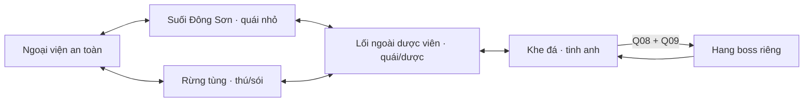

# Map nhập môn Hằng Nhạc — vùng liên kết v1

**Đầu ra:** vùng chung 3840 × 2560 px, năm khu nối nhau và hang boss riêng 960 × 640. [Bản bố trí đi lại](http://127.0.0.1:5173/starter-region.html), [dữ liệu](data/mvp-rpg-content.json), [kịch bản](STARTER-STORY.md), [MVP](MVP-RPG-A.md).

**Trạng thái duyệt:** người phát triển chấp nhận bố cục/tỷ lệ và bản đi thử làm chuẩn prototype ngày 07/10/2026: “tôi đã xem khá ổn rồi”. ART map hoàn chỉnh và gameplay nhiệm vụ/combat tiếp tục theo backlog.

**Ưu tiên bổ sung:** [thiết kế hình ảnh map](MAP-ART-DESIGN.md) để nhìn/duyệt trước gameplay. Bản khối giữ khung nghiên cứu; vị trí nhiệm vụ/quái nháp điều chỉnh sau ART, đường và lớp đi lại được chọn.

**Đi thử với ART:** [MAP03](MAP-LAYERED-DESIGN.md) nay bám đúng ảnh tổng Hằng Nhạc do người phát triển chỉ định: năm khu3840 × 2560, đường/footprint và lớp che theo tranh. Ảnh tổng phóng2.5× chỉ dùng đối chiếu, chưa là ART native cuối. Vị trí quest/POI của bản khối dưới đây vẫn là nháp, chưa đồng bộ sang bố cục ART.

## Tỷ lệ giữ nguyên

Nhân vật dùng nguyên atlas 64 × 96, điểm chân (32,88), cao khoảng 79–82 px ở zoom 1×. Mở rộng số pixel của thế giới và camera cuộn theo người; không tăng khung sprite hoặc kéo giãn sân 960 × 640 thành ảnh lớn. Khung nhìn 960 × 640 tương đương khoảng 16 trang cảnh cho vùng ngoài; trên mobile cắt vùng nhìn, giữ cùng cỡ nhân vật. Minimap là sơ đồ nhỏ, không thu nhỏ màn chơi theo nó.

Lưới bố trí 64 px phục vụ đặt khu/đường; collider nhân vật bán kính 8 px độc lập kích thước ô. Đường nối chủ yếu rộng 128 px, giao với vùng đủ phần chồng lấn để đi liên tục. Nhà khoảng 256–320 px ngang, cửa 64–96 px; cây/đá giữ tỷ lệ cạnh người. Nhà, mái và tán cây cần tách lớp; xếp theo điểm chân để kiểm che khuất.

## Kết nối

| Khu | Vị trí / kích thước native | Vai trò và điểm quan trọng |
| --- | --- | --- |
| Ngoại viện | (160,144), 1120 × 832 | Quản sự, Trương Hổ, Vương Lâm áo xám, luyện đánh/bế quan; an toàn |
| Suối | (1600,144), 1024 × 704 | Q02/Q04; lấy nước, sơn thử; sát bờ đá |
| Ngoài dược viên | (1600,1008), 960 × 832 | Người giữ lối, giáp trùng, hái sơn thảo/chế đồ; cổng vườn chặn |
| Rừng tùng | (160,1264), 1120 × 1088 | Q06/Q07; củi/nhựa, sơn trư và sói; đường qua dược viên |
| Khe đá | (2848,688), 800 × 1632 | Mini-boss, waypoint, lối hang; không đặt quái sát cửa hồi sinh |
| Hang boss | Scene riêng 960 × 640 | Đấu trường rộng, cửa trở lại và điểm nhận thưởng |

Suối phía đông, dãy phòng và cảnh dược viên lấy bối cảnh từ [chương 10](https://www.wuxiaworld.com/novel/renegade-immortal/rge-chapter-10), [11](https://www.wuxiaworld.com/novel/renegade-immortal/rge-chapter-11), [17](https://www.wuxiaworld.com/novel/renegade-immortal/rge-chapter-17). Tọa độ, đường vòng, quái và hang boss là bố cục game mới; không nhận là bản đồ nguyên tác.

## Đường nhiệm vụ và khoảng cách

Đường chính: ngoại viện → suối → trở về luyện → suối/dược viên → rừng → khe đá → chuẩn bị ở dược viên → hang. Đường vòng rừng–dược viên giúp không phải quay qua sân cho mỗi việc. Mục tiêu đi từ NPC đến điểm gần nhất khoảng 10–25 giây ở tốc độ 80 px/s; tuyến dài tới khu kế khoảng 30–50 giây trước khi mở trở về/waypoint. Dữ liệu cân bằng cuối phải đo quãng đường và thời gian thật trong bản đi lại.

Waypoint/điểm nghỉ là chức năng MVP dự kiến; bản bố trí có bộ chọn đến khu để duyệt, không phải cơ chế dịch chuyển tự do của gameplay. Cổng boss khi triển khai kiểm Q08/Q09/cảnh giới ở server; bản duyệt cho đi vào hang để kiểm khoảng né và cỡ người.

## Map và online

Vùng ngoài là bản đồ chung có ID room/shard, vị trí/va chạm và spawn do server quản lý. Hang boss A một người, thuộc runId riêng; rời phiên/mất mạng/chết cần quy tắc phục hồi trạng thái. Tăng kích thước map không tự tăng số người phục vụ: 8 client thật là mục tiêu kiểm thử ban đầu, còn cần số đo AI/network khi combat được triển khai.

Preview bố trí mới chạy cục bộ để duyệt địa hình, đường đi, các POI và tỷ lệ. Phòng online hiện có vẫn là sân thử 960 × 640; chuyển sang vùng mới là mốc kế tiếp trong backlog. Điểm quái/boss/nhiệm vụ trên preview là ký hiệu thiết kế; chưa là trận chiến hoặc tiến trình nhiệm vụ đã chạy.

## Sản xuất ART theo khu

Làm ngoại viện/suối trước: mặt đất, đường, phòng ký danh, quản sự, cổng, cây/đá, nước và điểm lấy nước. Sau đó dược viên/rừng: bãi hái ngoài, cổng hạn chế, bàn chế đồ, cây tùng/vách. Khe đá/hang sau cùng: vách, portal, đấu trường và vùng báo đòn.

Địa hình, vật cản và phần che phía trên phải là lớp riêng. Không ghép người/quái/UI vào ảnh nền. Tái dùng bộ đạo cụ cùng tỷ lệ; chia tải theo vùng/chunk sau khi đo client thay vì tải một ảnh duy nhất 3840 × 2560 để giải quyết mọi lớp.
