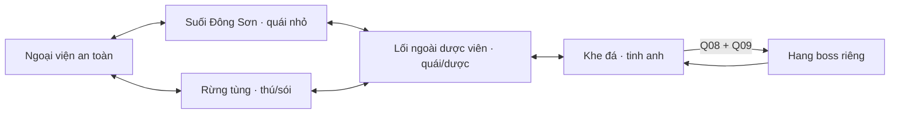

# Map nhập môn 3840 × 2560 — tham chiếu prototype trước

**Phạm vi lịch sử:** vùng 3840 × 2560 px, năm khu nối nhau và hang boss riêng 960 × 640. [Bản bố trí đi lại](http://127.0.0.1:5173/starter-region.html) và [dữ liệu nháp](data/mvp-rpg-content.json) vẫn là prototype cục bộ; ký hiệu quest/quái không có tiến trình hoặc combat chạy được.

**Mốc lịch sử:** người phát triển chấp nhận bố cục/tỷ lệ và bản đi thử làm chuẩn prototype ngày 07/10/2026. Sau đó hướng mở đầu đổi sang [bố cục Hằng Nhạc bảy địa điểm/tám chức năng HN-Z01–Z08](HANG-NHAC-MAP-LAYOUT.md), HN01–HN12 cho ba nhân vật. Không dùng các tọa độ, quest Q01–Q10 hoặc hang boss ở tài liệu này làm kế hoạch triển khai hiện hành.

**ART hiện tại:** ART Hằng Nhạc v1/v2/v3 và hai bản thử vùng đi đã [xóa](MAP-ASSETS-RESET.md); chờ kế hoạch map mới. [Thư viện editor](design/world/map-asset-library/README.md) vẫn trống. Fixture/prototype ở đây được giữ để kiểm kỹ thuật, không thay kế hoạch map mới.

**MAP03 legacy đã dừng:** ART/builder cũ đã xóa trong [đợt reset](MAP-ASSETS-RESET.md); không còn bản ART MAP03 để đi thử hoặc khôi phục. Những phần dưới ghi lại phương án prototype trước, không thay bố cục HN hiện hành.

## Tỷ lệ giữ nguyên

Nhân vật dùng nguyên atlas 64 × 96, điểm chân (32,88), cao khoảng 79–82 px ở zoom 1×. Mở rộng số pixel của thế giới và camera cuộn theo người; không tăng khung sprite hoặc kéo giãn sân 960 × 640 thành ảnh lớn. Khung nhìn 960 × 640 tương đương khoảng 16 trang cảnh cho vùng ngoài; trên mobile cắt vùng nhìn, giữ cùng cỡ nhân vật. Minimap là sơ đồ nhỏ, không thu nhỏ màn chơi theo nó.

Lưới bố trí 64 px phục vụ đặt khu/đường; collider nhân vật bán kính 8 px độc lập kích thước ô. Đường nối chủ yếu rộng 128 px, giao với vùng đủ phần chồng lấn để đi liên tục. Nhà khoảng 256–320 px ngang, cửa 64–96 px; cây/đá giữ tỷ lệ cạnh người. Nhà, mái và tán cây cần tách lớp; xếp theo điểm chân để kiểm che khuất.

## Kết nối

| Khu | Vị trí / kích thước native | Vai trò và điểm quan trọng |
| --- | --- | --- |
| Ngoại viện | (160,144), 1120 × 832 | Quản sự, Trương Hổ, Vương Lâm áo xám, luyện đánh/bế quan; an toàn |
| Suối | (1600,144), 1024 × 704 | Q02/Q04; lấy nước, sơn thử; sát bờ đá |
| Ngoài dược viên | (1600,1008), 960 × 832 | Người giữ lối, giáp trùng, hái sơn thảo/chế đồ; cổng vườn chặn |
| Rừng tùng | (160,1264), 1120 × 1088 | Q06/Q07; củi/nhựa, sơn trư và sói; đường qua dược viên |
| Khe đá | (2848,688), 800 × 1632 | Mini-boss, waypoint, lối hang; không đặt quái sát cửa hồi sinh |
| Hang boss | Scene riêng 960 × 640 | Đấu trường rộng, cửa trở lại và điểm nhận thưởng |

Suối phía đông, dãy phòng và cảnh dược viên lấy bối cảnh từ [chương 10](https://www.wuxiaworld.com/novel/renegade-immortal/rge-chapter-10), [11](https://www.wuxiaworld.com/novel/renegade-immortal/rge-chapter-11), [17](https://www.wuxiaworld.com/novel/renegade-immortal/rge-chapter-17). Tọa độ, đường vòng, quái và hang boss là bố cục game mới; không nhận là bản đồ nguyên tác.

## Đường nhiệm vụ và khoảng cách

Đường chính: ngoại viện → suối → trở về luyện → suối/dược viên → rừng → khe đá → chuẩn bị ở dược viên → hang. Đường vòng rừng–dược viên giúp không phải quay qua sân cho mỗi việc. Mục tiêu đi từ NPC đến điểm gần nhất khoảng 10–25 giây ở tốc độ 80 px/s; tuyến dài tới khu kế khoảng 30–50 giây trước khi mở trở về/waypoint. Dữ liệu cân bằng cuối phải đo quãng đường và thời gian thật trong bản đi lại.

Waypoint/điểm nghỉ là chức năng MVP dự kiến; bản bố trí có bộ chọn đến khu để duyệt, không phải cơ chế dịch chuyển tự do của gameplay. Cổng boss khi triển khai kiểm Q08/Q09/cảnh giới ở server; bản duyệt cho đi vào hang để kiểm khoảng né và cỡ người.

## Ý định online của prototype trước

Phương án trước dự kiến vùng ngoài là bản đồ chung có ID room/shard, vị trí/va chạm và spawn do server quản lý; hang boss A một người thuộc runId riêng. Đây là đề xuất chưa triển khai; mục tiêu thử 8 client cũng chưa là công suất đã đo. Thiết kế phiên/khảo nghiệm hiện tại theo HN01–HN12 ở tài liệu mới.

Preview bố trí này chạy cục bộ để duyệt đường/POI/tỷ lệ. Phòng online hiện có vẫn là sân thử 960 × 640, chưa nạp vùng này hoặc Hằng Nhạc mới. Điểm quái/boss/nhiệm vụ là ký hiệu thiết kế; chưa là trận chiến hoặc tiến trình nhiệm vụ đã chạy.

## Thứ tự ART đã đề xuất trước — dừng sau reset

Kế hoạch trước từng đề xuất ngoại viện/suối → dược viên/rừng → khe đá/hang. Bộ asset legacy và ART Hằng Nhạc đã xóa; không tiếp tục sản xuất theo thứ tự này. Chờ kế hoạch map mới rồi làm theo [phân công hiện hành](MAP-ASSET-PRODUCTION-NOTES.md).

Địa hình, vật cản và phần che phía trên phải là lớp riêng. Không ghép người/quái/UI vào ảnh nền. Tái dùng bộ đạo cụ cùng tỷ lệ; chia tải theo vùng/chunk sau khi đo client thay vì tải một ảnh duy nhất 3840 × 2560 để giải quyết mọi lớp.
