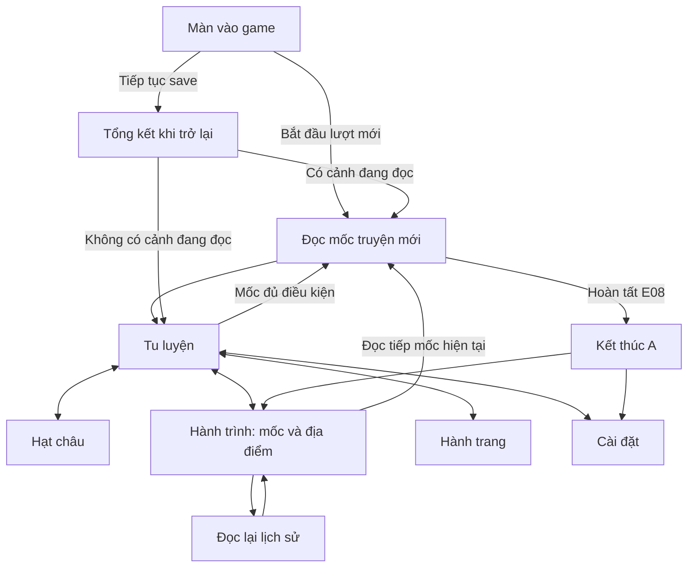

# Luồng màn hình và tương tác MVP A

> **UX tham chiếu:** các màn idle/tầng 1 dưới đây chưa là UX combat của [RPG-A mới](MVP-RPG-A.md). HUD target/kỹ năng/túi/trang bị/minimap và tracker nhiệm vụ cần cập nhật theo [kịch bản](STARTER-STORY.md); bản bố trí đi thử ở `/starter-region.html` giữ cỡ nhân vật hiện tại.

> **Bộ UX v0.6 giữ làm tham chiếu.** Hướng hiện tại là online nhiều người và đệ tử riêng. Cần thay portrait người chơi, khu Hạt châu, tài khoản/nhập save và nhãn vắng mặt theo [ONLINE-DIRECTION.md](ONLINE-DIRECTION.md); thêm tạo đệ tử và tương tác đồng môn. [Concept nhân vật v1](design/characters/index.html) là đầu ra thiết kế mới; chưa có bộ UX online hoàn chỉnh.

**Phiên bản:** 0.3, ngày 06/10/2026.  
**Trạng thái:** đặc tả UX, sơ đồ và bản phác hình; tương tác chờ kiểm chứng trong prototype.  
**Tham chiếu:** [GDD](GDD.md), [đặc tả hệ thống](MVP-A-SPEC.md), [chi tiết màn hình/trạng thái](UX-SCREENS-AND-STATES.md), [ART](ART-DIRECTION.md), [bộ UI](UI-COMPONENTS.md), [map](WORLD-MAPS.md), [asset](ASSET-PLAN.md).

## 1. Cấu trúc điều hướng

Có 5 khu vực chính: **Tu luyện · Hạt châu · Hành trình · Hành trang · Cài đặt**. Màn vào game và các lớp đọc truyện/tổng kết/kết thúc không tính thành khu vực chính mới.



Đọc mốc mới dừng hoạt động. Đọc lịch sử, đổi khu vực và xem địa điểm giữ hoạt động. Nút đọc tiếp mốc hiện tại luôn dẫn tới đoạn đã lưu.

## 2. Danh mục màn hình và lớp hiển thị

| ID | Màn hình/lớp | Nội dung bắt buộc | Tương tác chính |
| --- | --- | --- | --- |
| UI-TITLE | Vào game | Tên làm việc, trạng thái có/không có tiến trình | Bắt đầu; Tiếp tục; Nhập bản lưu |
| UI-CULTIVATION | Tu luyện | Cảnh giới, mục tiêu, 3 tài nguyên, hoạt động, lý do chờ | Chọn/Dừng/Tiếp tục hoạt động; mở mốc; bật tự động |
| UI-BEAD | Hạt châu | Hình dạng hiện tại, khám phá đã biết, chi phí/cách sử dụng | Đi tới hoạt động liên quan hoặc đọc tiếp mốc đủ điều kiện |
| UI-JOURNEY | Hành trình | Mốc truyện, địa điểm, hồ sơ nhân vật | Đọc tiếp; đọc lại; xem node; chọn hoạt động tại node hợp lệ |
| UI-INVENTORY | Hành trang | Vật phẩm đã nhận và vai trò trong A | Mở chi tiết; đi tới hệ thống liên quan |
| UI-SETTINGS | Cài đặt | Lưu/xuất/nhập, chữ, giảm chuyển động | Xuất; xem trước bản nhập; thay tiến trình |
| UI-STORY | Đọc truyện mới | Cảnh, đoạn, nền, nhân vật/gặp gỡ, tác dụng ở đoạn cuối | Tiếp tục; hoàn thành mốc; thu gọn để đọc sau |
| UI-HISTORY | Đọc lại | Nội dung cảnh đã hoàn thành, nhãn xem lại | Chuyển đoạn/cảnh đã biết; đóng |
| UI-RETURN | Trở lại game | Thời gian, thay đổi tài nguyên, hoạt động và lý do dừng | Đóng tổng kết; đi tới mục tiêu; đọc tiếp cảnh |
| UI-END | Kết thúc A | Ngưng Khí tầng 1, tóm tắt đã mở và tiến trình giữ lại | Xem hành trình; xuất bản lưu |

Sau E08, khu vực Tu luyện hiển thị trạng thái hoàn thành và dẫn sang hành trình. Không đưa nút đi tiếp B vào bản A trước khi có nội dung B.

## 3. Bố cục Tu luyện

### 3.1. Phác thảo desktop

Đây là wireframe cấu trúc; màu, hình và khoảng cách sẽ được điều chỉnh khi có prototype.

```text
┌───────────────────────────────────────────────────────────────┐
│ VƯƠNG LÂM · PHÀM NHÂN                           Đã lưu          │
├───────────────┬─────────────────────────────┬─────────────────┤
│ Tu luyện      │ MỤC TIÊU HIỆN TẠI           │ ĐỊA ĐIỂM        │
│ Hạt châu      │ Khám phá hạt châu           │ [Nền phòng]     │
│ Hành trình    │ Linh dịch: 4/6              │ Phòng riêng     │
│ Hành trang    │ [Tiếp tục: còn thiếu 2]     │ Đang ủ nước     │
│ Cài đặt       ├─────────────────────────────┤                 │
│               │ Nước 8/120 · Linh dịch 4/30 │ Kiến thức đã mở │
│               │ Tu vi 0/480                 │ [Xem hạt châu]  │
│               ├─────────────────────────────┤                 │
│               │ Ủ NƯỚC VỚI HẠT CHÂU         │                 │
│               │ 2 nước → 1 linh dịch / 10s  │                 │
│               │ Tiến độ: 6/10s              │                 │
│               │ [Dừng] [Đổi hoạt động]      │                 │
└───────────────┴─────────────────────────────┴─────────────────┘
```

Ảnh cảnh không che mục tiêu, số tài nguyên hoặc nút. Cột địa điểm có thể thu gọn; vòng chơi vẫn hiểu được khi thiếu hình.

### 3.2. Phác thảo màn hình nhỏ

```text
┌───────────────────────────────────┐
│ Vương Lâm · Phàm nhân             │
│ Mục tiêu: khám phá hạt châu        │
│ Linh dịch 4/6 · còn thiếu 2        │
│ [Tiếp tục — chưa đủ điều kiện]    │
├───────────────────────────────────┤
│ Nước 8/120 · Linh dịch 4/30        │
│ Tu vi 0/480                       │
├───────────────────────────────────┤
│ Ủ nước · tại Phòng riêng          │
│ 2 nước → 1 linh dịch / 10 giây     │
│ Tiến độ 6/10 giây                 │
│ [Dừng]  [Đổi hoạt động]           │
├───────────────────────────────────┤
│ [Xem địa điểm và kiến thức]       │
├───────────────────────────────────┤
│ Tu luyện · Châu · Truyện · Túi · ⚙ │
└───────────────────────────────────┘
```

Tên đầy đủ vẫn hiển thị khi mở khu vực. Ở chiều rộng 360 px, nội dung dùng một cột; map dùng danh sách dọc. Khi tăng cỡ chữ, thanh điều hướng có thể xuống dòng để giữ nhãn dễ đọc.

### 3.3. Thẻ hoạt động

Mỗi thẻ có tên, địa điểm, chi phí, sản lượng, thời gian, trạng thái và nút phù hợp. Các hoạt động đã mở luôn có thể xem để so sánh; hoạt động chưa mở không hiển thị thông tin của mốc chưa được giới thiệu.

Trước khi hoàn thành E04, khu vực Tu luyện chỉ có nhân vật, mục tiêu và nút đọc tiếp; bảng tài nguyên/hoạt động xuất hiện cùng lần mở khóa đầu tiên.

| Trạng thái | Nội dung thẻ | Nút |
| --- | --- | --- |
| Hợp lệ, chưa chọn | Luật mỗi chu kỳ | Bắt đầu |
| Đang chạy | Luật + tiến độ + nơi đang thực hiện | Dừng |
| Thiếu đầu vào | Lượng thiếu + nơi chuẩn bị | Đi lấy nước/Chuẩn bị linh dịch |
| Đầy kho | Tài nguyên đầy + cách sử dụng đã mở | Đi tới hoạt động/mốc liên quan |
| Dừng chủ động | Đã dừng; chu kỳ tiếp theo từ 0 | Tiếp tục nếu hợp lệ |
| Khóa đã được giới thiệu | Mốc cần hoàn thành | Xem mục tiêu |
| A hoàn thành | Đã đạt tầng đầu | Xem hành trình |

`Tự động chuẩn bị và tu luyện` chỉ xuất hiện sau E07. Khi bật, thẻ chính ghi bước đang chạy trong chuỗi; tự động không tự đọc truyện hoặc đột phá.

## 4. Mục tiêu và hướng dẫn theo từng mốc

| Thời điểm | Mục tiêu hiển thị | Hướng dẫn/hành động |
| --- | --- | --- |
| Trước E04 | Tiếp tục hành trình nhập môn | Nút đọc tiếp; chưa có hoạt động chạy nền |
| Sau E04 | Làm quen lấy nước và ủ nước | Hiện 0/6 lần lấy, 0/3 lần ủ, linh dịch hiện có/1; hướng dẫn lấy nước trước |
| Sau E05 | Thử công pháp nhập môn | Hiện 0/3 lần thổ nạp và linh dịch/6; giải thích chưa giữ được tu vi |
| Đủ luyện thử, chưa đủ E06 | Chuẩn bị cho mốc kế tiếp | Hiện số linh dịch còn thiếu; gợi ý chuỗi lấy → ủ |
| Sau E06 | Khám phá hạt châu | Hiện linh dịch/6; tu luyện thường đã sinh tu vi; không lộ nội dung mộng cảnh trước truyện |
| Sau E07 | Chuẩn bị đột phá tầng đầu | Hiện tu vi/480; giới thiệu mộng cảnh và nút tự động |
| Tu vi đủ | Hoàn tất đột phá | Nút Đột phá; báo hoạt động chờ |
| Sau E08 | Đã hoàn thành bản nhập môn | Xem hành trình và xuất bản lưu |

Chỉ dẫn không tự chọn hoạt động hay tự chuyển cảnh. Điều kiện dùng số hiện có và số còn thiếu; màu sắc chỉ bổ sung cho chữ. Khi chưa đủ, nút bị khóa nhưng lý do vẫn đọc được ngay trên thẻ.

## 5. Đọc truyện mới và đọc lại

```text
┌─────────────────────────────────────────────────┐
│ NHẬN CÔNG PHÁP                      Đoạn 2/2    │
│ [Nền dược viên/phòng · chân dung đã giới thiệu]  │
│                                                 │
│ Lời dẫn ngắn, viết riêng cho game.               │
│ Thao tác tiếp tục giữ diễn biến theo nguyên tác. │
│                                                 │
│ Khi hoàn thành: dùng 1 linh dịch.                │
│ Mở: luyện thổ nạp, công pháp và túi trữ vật.      │
│ [Để đọc sau]           [Hoàn thành mốc]          │
└─────────────────────────────────────────────────┘
```

`Để đọc sau` thu gọn cảnh, lưu vị trí và hiện nhãn `Đang đọc truyện — hoạt động đã dừng`. Người chơi mở lại bằng `Đọc tiếp`. Ở đoạn trung gian, nút là `Tiếp tục`; đoạn cuối dùng nhãn riêng của mốc trong catalog.

Xem lại có nhãn `Lịch sử — chỉ xem nội dung`. Không hiện nút áp dụng chi phí/phần thưởng. Chỉ cho xem cảnh đã hoàn thành; cảnh đang đọc dùng luồng đọc tiếp. Sau khi đóng lịch sử, quay về node/mốc đã mở trước đó.

Hổ trắng dùng hình sự kiện trên nền đường núi. Kiếm linh và lực hút dùng lớp/hiệu ứng đã đề xuất; người chơi tiếp tục diễn biến, không chọn đòn đánh.

## 6. Hạt châu, Hành trình và Hành trang

| Khu vực | Thứ tự nội dung | Điều kiện hiển thị/tương tác |
| --- | --- | --- |
| Hạt châu trước E03 | Chưa có vật phẩm; trở về mục tiêu hiện tại | Không hiện tên/lai lịch tương lai |
| Hạt châu sau E03 | Hình dạng → điều đã biết → cách dùng đã mở | E04 thêm ủ nước; E07 thêm mộng cảnh và chi phí |
| Hành trình / Mốc | Mốc hiện tại → điều kiện → cảnh đã xong → hồ sơ đã biết | Mốc tương lai chưa được giới thiệu không lộ tên hoặc nhân vật |
| Hành trình / Địa điểm | Node mục tiêu → node đang hoạt động → các node đã biết | Phân biệt đang xem/đang hoạt động/lịch sử; cùng hành động ở đồ thị và danh sách |
| Hồ sơ nhân vật | Tên → vai trò đã biết → chân dung hoặc thẻ tên | Theo cảnh giới thiệu; không yêu cầu chân dung P2 để đọc |
| Hành trang | Vật phẩm đã nhận → vai trò → nút đi tới hệ thống liên quan | Mỗi vật phẩm một bản; nút đi tới chỉ điều hướng, không tự dùng |

Chọn `Bắt đầu hoạt động` trong một node áp dụng luật đổi hoạt động và đưa về Tu luyện. Bấm ảnh, tên node hoặc nút `Xem` chỉ điều hướng.

Quy tắc từng biến thể châu, chi tiết bốn vật phẩm và đích của các nút Xem nằm trong [chi tiết màn hình, mục 2–3](UX-SCREENS-AND-STATES.md#2-hạt-châu). Bản phác Hạt châu và Hành trang đã có trong thư viện; các mục chưa biết dùng trạng thái trống.

## 7. Tổng kết khi trở lại

| Trường | Ví dụ sau khi lấy nước từ kho trống |
| --- | --- |
| Thời gian vắng mặt | 8 giờ |
| Giới hạn được tính | Tối đa 8 giờ |
| Thời gian có hoạt động | 10 phút |
| Thay đổi tài nguyên | Nước +120; linh dịch 0; tu vi 0 |
| Nơi hoạt động | Suối trong núi |
| Trạng thái hiện tại | Kho nước đầy; chọn ủ nước để tiếp tục |

Nếu tự động từ kho trống đạt 480, tổng kết ghi +480 tu vi, nước/linh dịch ròng 0 và 24 phút có hoạt động. Nếu đang đọc mốc hoặc đã dừng, ghi không có hoạt động trong quãng vắng mặt và đưa tới nút phù hợp.

Tổng kết là thông tin của tiến trình **đã được xử lý và lưu**. Đóng hoặc tải lại lớp tổng kết không nhận thêm tài nguyên. Thông báo ngắn cho phép bỏ qua bảng chi tiết khi thời gian/tài nguyên không đổi.

[Tổng kết desktop](design/offline-desktop.svg) và [mobile](design/offline-mobile.svg) dùng ví dụ vắng 10 giờ, trong giới hạn 8 giờ, có hoạt động 24 phút. `Xem mục tiêu đột phá` chỉ đưa về mục tiêu; người chơi bấm Đột phá ở đó để mở E08.

## 8. Lưu, nhập và lỗi phục hồi

| Tình huống | Nội dung người chơi thấy | Thao tác |
| --- | --- | --- |
| Lưu thành công | Đã lưu; thời điểm gần nhất | Tiếp tục chơi |
| Ghi thất bại | Chưa lưu được tiến trình vừa thay đổi | Thử lại; xuất tiến trình hiện tại; trạng thái trên trang được giữ |
| Nhập bản hợp lệ | Tóm tắt cảnh giới, mốc và ba tài nguyên của bản nhập | Thay tiến trình bằng bản này hoặc giữ bản hiện tại |
| Nhập sai dữ liệu | Bản lưu không hợp lệ; nêu lỗi có thể hiểu | Giữ tiến trình hiện tại; chọn file khác |
| Phiên bản chưa hỗ trợ | Bản lưu thuộc phiên bản chưa được hỗ trợ | Giữ tiến trình; không tự sửa hoặc bỏ mốc |
| Khôi phục từ bản sao | Đã phục hồi bản lưu trước đó, kèm thời điểm | Tiếp tục; xuất bản phục hồi |
| Tab chỉ xem | Game đang chạy ở tab khác | Xem tiến trình; chuyển quyền chơi khi cơ chế cho phép |

Nếu bản chính và bản sao đều không phục hồi được, màn vào game cho nhập file hoặc bắt đầu lượt mới. Không tự tạo lượt mới ghi đè dữ liệu trước khi người chơi chọn.

Luồng chọn file → kiểm tra → so sánh → xác nhận thay cùng trạng thái ghi thất bại/tab chỉ xem được chi tiết ở [UX-SCREENS-AND-STATES, mục 4 và 8](UX-SCREENS-AND-STATES.md#4-cài-đặt-và-bản-lưu). Trong lúc xem trước, bản hiện tại giữ hoạt động; bản được chọn chưa nhận offline hoặc thay dữ liệu.

## 9. Quy tắc chữ, chuyển động và asset

Các thông số sau là mục tiêu thiết kế của dự án, cần kiểm tra trên prototype:

- Chữ nội dung mặc định 18 px, giãn dòng khoảng 1,6; cho chọn cỡ chữ. Số liệu và tên tài nguyên luôn có chữ.
- Nút chính có vùng bấm tối thiểu 44 × 44 px; dùng bàn phím để đi qua các thao tác chính, thấy rõ vị trí đang chọn.
- Không bắt người chơi đọc xong theo đồng hồ. Chuyển cảnh/hiệu ứng không quyết định phần thưởng; giảm chuyển động vẫn hoàn thành cùng luật.
- Hiệu ứng đột phá chạy sau khi kết quả đã lưu; tải lại không cần chạy lại hiệu ứng để nhận kết quả.
- Mỗi khung hình thiếu có tên/mô tả và bố cục giữ ổn định. Không đặt chữ truyện trong nền hoặc chân dung.
- Asset được chọn theo mốc hiện tại hoặc cảnh đang xem. Xem lịch sử áo xám không đổi áo hiện tại của Vương Lâm.
- Hai chân dung P2 dùng thẻ tên; gói A vẫn giữ 18 nguồn P0/P1 và không thêm hình chỉ cho màn hình mới.

## 10. Nghiệm thu UX của bản thiết kế

| ID | Điều người chơi cần làm được | Cách kiểm tra khi có prototype |
| --- | --- | --- |
| A-UX-01 | Biết mục tiêu hiện tại và thiếu gì | Từ mỗi mốc E04–E08, đọc được điều kiện trong khu vực Tu luyện |
| A-UX-02 | Phân biệt hai loại nước | Nhìn bảng tài nguyên và chọn đúng bước ủ nước |
| A-UX-03 | Hiểu vì sao luyện thử không có tu vi | Sau 3 chu kỳ, giải thích được cần tiếp tục mốc truyện |
| A-UX-04 | Đọc tiếp đúng đoạn sau khi mở lại | Đóng giữa E03 hoặc E07 rồi trở lại |
| A-UX-05 | Xem map mà không đổi hoạt động | Đang lấy nước, mở thôn; thẻ hoạt động vẫn ghi suối |
| A-UX-06 | Đọc lại mà không nhận lại tác dụng | Xem cảnh hang hoặc E05 rồi kiểm tra tài nguyên/vật phẩm |
| A-UX-07 | Hiểu lợi ích và chi phí mộng cảnh | Sau E07, giải thích được vai trò linh dịch và tự động |
| A-UX-08 | Hiểu tổng kết offline | Phân biệt thời gian vắng mặt và thời gian thật sự có hoạt động |
| A-UX-09 | Chơi trên màn hình nhỏ | Tại 360 px, thao tác vòng tài nguyên, map, truyện và xuất save |
| A-UX-10 | Biết đã kết thúc A | Sau E08, không tìm nút tăng tầng tiếp trong bản hiện tại |

Số liệu thời gian, nhu cầu hỏi cách chơi và phản hồi khoảng 5 người được ghi theo kế hoạch chơi thử trong GDD. Đây là yêu cầu thiết kế để kiểm chứng, chưa phải kết quả quan sát.

## 11. Bản phác UX và hướng ART

[Thư viện bản phác](design/index.html) có bảng tranh mực/giấy cổ và 14 bản vẽ UI: Tu luyện desktop/mobile, Hành trình, cảnh nhận công pháp, Hạt châu, Hành trang, Cài đặt, xem trước save, offline desktop/mobile, kết thúc A và ba bảng trạng thái. Các hình SVG/PNG dùng snapshot thiết kế; chú thích và trạng thái được đối chiếu với đặc tả A.

Nhân vật/tài nguyên/mục tiêu được đặt trước tranh minh họa trong thứ tự đọc. Những vùng chữ/số chính dùng mặt giấy phẳng. Màu nhấn, kích thước, font và trạng thái thành phần lấy từ [UI-COMPONENTS](UI-COMPONENTS.md) và [UI tokens](design/ui-tokens.json).

Hình tĩnh kiểm tra bố cục và ngôn ngữ hình. Bàn phím, tăng cỡ chữ, reflow, lưu, offline và bấm nút vẫn theo danh sách nghiệm thu khi có prototype.

Các trường hợp bổ sung A-UX-11…18 ở [chi tiết màn hình/trạng thái](UX-SCREENS-AND-STATES.md#10-trường-hợp-nghiệm-thu-khi-có-prototype) dùng khi ghép các màn còn lại vào prototype.
