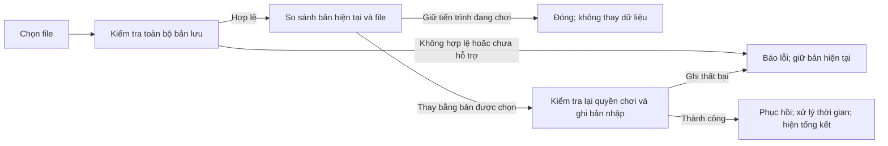

# Chi tiết màn hình và trạng thái — lịch sử UX idle

> **Hồ sơ lịch sử, đối chiếu ngày 08/10/2026:** toàn bộ màn Hạt châu, import/thay save cục bộ, snapshot offline 8 giờ, kết thúc E08/tầng 1 và các con số bên dưới là UX idle v0.6. Giữ chúng để đối chiếu bản vẽ, không là màn hình/hợp đồng máy chủ hiện hành. Hướng tạo đệ tử riêng cũng đã bị thay; không có một khu Hạt châu mặc định dùng chung cho cả ba.

> **Chuẩn hiện hành [GDD 0.28](GDD.md):** cả ba chọn từ đầu, có sẵn Kiếm Khí/Lôi Ấn/Ngự Phong Bộ R01; Hằng Nhạc qua Ngưng Khí, phân hóa từ hành trình Trúc Cơ. UX mới cần [trải nghiệm Hằng Nhạc](HANG-NHAC-NGUNG-KHI-SPEC.md), [hệ thống tu tiên](CULTIVATION-SYSTEM.md), [online](ONLINE-DIRECTION.md) và [mapping UX](UX-MVP-A.md#0-điểm-cần-biên-tập-cho-ux-hiện-hành). Lưu/import client bên dưới không cấp tiến trình hợp lệ; cơ chế tài khoản/lưu bền vững còn cần đặc tả.

**Phiên bản:** 0.1, ngày 06/10/2026.  
**Trạng thái nguồn:** thiết kế UX idle; các hình là bản vẽ tĩnh, chưa chứng minh hành vi runtime.\
**Tham chiếu:** [luồng UX](UX-MVP-A.md), [luật hệ thống](MVP-A-SPEC.md), [bộ UI](UI-COMPONENTS.md), [thư viện bản phác](design/index.html), [fixture](design/mockup-fixtures.json).

Phần lịch sử này mô tả các màn Hạt châu, Hành trang, Cài đặt, tổng kết offline và kết thúc A của bản idle. Năm khu vực, ngân sách 18 nguồn P0/P1 cùng 2 nguồn P2 và fixture E đều là phạm vi cũ; không dùng làm ngân sách UX/ART của tuyến ba người. Icon/hình châu là nét phác SVG; xem [bộ UI](UI-COMPONENTS.md) để phân biệt ý tưởng thành phần có thể dùng lại với nội dung chưa được biên tập.

## 1. Danh mục bản phác bổ sung

| Bản phác | Điểm trong hành trình | Nội dung cần duyệt |
| --- | --- | --- |
| [Hạt châu](design/bead-desktop.svg) | E07 đã hoàn thành | Hình hiện tại, cách ủ nước, chi phí mộng cảnh và xem lại |
| [Hành trang](design/inventory-desktop.svg) | E05 đã hoàn thành | Bốn vật phẩm; chi tiết công pháp; tài nguyên tách khỏi vật phẩm |
| [Cài đặt](design/settings-desktop.svg) | Sau E07 | Cỡ chữ, giảm chuyển động và trạng thái bản lưu |
| [Xem trước bản nhập](design/save-import-desktop.svg) | Bản đang chơi sau E07; bản được chọn sau E05 | So sánh tiến trình trước khi thay thế |
| [Tổng kết offline desktop](design/offline-desktop.svg) | Tự động từ kho trống sau E07 | Vắng 10 giờ, trong giới hạn 8 giờ, hoạt động 24 phút, tu vi +480 |
| [Tổng kết offline mobile](design/offline-mobile.svg) | Cùng snapshot, rộng 360 px | Thông tin và nút một cột |
| [Kết thúc A](design/end-desktop.svg) | E08 đã hoàn thành | Ngưng Khí tầng 1; nước 4, linh dịch 2 và tu vi 480 được giữ |
| [Trạng thái hoạt động](design/activity-states.svg) | Tám ví dụ độc lập | Thiếu đầu vào, đầy kho, luyện thử, mốc sẵn sàng, dừng và đủ đột phá |
| [Trạng thái truyện/vật phẩm](design/story-bead-states.svg) | Sáu ô thiết kế độc lập | Thu gọn, lịch sử, trước nút cuối E08, trạng thái trống và biến thể châu |
| [Trạng thái lưu/offline](design/system-states.svg) | Sáu ví dụ độc lập | Offline không hoạt động, lỗi ghi/nhập, phiên bản chưa hỗ trợ và tab chỉ xem |

Tổng thư viện có **14 bản vẽ UI**, gồm 4 bản trước và 10 bản bổ sung. Đây là các snapshot riêng, không phải chuỗi ảnh của một lượt chơi đã được chạy.

## 2. Hạt châu

### 2.1. Nội dung theo khám phá

| Thời điểm | Hình dạng hiện tại | Nội dung/hành động được hiện |
| --- | --- | --- |
| Chưa hoàn thành E03 | Trạng thái chưa có vật phẩm | Lời dẫn ngắn và `Xem mục tiêu`; giữ kín công dụng chưa biết |
| E03 hoàn thành | Năm đám mây | Mô tả cơ duyên đã gặp; xem lại cảnh hang |
| E04 hoàn thành | Bảy đám mây | Thêm cách ủ nước: 2 nước → 1 linh dịch / 10 giây |
| E05 hoàn thành, E06 chưa xong | Giữ bảy đám mây | Giữ thông tin đã biết; mục tiêu dẫn tới thử công pháp |
| E06 hoàn thành | Chín đám mây | Hiện mục tiêu khám phá tiếp theo và linh dịch hiện có/6 |
| Trong E07 | Theo đoạn đang đọc | Mười đám mây chỉ là lớp chuyển tiếp; đoạn sau dùng hình có dấu |
| E07 hoàn thành, kể cả sau E08 | Có dấu/chữ, không còn mây | Thêm mộng cảnh: 1 linh dịch → 10 tu vi / 10 giây; xem lại lần khám phá |

Hình của vật phẩm sở hữu suy ra từ mốc đã hoàn thành. Hình trong cảnh đang đọc hoặc lịch sử là lớp trình bày của cảnh đó. Mở lại cảnh có năm đám mây không đổi vật phẩm hiện tại về năm đám mây.

### 2.2. Hành động

| Nhãn | Đích/hành vi | Ảnh hưởng hoạt động |
| --- | --- | --- |
| `Xem cách ủ nước` | Tu luyện, đưa thẻ ủ nước vào vùng nhìn | Giữ nguyên; chưa bắt đầu hoặc tiêu hao |
| `Xem mộng cảnh` | Tu luyện, đưa thẻ mộng cảnh vào vùng nhìn | Giữ nguyên; người chơi chọn Bắt đầu tại thẻ |
| `Xem lại lần khám phá mộng cảnh` | Lịch sử E07 đã hoàn thành | Hoạt động tiếp tục; không trừ 6 linh dịch lần nữa |
| `Đọc tiếp` trong mục tiêu khám phá | Mở cảnh mới khi đủ điều kiện hoặc khôi phục cảnh đang đọc | Dừng theo luật đọc truyện mới |

Tên/lai lịch thật và nhân vật chưa được giới thiệu không xuất hiện ở mô tả, tooltip hoặc tên nút. Sau E08, thông tin châu vẫn xem được; các thẻ hoạt động dẫn đến trạng thái đã hoàn thành A.

## 3. Hành trang

Danh sách chỉ lấy vật phẩm đã nhận theo mốc. Bấm tên, icon hoặc `Xem chi tiết` đổi mục đang xem và giữ hoạt động. Không dùng các ô trống để hé lộ tên vật phẩm tương lai.

| Vật phẩm | Nhận khi | Chi tiết và đích điều hướng |
| --- | --- | --- |
| Hạt châu bí ẩn | E03 hoàn thành | Hình theo mốc hiện tại; `Xem hạt châu` |
| Bầu nước | E04 hoàn thành | Vai trò chuẩn bị nước; `Xem lấy nước` tại Tu luyện |
| Công pháp nhập môn | E05 hoàn thành | Trước E06: luyện thử 3 lần; sau E06: luyện thường +1 tu vi / 10 giây; `Xem luyện thổ nạp` |
| Túi trữ vật | E05 hoàn thành | Vai trò vật phẩm truyện và tài nguyên đang có; `Xem tài nguyên` tại Tu luyện |

Tài nguyên hiển thị bằng ba hàng số riêng. Bầu nước/túi không tăng giới hạn 120 nước hoặc 30 linh dịch. Bản A không có trang bị, bán, vứt, gộp hay nâng cấp vật phẩm. Một mục sở hữu giữ một bản qua xem lại và tải lại.

Trước E03, thẻ trống ghi `Vật phẩm nhận được sẽ xuất hiện tại đây` và dẫn về mục tiêu. Mobile dùng danh sách một cột; chi tiết mở dưới mục được chọn hoặc ở một lớp có nút Quay lại. Giữ vị trí trong danh sách khi đóng chi tiết.

## 4. Cài đặt và bản lưu

### 4.1. Thiết lập đọc

| Mục | Đề xuất cho A | Phản hồi |
| --- | --- | --- |
| Cỡ chữ nội dung | 18 px mặc định; chọn 20 hoặc 22 px | Mẫu chữ cập nhật; thẻ tăng chiều cao và xuống dòng |
| Giảm chuyển động | Bật/Tắt | Giảm hiệu ứng, giữ lời dẫn, thông báo và cùng kết quả gameplay |
| Trạng thái lưu | Đã lưu/đang lưu/chưa lưu được, thời điểm gần nhất | Trạng thái bằng chữ, không chỉ đổi màu |

Cỡ chữ áp dụng vào lời dẫn, mô tả và nội dung thẻ. Số liệu chính và tiêu đề giữ thứ bậc dễ đọc; các điều khiển cũng phải vừa nhãn khi chữ tăng. Âm thanh chỉ thêm vào giao diện khi có nội dung âm thanh được tích hợp. Đổi thiết lập không dừng hoạt động hay hoàn thành mốc.

### 4.2. Xuất bản lưu

Tab đang chơi xử lý thời gian tới lúc bấm và xuất trạng thái hiện tại hợp lệ. Khi lỗi ghi trên trình duyệt, người chơi vẫn có thể xuất trạng thái đang giữ trong bộ nhớ của trang; nhãn là `Xuất tiến trình hiện tại`. Tab chỉ xem xuất snapshot hợp lệ mới nhất đã được lưu, không tự xử lý thêm offline.

Xuất file không đổi hoạt động hoặc xóa tiến trình. Sau khi xuất, thông báo ngắn xác nhận file đã được tạo; không dùng lời khẳng định đồng bộ lên máy chủ.

### 4.3. Nhập và xem trước

Hai cột desktop, hai thẻ xếp dọc trên mobile. Mỗi thẻ có cảnh giới, mốc gần nhất đã hoàn thành, số mốc và ba tài nguyên. Tên file giúp phân biệt file đã chọn. Hiện rõ bản được chọn sẽ thay thế toàn bộ tiến trình đang chơi; hai nút có nhãn riêng `Giữ tiến trình đang chơi` và `Thay bằng bản lưu được chọn`.

Mở xem trước giữ hoạt động của bản hiện tại theo trạng thái vốn có. Số của bản hiện tại được cập nhật khi đang chạy; số của file là snapshot chưa mô phỏng thêm. Chưa trừ tài nguyên, nhận offline hoặc thay save chỉ bằng việc chọn file.

Xác nhận thay thế kiểm tra lại dữ liệu và quyền chơi. Chỉ báo thành công khi ghi được bản nhập; nếu ghi thất bại, giữ tiến trình đang chơi và cho thử lại. Sau thành công, xử lý thời gian từ bản được nhập theo giới hạn A, lưu kết quả rồi hiển thị tổng kết. Không cộng kết quả offline của bản cũ vào bản nhập.

Lỗi cần nói được người chơi nên làm gì: `Thứ tự hành trình trong bản lưu không hợp lệ`, `Phiên bản của bản lưu này chưa được hỗ trợ`, hoặc `Không đọc được file này`. Chi tiết kỹ thuật có thể có ở phần mở rộng để hỗ trợ sửa lỗi, không thay lời giải thích chính.

## 5. Tổng kết khi trở lại

### 5.1. Thứ tự thông tin

1. Thời gian vắng mặt → thời gian trong giới hạn → thời gian thực sự có hoạt động.
2. Thay đổi **ròng** và số hiện có của nước, linh dịch, tu vi.
3. Hoạt động/chuỗi đã thực hiện, nơi liên quan và nguyên nhân dừng.
4. Hành động phù hợp với trạng thái hiện tại.

| Trường hợp | Kết quả minh họa | Hành động |
| --- | --- | --- |
| Lấy nước từ kho trống, vắng 8 giờ | 10 phút hoạt động; nước +120; đầy kho | Đóng tổng kết; chọn ủ nước ở Tu luyện |
| Tự động sau E07 từ kho trống, vắng 10 giờ | Giới hạn 8 giờ; 24 phút hoạt động; nước/linh dịch ròng 0, tu vi +480 | `Xem mục tiêu đột phá` |
| Đã dừng chủ động | 0 phút hoạt động; tài nguyên không đổi | Đóng; chọn/tiếp tục hoạt động |
| Đang đọc E05 | 0 phút hoạt động; còn 2 linh dịch trong ví dụ | `Đọc tiếp` đoạn đã lưu; chưa trừ chi phí 1 |
| E08 đã hoàn thành | 0 phút hoạt động; tài nguyên giữ nguyên | Xem hành trình hoặc bản lưu |

Trong ví dụ tự động, mỗi hoạt động lấy/ủ/mộng cảnh chạy 48 chu kỳ. Tổng cộng 144 chu kỳ × 10 giây = 24 phút. Tu vi đủ không đổi cảnh giới: Vương Lâm vẫn là phàm nhân đến khi hoàn tất E08.

`Xem mục tiêu đột phá` đóng tổng kết và đưa về mục tiêu Tu luyện; chưa mở E08. `Đột phá` tại mục tiêu mới mở cảnh. `Đọc tiếp` từ tổng kết khôi phục cảnh chủ động đang đọc. `Đóng tổng kết` chỉ đổi lớp xem, giữ trạng thái hoạt động sau xử lý.

Tổng kết hiển thị kết quả đã xử lý/lưu và không có nút Nhận thưởng. Quãng vượt giới hạn hoặc thời gian chờ sau đạt ngưỡng không được bù ở lần mở tiếp theo. Nếu ghi thất bại, hiện phản hồi chưa lưu được cùng thử lại/xuất; không gắn nhãn Đã lưu cho kết quả chưa ghi.

Mobile dùng ba hàng thời gian, ba hàng tài nguyên và nút toàn chiều rộng. Các mô tả có thể xuống dòng; nội dung được cuộn nếu chiều cao màn hình ngắn hơn bản phác.

## 6. Kết thúc A và hai bước đột phá

| Trạng thái | Cảnh giới | Thao tác và kết quả |
| --- | --- | --- |
| E07 hoàn thành, tu vi 480 | Phàm nhân | `Đột phá` mở E08; dừng hoạt động |
| Đang đọc E08, chưa bấm nút cuối | Phàm nhân | `Hoàn tất đột phá` áp dụng E08; đóng trang trước nút này sẽ khôi phục cảnh |
| E08 hoàn thành | Ngưng Khí tầng 1 | Hiện màn kết quả; mọi hoạt động dừng; giữ tu vi 480 và tài nguyên còn lại |

Màn kết quả đọc theo thứ tự tên nhân vật → Ngưng Khí tầng 1 → hoàn thành bản nhập môn → tài nguyên giữ lại → Xem hành trình/Xuất bản lưu. Hình nền là minh họa, không quyết định kết quả. Lưu trạng thái trước hiệu ứng; giảm chuyển động vẫn thấy kết quả bằng chữ.

Khu vực Tu luyện sau đó giữ trạng thái đã hoàn thành. Người chơi vẫn xem Hạt châu, Hành trang, các địa điểm/hồ sơ đã biết, lịch sử và Cài đặt. Không đặt nút tăng tầng tiếp vào bản A. Khi phát triển B sẽ thiết kế cách nối tiến trình và đổi phiên bản nội dung riêng.

## 7. Phản hồi hoạt động và mục tiêu

Mã ở cột đầu phục vụ thiết kế/dữ liệu. Giao diện dùng lời giải thích ở cột giữa.

| Trạng thái | Người chơi thấy | Hành động chính/hành vi |
| --- | --- | --- |
| `NEED_WATER` | Cần 2 nước cho chu kỳ; hiện còn thiếu bao nhiêu | `Chọn lấy nước`: bắt đầu thủ công |
| `NEED_SPIRIT_WATER` | Cần 1 linh dịch cho chu kỳ tiếp theo | Sau E07: `Bật chuẩn bị tự động`; cũng có thể chọn bước chuẩn bị thủ công |
| `WATER_CAPACITY` | Kho không còn đủ chỗ cho +2 nước | `Chọn ủ nước` nếu chứa được đầu ra; nếu linh dịch cũng đầy, dẫn tới cách dùng đã mở |
| `SPIRIT_CAPACITY` | Linh dịch 30/30; ủ nước đang chờ | Dùng linh dịch cho mốc đã đủ điều kiện hoặc mộng cảnh đã mở |
| `PRACTICE_GATE` | Đã luyện thử 3/3; chưa giữ được tu vi; linh dịch/6 | Nếu đủ, đọc E06; nếu thiếu, chọn lấy/ủ theo đầu vào đang có |
| Mốc đủ điều kiện | Điều kiện đã đạt và chi phí khi hoàn thành | Mở mốc truyện; giữ hoạt động đến lúc người chơi bấm mở |
| `USER_STOPPED` | Đã dừng; tiếp tục bắt đầu chu kỳ mới từ 0 | Tiếp tục lựa chọn nếu hợp lệ; nếu thiếu tài nguyên, hiện hướng chuẩn bị |
| `BREAKTHROUGH_READY` | Tu vi 480/480; Vương Lâm vẫn là phàm nhân | `Đột phá`: mở cảnh, chưa hoàn tất ngay |
| `STORY_ACTIVE` | Đang đọc truyện; hoạt động đã dừng | `Đọc tiếp`; chọn hoạt động bị khóa với lý do này |
| `CONTENT_COMPLETE` | Đã hoàn thành bản nhập môn | Xem hành trình/Xuất bản lưu |

Các nút `Chọn…` là lệnh bắt đầu hoạt động thủ công, xử lý thời gian trước rồi đổi lựa chọn và hủy phần chu kỳ dở theo luật A. Các nút `Xem…` chỉ điều hướng. Chọn hoạt động đang chạy giữ tiến độ. Không hiện nút bắt đầu khi đầu vào/đầu ra vẫn không hợp lệ.

Trong trường hợp nhiều lý do cùng tồn tại, thông báo ưu tiên: tab chỉ xem → A hoàn thành → cảnh mới đang đọc → đủ đột phá → dừng chủ động → lý do chờ của hoạt động. Mục tiêu đủ điều kiện vẫn có thể hiển thị cạnh hoạt động chạy/chờ; tự động không mở mốc.

Các snapshot đầy kho trong bảng phác có một hướng xử lý hợp lệ. Trường hợp nước 119/120 cũng chờ vì không chứa được toàn bộ +2, dù chưa đạt 120. Nếu trước E07 mà linh dịch đầy, chỉ đề xuất mốc đã được giới thiệu; không hé lộ mộng cảnh để giải quyết kho.

## 8. Lỗi và tab chỉ xem

| Tình huống | Trạng thái cần giữ | Hành động |
| --- | --- | --- |
| Lưu thất bại | Trạng thái hiện tại trên trang; phân biệt với lần ghi thành công gần nhất | Thử lưu lại; xuất tiến trình hiện tại |
| Nhập không hợp lệ | Tiến trình đang chơi không bị thay thế | Chọn file khác; giữ bản hiện tại |
| Phiên bản chưa hỗ trợ | Không tự bỏ mốc/sửa file để ép nhận | Chọn file khác; giữ bản hiện tại |
| Tab chỉ xem | Snapshot mới nhất đã nhận; không mô phỏng/ghi tài nguyên | Xem hành trình; xuất bản đã lưu; chuyển quyền chơi |

Chuyển quyền chơi chỉ bật điều khiển sau khi tab cũ ngừng ghi và tab mới nhận snapshot mới nhất. Trong lúc chờ, giữ nhãn chỉ xem; nếu chưa nhận được quyền, tiếp tục chế độ xem và nêu trạng thái. Tab chỉ xem không có thao tác chọn hoạt động, hoàn thành mốc, nhập thay tiến trình hay bắt đầu lượt mới.

## 9. Bố cục nhỏ, bàn phím và thứ tự focus

Các thông số là mục tiêu thiết kế, cần kiểm tra trong giao diện thật:

- 360 px: một cột; Hạt châu ưu tiên cách dùng sau hình gọn; Hành trang ưu tiên tên/chi tiết; so sánh save xếp hai thẻ dọc; tổng kết và kết thúc dùng nút toàn chiều rộng.
- Bảng trạng thái là trang duyệt thiết kế; các ô sẽ trở thành trạng thái của thành phần trong game, không xuất hiện đồng thời thành một màn chơi.
- Nhãn điều kiện nằm ngoài nút khóa để luôn đọc được. Thông báo chờ không tự che thao tác đang dùng.
- Khi mở lớp truyện/tổng kết/xem trước save, focus tới tiêu đề; Tab đi qua các điều khiển trong lớp theo thứ tự đọc. Khi đóng, trả focus về nút mở hoặc đích vừa điều hướng.
- Tại xem trước save, hành động giữ tiến trình đứng trước thay thế trong thứ tự bàn phím. Phím Enter kích hoạt nút đang focus; không tự thay save khi chọn file.
- `Để đọc sau` giữ cảnh chủ động. Lịch sử có thao tác đóng rõ ràng. Tăng chữ 22 px, zoom và bàn phím không được làm mất điều kiện/nút cuối.

## 10. Trường hợp nghiệm thu khi có prototype

| ID | Tình huống | Kết quả cần kiểm chứng |
| --- | --- | --- |
| A-UX-11 | Mở Hạt châu trước E03 và sau từng mốc | Chỉ thấy kiến thức/hình đúng giai đoạn; lịch sử không đổi hình hiện tại |
| A-UX-12 | Sau E05 xem công pháp, sau E06 xem lại chi tiết | Lời hướng dẫn đổi từ luyện thử sang luyện thường; không nhận lại vật phẩm |
| A-UX-13 | Chọn file hợp lệ, hủy xem trước | Tiến trình đang chơi tiếp tục; file chưa thay dữ liệu hoặc nhận offline |
| A-UX-14 | Xác nhận thay save khi ghi thất bại hoặc quyền chơi đổi | Giữ bản đang chơi, không báo thay thành công; không có hai tab cùng ghi |
| A-UX-15 | Offline tự động theo snapshot 10 giờ | Phân biệt 10 giờ/8 giờ/24 phút; +480 tu vi ròng; vẫn phàm nhân |
| A-UX-16 | Lấy nước ở 119/120 hoặc linh dịch đầy trước E07 | Không cấp đầu ra vượt kho; nút xử lý hợp lệ và không lộ khả năng tương lai |
| A-UX-17 | E08 trước/sau nút cuối, kể cả tải lại | Trước nút cuối phàm nhân; sau nút cuối Ngưng Khí/1 và tài nguyên giữ lại |
| A-UX-18 | Dùng bàn phím, chữ 22 px và màn hình 360 px | Đọc/bấm được các màn bổ sung; lớp xem trả focus đúng nơi |

Đã kiểm tra dữ liệu minh họa và hình render không thay cho nghiệm thu trên. Bước tiếp theo sau duyệt UX là chọn công nghệ và dựng prototype vòng lấy nước → ủ nước → tu luyện → đột phá, rồi ghép truyện/lưu/offline.
