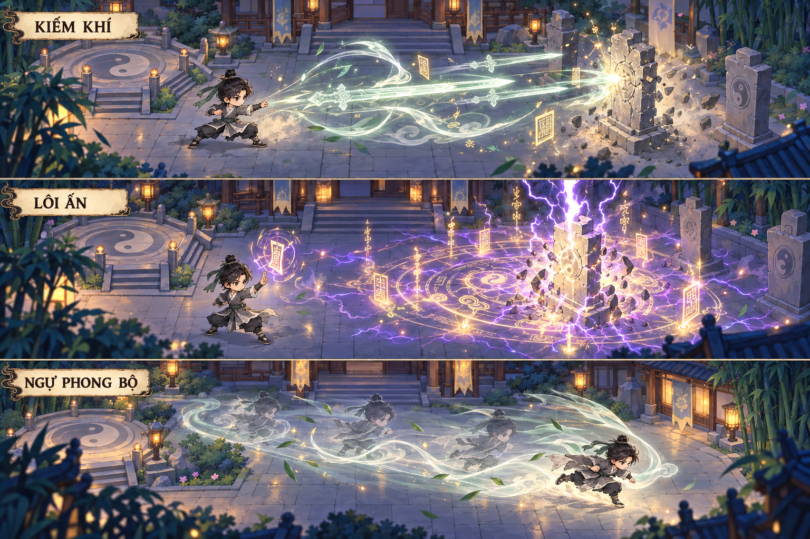

# Phân bổ ART/VFX kỹ năng theo cảnh giới

**Phiên bản:** 0.16 · 08/10/2026.
**Phạm vi:** thư viện ART/VFX MMORPG dùng làm nền tích hợp cho ba nhân vật người chơi của [GDD 0.28](GDD.md), chọn từ đầu; bộ thi triển hiện dùng Vương Lâm chibi hướng Đông. Chưa có mapping kỹ năng/pose đầy đủ cho từng actor hoặc tích hợp client/server.\
**Đã được người phát triển chấp nhận:** bộ ba Kiếm Khí, Lôi Ấn, Ngự Phong Bộ; chất lượng và ngôn ngữ mỹ thuật của [bảng Ngưng Khí v1](design/vfx/ngung-khi-approved-art-v1.png); cảnh giới cao tăng độ phức tạp và uy lực từ nền này.  
**Đợt ART đã đóng:** P1 Kiếm Khí → P2 Lôi Ấn / Ngự Phong Bộ → P3 Trúc Cơ → P4 Kết Đan → P5 Nguyên Anh / Hóa Thần đã sản xuất/chấp nhận cả **15 skill, 646 PNG, 76 atlas** ngày 07/10. Ma trận dưới là hồ sơ ART và hợp đồng tích hợp; không mở cảnh giới/skill gameplay chỉ từ việc có asset. Ưu tiên hiện tại vẫn là map, VFX chưa tích hợp runtime.

**Mốc P1 đã bàn giao:** chủ dự án đã duyệt bản frame-by-frame và yêu cầu lưu thành bộ. Release Kiếm Khí 1.0.0 đã đóng ZIP, đối chiếu SHA-256 từng file. [Gói Kiếm Khí mẫu](design/vfx/frame-by-frame-r01/PIPELINE.md) có 12 pose Vương Lâm hướng đông, 6 frame charge, 6 frame projectile và 12 frame hit/tan; 36 PNG, 4 atlas, timeline/frame event, adapter trình bày và preview/editor. Thân giữ cao khoảng 80 px như bộ idle 64 × 96; canvas cast 96 × 96 thêm padding cho tay/tóc. Vương Lâm là mẫu thi triển; bộ pose một hướng không đại diện animation combat đầy đủ của ba lựa chọn người chơi. Các hướng khác, SFX, tích hợp và benchmark runtime còn cần sản xuất/kiểm tra.

## 1. Chuẩn mỹ thuật

Nguồn được tạo bằng imagegen tích hợp, dùng concept đệ tử nam và sân môn phái làm tham chiếu. Hình là concept tổng hợp, không phải sprite sheet, map hay texture VFX đã tách lớp. Bản nguồn được giữ nguyên trong thư mục generated_images; bản sao ở đây dùng làm chuẩn ART cho phiên thiết kế này.

Giữ camera orthographic top-down ba phần tư, nhân vật chibi khoảng 2,5–3 đầu, nền stylized 2D. Nhân vật runtime giữ cạnh pixel và điểm chân theo bộ sprite hiện tại; VFX dùng nét vẽ mềm, lõi sáng sắc, không áp palette 24 màu của nhân vật lên toàn bộ linh khí. VFX và sprite có quy tắc sampling riêng, cần xem chung ở cỡ hiển thị thật.

Các dấu nhận diện xuyên suốt:

- **Kiếm:** ngọc trắng, celadon, lõi ngà; hình kiếm thanh, đầu nhọn, đường khí như nét thư pháp.
- **Lôi:** bạc tím, vàng phù; phù lệnh, vòng trận nằm trên mặt đất, nhánh sét có cấu trúc và tâm đánh rõ.
- **Phong:** ngọc nhạt, trắng lụa; dải khí theo áo/chân, tàn ảnh có nhịp, lá trúc thưa.
- **Chất lượng:** pose thi triển, lực kéo tay áo, ánh sáng cục bộ lên người/nền, mảnh linh quang tại điểm chạm, phần tan khí có diễn hoạt. Bụi/mảnh vật liệu chỉ dùng cho môi trường phù hợp, không đặt trong hit chung cho quái, boss, nhân vật và PvP.

Mức độ đẹp của nét, silhouette và điểm chạm được giữ từ nhập môn. Cảnh giới tăng khả năng tổ chức linh khí: đường đơn → cấu trúc phối hợp → lõi ổn định → linh ảnh → ý cảnh. Không dùng số lượng hạt hoặc độ sáng làm thước đo duy nhất.

## 2. Phạm vi nguyên tác và thiết kế game

Thứ tự Ngưng Khí → Trúc Cơ → Kết Đan → Nguyên Anh → Hóa Thần theo phần giới thiệu cảnh giới ở [Tiên Nghịch, chương 20 — Wuxiaworld](https://www.wuxiaworld.com/novel/renegade-immortal/rge-chapter-20), cũng được ghi trong [GDD](GDD.md). Đây là năm mốc để lập kế hoạch ART đợt đầu, không phải toàn bộ hệ cảnh giới của truyện.

Tên nhánh tiến hóa, hình kiếm/phù/linh ảnh, thời điểm mở kỹ năng và hiệu ứng mô tả dưới đây là **sáng tạo cho game**. Chưa gán chúng thành thuật pháp nguyên tác hoặc xác nhận năng lực của mọi tu sĩ ở từng cảnh giới. Vật phẩm/thuật/cơ duyên và quyền mở kỹ năng của từng nhân vật theo GDD/hệ thống tu tiên; dùng chung thư viện VFX không tự cấp năng lực nguyên tác hoặc cùng một bộ skill cho cả ba.

Cảnh giới sau Hóa Thần có gói thiết kế riêng sau khi xác định phạm vi nội dung. Giai đoạn này không sản xuất trước asset cho những mốc chưa có vòng chơi.

## 3. Ma trận tiến hóa: 15 biến thể chủ lực

Các tên sau Ngưng Khí là tên làm việc cho ART, chưa chốt tên kỹ năng trong UI. Mỗi hàng có một chủ đề mới; cả ba nhánh giữ nhận diện ban đầu.

| Mốc / mã | Chủ đề thị giác | Nhánh Kiếm | Nhánh Lôi | Nhánh Phong |
| --- | --- | --- | --- | --- |
| Ngưng Khí / R01 | Linh khí thành nét | **Kiếm Khí:** một kiếm quang chủ đạo, 2–3 vệt dư ảnh nhẹ, cung khí có đầu/đuôi rõ | **Lôi Ấn:** một phù lệnh, trận gọn, một nhánh sét chủ đạo, lóe sáng ở tâm | **Ngự Phong Bộ:** bước lướt ngắn, 2–3 tàn ảnh, dải khí ôm chân/áo, lá trúc thưa |
| Trúc Cơ / R02 | Linh khí được tổ chức | **Ngự Kiếm:** ba kiếm ảnh vào đội hình rồi xuất cùng một hướng; thêm đường dẫn nối tay và kiếm | **Liên Lôi Ấn:** ba dấu phụ hội tụ vào tâm; sét có trình tự, rõ điểm chính/phụ | **Hồi Phong Bộ:** dải khí xoắn thành vòng ở điểm xuất phát, vệt lướt có đường hồi cuộn khi tan |
| Kết Đan / R03 | Pháp lực có lõi | **Kiếm Luân:** hạch sáng nhỏ điều khiển vòng kiếm, khép đội hình rồi bung theo trục đánh | **Lôi Hạch:** điểm tụ cô đặc giữa trận nhiều lớp, chớp nội bộ rồi một nhịp xả mạnh | **Phong Luân:** vòng khí mỏng quanh thân, dòng gió ép gọn thành đuôi dài khi lướt |
| Nguyên Anh / R04 | Pháp thuật có linh ảnh | **Kiếm Linh Ảnh:** linh ảnh ngắn đồng bộ thủ quyết, nhiều đường kiếm tạo một kết cấu có chủ đích | **Linh Ảnh Lôi Ấn:** dấu tay linh thể giữ phù, các nhánh sét dệt vào cùng vùng đánh | **Linh Ảnh Phong Bộ:** bóng khí tách nhẹ khỏi thân ở đầu nhịp rồi nhập lại khi đáp, đường lướt hai tầng |
| Hóa Thần / R05 | Ý cảnh chi phối cách thể hiện | **Ý Cảnh Kiếm:** khoảng tĩnh ngắn, một nét kiếm cô đọng, khí ngọc cong và phù vàng quanh đường kiếm | **Ý Cảnh Lôi:** phù và tiếng sét có nhịp dứt khoát; sáng/tối thay đổi cục bộ trong vùng hiệu lực | **Ý Cảnh Phong:** thân gần như tĩnh trước khi bước, khí và lá chuyển động theo đường đã đi; dư âm ý cảnh ở điểm đáp |

Linh ảnh ở R04 là hình phụ trợ ART ngắn, không phải nhân vật triệu hồi có AI hoặc một bản sao gây sát thương đã được duyệt. Ý cảnh R05 là hướng mỹ thuật cần gắn với công pháp/nội dung cụ thể; tránh tự gán cùng một ý cảnh cho toàn bộ người chơi.

Uy lực thực tế, số mục tiêu, khả năng bay, phạm vi sát thương và miễn nhiễm phải do thiết kế combat quyết định. Bản ART được chỉnh theo luật đó; tàn ảnh và kiếm ảnh không tự tạo thêm hit.

## 4. Phân bổ hiệu ứng trong một lần ra chiêu

Mỗi kỹ năng được dựng thành bốn phần. Khoảnh khắc đẹp nhất là lúc xuất chiêu/điểm chạm; phần chuẩn bị và kết thúc vẫn có chuyển động được thiết kế.

| Phần | Kiếm | Lôi | Phong |
| --- | --- | --- | --- |
| Tụ / báo trước | Thủ quyết, khí chạy về ngón tay, kiếm quang hiện nét | Phù nổi cạnh tay, đường biên vùng đánh hiện trước tia sét | Hạ trọng tâm, khí cuốn cổ chân, tay áo kéo theo hướng |
| Xuất chiêu | Mũi kiếm và thân kiếm đi trước dải khí | Phù khóa tâm, tia chính dẫn xuống | Thân lướt dẫn dải khí, tàn ảnh lưu phía sau |
| Chạm / đáp | Lõi lóe nhỏ, khí hồi và mảnh sáng theo hướng va chạm | Lóe bạc tại tâm, nhánh phụ và khí trên nền | Chân tiếp đất, vòng khí mở mỏng, áo hồi lực |
| Tan | Kiếm và nét khí rã từ đuôi về đầu | Phù vỡ thành nét, trận tắt theo lớp | Tàn ảnh nhạt dần, dải khí cuộn rồi tan |

Nhịp tham khảo cho R01, dùng trong animatic chứ chưa là thông số chiến đấu:

| Chiêu | Tụ | Xuất / lướt | Chạm / đáp | Tan | Tổng hình ảnh tối đa |
| --- | --- | --- | --- | --- | --- |
| Kiếm Khí | 0,18 s | 0,14 s | 0,08 s | 0,28 s | 0,68 s |
| Lôi Ấn | 0,30 s | 0,08 s | 0,12 s | 0,40 s | 0,90 s |
| Ngự Phong Bộ | 0,06 s | 0,18 s | 0,08 s | 0,28 s | 0,60 s |

Phần chạm có thể phát sinh tại mục tiêu trong lúc phần xuất vẫn đang diễn ra. Thời điểm hit/di chuyển do sự kiện combat xác nhận; vòng đời trang trí không khóa điều khiển hoặc kéo dài cooldown. Animation nhân vật và VFX tách thành hai track để chỉnh nhịp phù hợp.

## 5. Độ phức tạp và khả năng đọc trong MMO

| Mốc | Cấu trúc chính tại đỉnh chiêu | Điểm nhấn được giữ |
| --- | --- | --- |
| R01 | Một hình chủ đạo + 2–3 lớp phụ nhẹ | Nét khí tinh, pose rõ, một tâm sáng |
| R02 | Cụm 3 hình phối hợp + một đường điều khiển | Đội hình và trình tự ra chiêu |
| R03 | Một lõi + cấu trúc xoay/khép + nhịp xả | Cảm giác cô đặc, sức nén trước khi bung |
| R04 | Một linh ảnh thoáng + cấu trúc kỹ năng | Tách thân/linh ảnh rõ, hướng đánh đọc được |
| R05 | Một biểu hiện ý cảnh + một đòn chủ đạo | Khoảng tĩnh, độ cô đọng và phản hồi môi trường |

Đây là số cấu trúc ART, không phải ngân sách draw call/particle đã đo. Kích thước trang trí quanh người và hiệu lực gameplay dùng hai tham số riêng. Ngưng Khí vẫn đạt chất lượng bản concept, với vùng sáng mạnh bám vào đường đánh/điểm chạm thay vì sáng đồng đều cả sân.

Ba chế độ trình bày dùng cùng nhận diện:

- **Chiêu của mình / mục tiêu đang theo dõi:** pose, lõi, dải chính, trang trí, phản hồi mặt đất đầy đủ.
- **Chiêu đồng đội khi đông người:** giữ lõi và hướng, giảm lá/hạt/dư ảnh, giảm độ phủ bloom và nét phụ. Không đổi màu toàn bộ chiêu chỉ vì quan hệ đội.
- **Chiêu địch / nguy hiểm:** giữ biên vùng hiệu lực, hướng và báo trước với độ tương phản ổn định; trang trí có thể giảm. Dấu quan hệ/thù địch là lớp hình và UI riêng.

Đại chiêu và đột phá có gói riêng với trường cảnh, nhịp camera hoặc hiệu ứng trời đất theo ngữ cảnh. Chiêu cơ bản ở R05 vẫn có thời lượng và vùng ảnh phù hợp chiến đấu thường xuyên. Dấu nguy hiểm được khóa theo vùng gameplay, không lấy rìa bloom làm ranh giới.

## 6. Phân bổ asset và nguồn dùng lại

| Gói | Nội dung cần sản xuất | Dùng lại | Trạng thái |
| --- | --- | --- | --- |
| REF-R01 | 1 bảng concept tổng hợp | Chuẩn palette, nét, chất sáng cho mọi mốc | Đã có và được chấp nhận |
| BASE | Nét khí, hạt sáng, hit ma thuật, bóng/ánh sáng cục bộ; quy tắc blend và điểm neo | Cho cả ba nhánh; biến đổi theo chiêu | Có thư viện sequence/event, pool, atlas và các hit/ground riêng theo nhánh; chưa chuẩn hóa LOD đông người |
| R01-SWORD | Kiếm quang, cung khí, dấu tụ, lõi chạm, mảnh kiếm, nét tan; timing board và icon | Bộ nét và lõi cho R02–R05 | Có 24 frame FX trong 3 atlas và preview frame-by-frame; icon/hướng khác và runtime chưa hoàn tất |
| R01-THUNDER | Phù, trận, sét và hit/tan; 30 frame FX, 12 pose | Phù, tia và biên trận cho R02–R05 | 42 PNG / 5 atlas, P2 đã được chủ dự án chấp nhận; icon/hướng khác/runtime chưa hoàn tất |
| R01-WIND | Khởi phong, đuôi gió, đáp/tan; 24 frame FX, 12 pose | Dải khí, lá, vòng đáp cho R02–R05 | 36 PNG / 4 atlas, P2 đã được chủ dự án chấp nhận; icon/hướng khác/runtime chưa hoàn tất |
| POSE-R01 | Ba bộ pose: kiếm chỉ, kết ấn, lướt/đáp; riêng cho mẫu nam/nữ | Pose cơ sở cho biến thể cao; thêm pose khi đổi cấu trúc chiêu | Có 36 pose Vương Lâm đông cho ba chiêu; thân tối đa 80 px, canvas 96×96 hoặc 112×96 có padding; hướng khác/nữ chưa sản xuất |
| UPGRADE-R02 | 3 biến thể, thêm đội hình kiếm / dấu lôi phụ / đường hồi phong | Tái dùng BASE và R01 | 132 PNG / 15 atlas; chủ dự án đã chấp nhận |
| UPGRADE-R03 | Kiếm Luân / Lôi Hạch / Phong Luân, thêm lõi và nén–xả | 84 PNG nguyên byte từ R02 | 130 PNG / 15 atlas, 46 FX mới; đã chấp nhận, pack 1.0.1 |
| UPGRADE-R04 | 3 biến thể, một ngôn ngữ linh ảnh chung và chuyển động đồng bộ | 116 PNG R03 dùng lại nguyên byte | 156 PNG / 19 atlas; linh ảnh V2 được chấp nhận, pack 2.0.1 |
| UPGRADE-R05 | 3 biến thể, gói biểu hiện ý cảnh theo công pháp | Lõi nhận diện của mỗi nhánh | 114 PNG / 14 atlas, V3 58 frame mới / 56 giữ nguyên; R05 đã được chấp nhận |

R01 có **18 nhóm nguồn đặc trưng** (6/nhánh), **4 nhóm nền dùng chung**, **3 icon** và **3 timing board**. Nhóm nguồn có thể chứa nhiều frame/texture; đây không phải tổng số PNG hoặc atlas cuối cùng. Không đóng đinh số frame/độ phân giải trước khi kiểm tra cỡ hiển thị và ngưỡng hiệu năng.

Mỗi skill có metadata riêng: mã nhánh/cảnh giới, pivot/cast socket, trục hướng, lớp ground/body/air, blend, lifetime, sự kiện cast/impact/end, vùng gameplay và vùng trang trí, phiên bản chất lượng đầy đủ/rút gọn. Khung VFX độc lập khung nhân vật 64 × 96; dùng lưới/anchor nhân vật để gắn pose, không ép toàn bộ chiêu vào frame nhỏ đó.

Nguồn ART sạch có alpha và lớp riêng; không lấy ảnh concept tổng hợp rồi dùng trực tiếp như một kỹ năng runtime. Giữ biểu tượng phù văn là họa tiết thiết kế game, không tự ghi nhãn kinh văn có thật. Asset mới được đặt trong thư mục VFX riêng; không ghi đè sprite, nền hoặc manifest hiện có.

## 7. Thứ tự sản xuất đã hoàn thành trong đợt ART

1. **P1 — Kiếm Khí R01:** làm một chiêu đạt chuẩn trước: timing board bốn phần, pose, nguồn tách lớp, animatic trên nền sáng và tối. Dùng chiêu này kiểm nét, bloom, điểm neo và kích thước.
2. **P2 — Lôi Ấn và Ngự Phong Bộ R01:** hoàn thiện đủ ba chiêu; kiểm đường biên trận, tiếp đất và dư ảnh. Chốt BASE bằng các thành phần thực sự dùng được ở cả ba.
3. **P3 — Trúc Cơ:** làm ba biến thể cùng một bảng so sánh R01/R02, xác nhận thấy khác cảnh giới dù bỏ nhãn.
4. **P4 — Kết Đan:** thêm lõi và cơ chế khép/bung trong hình; kiểm cảm giác cô đặc, không tăng thời gian sáng phủ màn hình.
5. **P5 — Nguyên Anh, rồi Hóa Thần:** làm theo từng mốc nội dung; gắn linh ảnh/ý cảnh với hồ sơ công pháp. Mỗi mốc được so cùng mốc trước tại một camera/cỡ người.

Các bước P1–P5 trên ghi trình tự đã thực hiện, không là backlog sản xuất đang mở. Mỗi gói bàn giao có nguồn/prompt, PNG alpha, metadata, atlas, preview và checksum. Tích hợp gameplay/hướng/actor/SFX/icon/LOD là hạng mục riêng khi chuyển ưu tiên khỏi map.

## 8. Tiêu chí nghiệm thu

- Xem ở camera và kích thước nhân vật thật: nhận ra kiếm/lôi/phong qua hình, kể cả khi tắt nhãn và giảm màu.
- Nhịp tụ/xuất/chạm/tan liền mạch; thân người, điểm chân và hướng đánh ổn định; tay áo góp vào lực.
- Nét và ánh sáng giữ chất lượng của REF-R01 trên nền ngày/đêm; hạt nhỏ không thành nhiễu, bloom không xóa hình kiếm/phù.
- Mỗi cảnh giới có cấu trúc khác mốc trước; không phụ thuộc tăng kích thước/màu để nhận biết.
- Vùng nguy hiểm và vị trí mục tiêu vẫn đọc rõ khi nhiều chiêu cùng xuất hiện; kiểm cả bản đầy đủ và bản rút gọn.
- Preview phải có một người, nhóm nhỏ và đám đông mô phỏng; cấu hình kiểm tra cụ thể chốt khi đã có render VFX để đo.
- Khi tích hợp bộ ba, giữ cùng chất lượng thị giác; đo socket/pivot/pose riêng theo actor và hướng. Hai mẫu đệ tử preview không quyết định roster/skill của GDD mới.
- Concept tĩnh, animatic và VFX runtime được ghi trạng thái riêng; chỉ báo hoàn thành runtime sau khi đã tích hợp và xem trong game.

## 9. Bộ đã đóng gói và bước tiếp theo

Chủ dự án đã chấp nhận Ngưng Khí, Trúc Cơ, Kết Đan và Nguyên Anh sau redesign linh ảnh. [Thư viện 15 skill](design/vfx/skill-library.html) có ZIP riêng, PNG/source/prompt, atlas, timeline và manifest SHA-256. Pack R02/R03 1.0.1, R04 2.0.1 ghi duyệt; source và các ZIP đã khóa giữ nguyên.

[Bộ Nguyên Anh](design/vfx/NGUYEN-ANH-KIT.md) có 156 PNG / 19 atlas: nguồn 2.0.0 dùng linh ảnh khí ấn nửa thân, 18 frame vẽ lại và 138 PNG khác giữ nguyên từ V1. Linh ảnh cao tối đa 48 px, phía sau body; Phong nhập vào vùng thân và bỏ body echo. Bản đã được chấp nhận, pack 2.0.1 khóa nội dung duyệt.

[Bộ Hóa Thần](design/vfx/HOA-THAN-KIT.md) đã sản xuất **114 PNG / 14 atlas**, V3 có 58 frame mới và 56 PNG nguyên byte từ R05 V2. Ý Cảnh Kiếm có nhịp tĩnh và một kiếm chủ đạo; Ý Cảnh Lôi dùng ấn nền/tương phản cục bộ; Ý Cảnh Phong giữ bước rồi lưu khí/lá trên đường đã đi. Chủ đề công pháp là ART cho game, chưa xác nhận thuật pháp canon hoặc công pháp gameplay.

Giữ thân Vương Lâm tối đa 80 world px và world 960×640; frame-by-frame 24 FPS. Host cung cấp hit/projectile/movement/arrival; effect không tạo AI/damage/miễn nhiễm. Thư viện hiện tại **646 PNG / 76 atlas**; ZIP chung giữ thêm R04 V1 và R05 V1/V2 để kiểm nên archive **1032 PNG / 123 atlas**, có phần dùng lại giữa cảnh giới/phiên bản.

**87 kiểm tra tự động đạt**, gồm RGBA/rect/hold/opacity, nguồn và gói cũ nguyên byte, hit/miss/trễ, vị trí boss, host movement, linh ảnh, local lighting và pool. Có 30 capture R05 cục bộ tại 1×/2× và ba bảng R04/R05; tương tác browser chưa xác minh. Chưa có SFX/icon, toàn bộ hướng, crowd LOD, benchmark hoặc tích hợp client/server.

P5 đã có ART cả Nguyên Anh và Hóa Thần; **R04 được chấp nhận, R05 được chấp nhận**. ART P5 đã được chấp nhận/đóng; chưa hoàn tất tích hợp runtime hoặc các hạng mục gameplay. [Trạng thái từng mốc](design/vfx/library.json), [brief P5](design/vfx/milestones/P5-NGUYEN-ANH.md). Hướng/SFX/icon/LOD và tích hợp theo luật combat cần hạng mục riêng; đợt ART đã đóng và ưu tiên vẫn là map, không tự mở sản xuất cảnh giới mới.

R05 V2 sửa phản hồi thiếu lực: silhouette áp lực có hướng, impact riêng, xuất nhanh, preview tốc độ thật 1×; camera/hit-stop chỉ bổ trợ trình bày. Các asset/ZIP V1 đã khóa giữ nguyên. R05 V2 là bản lịch sử đã được thay bằng V3 theo phản hồi mỹ thuật.

R05 V3 khôi phục hướng mỹ thuật theo ảnh tham chiếu: kiếm ngọc sáng cùng hai bóng kiếm dẫn khí; sét tím tự nhiên và trận phù vàng; lụa khí/lá với tàn ảnh nhẹ. Một đòn chủ đạo, không tăng số damage event từ trang trí. Phong preview lướt F10→F15; tàn ảnh chỉ từ snapshot host có timestamp. Feedback camera mặc định tắt. 30 capture V3 ở 1×/2×, ba so sánh V2/V3; đã được chủ dự án chấp nhận.

**Đóng đợt ART ngày 07/10/2026:** chủ dự án chấp nhận Hóa Thần V3, yêu cầu đóng gói và kết thúc VFX/skill nhập môn. Chốt P1–P5, 15 skill / 646 PNG / 76 atlas. Source R05 3.0.0 không đổi, pack 3.0.1 lưu duyệt. [Bàn giao](design/vfx/STARTER-VFX-HANDOFF.md). Không tiếp tục sản xuất cảnh giới mới trong đợt này. Runtime/SFX/hướng đầy đủ/LOD là hạng mục riêng.
