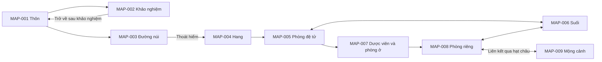

# Hệ thống map — MVP và dài hạn

> **Archived reference:** current gameplay scope is [RPG-A](MVP-RPG-A.md), with the [new backlog](MVP-BACKLOG.md).

> **Điều chỉnh MMORPG v0.10:** khu môn phái là vùng khởi đầu; nhân vật pixel art trên nền stylized 2D/top-down ba phần tư đã chọn sau thử Vương Lâm. Sân v2 (bộ cũ đã xóa) giữ tham chiếu nền/bố cục; cần thử cách ghép pixel theo [WORLD-VISUAL-SPEC](WORLD-VISUAL-SPEC.md). Các 9/13 node dưới đây chỉ tham chiếu chính truyện. Phạm vi A/B và ngân sách map/sprite/animation cần xét lại.

**Phiên bản:** 0.2, ngày 06/10/2026.  
**Trạng thái:** lộ trình A → B đã chốt; chi tiết map là thiết kế chờ triển khai và chơi thử.  
**Tham chiếu:** [GDD](GDD.md), [asset](ASSET-PLAN.md), [gặp gỡ](ENCOUNTERS.md).

## 0. Phân biệt map thế giới và map chính truyện

| Lớp | Cách người chơi sử dụng | Trạng thái |
| --- | --- | --- |
| Khu môn phái chung | Nhân vật pixel đi lại trên nền stylized 2D, gặp đồng môn/điểm tương tác | Top-down ba phần tư đã chọn; cách ghép/bố cục/điều khiển cần thiết kế |
| Vùng RPG mở rộng | Khám phá, nhiệm vụ và chiến đấu theo arc | Mục tiêu dài hạn đề xuất, phân bổ A/B cần xét lại |
| Chính truyện Vương Lâm | Mở chương/cảnh cá nhân qua mốc/nút | Dùng đồ thị 9/13 node dưới đây làm tham chiếu |

Vị trí NPC/đạo cụ ở khu đi lại là bố cục game cần biên tập, chưa là bản đồ địa lý được xác minh từ nguyên tác.

## 1. Phạm vi theo lộ trình A → B

| Giai đoạn | Nội dung | Khối lượng chính | Vị trí trong lộ trình |
| --- | --- | --- | --- |
| A — MVP nhập môn | E01–E08, đến Ngưng Khí tầng 1; 9 địa điểm; 1 sinh vật sự kiện và 2 thử thách môi trường | Vòng idle, map theo nút, cổng truyện, save/offline; 18–20 nguồn đồ họa | Phạm vi bản đầu đã chọn |
| B — Mở rộng có giao đấu | Thêm luyện thuật, hậu sơn và mốc giao lưu đầu; 13 địa điểm tổng cộng; 2 mẫu mục tiêu luyện thuật và 1 đối thủ giao đấu thực | Thêm độ thành thạo, HP/linh lực khi giao đấu, bộ mô phỏng combat, kết quả trận; tối đa 28 nguồn đồ họa tổng cộng | Giai đoạn kế tiếp đã chọn, sau khi A hoàn thành |
| C — Bản nhỏ có săn/farm | Thêm một gói arc với 6–8 địa điểm nữa, khoảng 4 mẫu đối thủ thường, 2 biến thể tinh anh và 1 gặp gỡ lớn | Combat lặp, phần thưởng, hồi phục, cân bằng tài nguyên và ngữ cảnh cốt truyện từng khu | Hướng dài hạn, chưa lên lịch |

**Đã chốt: A → B.** A kiểm chứng vòng tài nguyên và hành trình; B bổ sung luyện thuật và trận đấu nhỏ sau đó. Điều kiện chuyển giai đoạn gồm hoàn thành hành trình, kiểm tra save/offline và chơi thử, được ghi trong [MVP-BACKLOG.md](MVP-BACKLOG.md).

C là hướng có thể phát triển sau hai bước trên. Địa điểm và nhân vật của phần farm phải được biên tập theo arc; số mẫu trong bảng là ngân sách hệ thống, chưa phải danh sách sinh vật nguyên tác đã duyệt.

## 2. Map theo nút phù hợp game idle

Mỗi địa điểm là một node với ảnh, mô tả, hoạt động, gặp gỡ và điều kiện mở. Chọn node để xem hoặc chọn hoạt động; thay đổi địa điểm theo mốc truyện được trình bày bằng sự kiện.

Cách này cho phép thêm khu vực bằng dữ liệu và dùng lại giao diện. Nền minh họa thể hiện không gian, còn kết nối giữa node thể hiện hành trình.

Đồ thị MVP là bản trình bày tiến trình; vị trí node trên màn hình là bố cục game, chưa phải bản đồ địa lý được xác minh từ tiểu thuyết.

Mộng cảnh thuộc lớp không gian riêng, không đặt như địa điểm thông thường trên bản đồ Triệu Quốc. Mũi tên tới mộng cảnh là liên kết đặc biệt qua hạt châu.

## 3. Hồ sơ 9 địa điểm MVP

| ID | Địa điểm | Xuất hiện ở mốc | Vai trò | Hoạt động sau điều kiện mở | Gặp gỡ | Nền |
| --- | --- | --- | --- | --- | --- | --- |
| MAP-001 | Thôn và nhà Vương Lâm | E01 | Mở đầu và động lực gia đình | Đọc truyện/hồ sơ; xem lại khi đã đi tiếp | Không | AS-ENV-001 |
| MAP-002 | Cổng và khu khảo nghiệm Hằng Nhạc | E02 | Khảo nghiệm theo diễn biến cố định | Tiếp tục khảo nghiệm; xem lại | ENC-003 áp lực kiếm linh | AS-ENV-004 |
| MAP-003 | Đường núi trở lại tìm môn phái | E03, cảnh đường núi | Sự kiện nguy hiểm dẫn tới hang | Tiếp tục sự kiện thoát hiểm | ENC-001 hổ trắng | AS-ENV-002, cắt vào đường |
| MAP-004 | Hang bên vách núi | E03, cảnh hang | Nhận hạt châu; giới thiệu bí ẩn | Tiếp tục cảnh hang | ENC-002 lực hút | AS-ENV-003 |
| MAP-005 | Phòng đệ tử ký danh | E04 | Sinh hoạt và chuẩn bị nước giai đoạn đầu | Ủ nước sau khi hoàn thành E04 | Không | AS-ENV-005, phòng chung |
| MAP-006 | Suối trong núi | E04 | Nguồn nước của vòng tài nguyên | Lấy nước sau E04; hoạt động còn dùng đến cuối MVP | Không | AS-ENV-002, cắt vào suối |
| MAP-007 | Dược viên và phòng đệ tử | E05 | Gặp Tôn Đại Trụ; học công pháp | Ủ nước và luyện thổ nạp trong phòng sau E05 | Biến cố truyện E06; chưa có quái chiến đấu | AS-ENV-004, lớp vườn; lớp phòng khi luyện |
| MAP-008 | Phòng riêng để tu luyện | E06 | Chuẩn bị và nghiên cứu châu | Ủ nước và luyện thường sau E06 | Không | AS-ENV-005, phòng riêng |
| MAP-009 | Không gian mộng cảnh | E07 | Tu luyện bằng tác dụng của châu | Luyện mộng cảnh sau E07 | Không | AS-ENV-006 |

Nguồn: thôn và gia đình ở [chương 1](https://www.wuxiaworld.com/novel/renegade-immortal/rge-chapter-1); khảo nghiệm ở [chương 3](https://www.wuxiaworld.com/novel/renegade-immortal/rge-chapter-3) và [4](https://www.wuxiaworld.com/novel/renegade-immortal/rge-chapter-4); đường núi/hang ở [chương 7](https://www.wuxiaworld.com/novel/renegade-immortal/rge-chapter-7) và [8](https://www.wuxiaworld.com/novel/renegade-immortal/rge-chapter-8).

Phòng ký danh và suối ở [chương 10](https://www.wuxiaworld.com/novel/renegade-immortal/rge-chapter-10) và [11](https://www.wuxiaworld.com/novel/renegade-immortal/rge-chapter-11); dược viên/phòng đệ tử ở [chương 17](https://www.wuxiaworld.com/novel/renegade-immortal/rge-chapter-17); phòng riêng sau rời dược viên ở [chương 20](https://www.wuxiaworld.com/novel/renegade-immortal/rge-chapter-20); mộng cảnh ở [chương 23](https://www.wuxiaworld.com/novel/renegade-immortal/rge-chapter-23) và [24](https://www.wuxiaworld.com/novel/renegade-immortal/rge-chapter-24).

## 4. Luật mở và trạng thái địa điểm

| Trạng thái | Hiển thị | Tác dụng |
| --- | --- | --- |
| Chưa biết | Ẩn | Giữ thông tin theo mức hiểu biết của nhân vật |
| Đã được nhắc đến | Hiện tên/thẻ khóa nếu truyện đã giới thiệu | Cho biết điều kiện tiếp theo, chưa có hoạt động |
| Đang dùng | Hiện hoạt động hợp lệ | Có thể chọn hoạt động đã mở |
| Lịch sử | Hiện nội dung đã biết | Xem lại truyện và hồ sơ; hoạt động cũ chuyển sang bối cảnh mới nếu cần |

Node được tiết lộ khi cảnh trong mốc truyện giới thiệu nó. Hoạt động chỉ mở khi mốc cần thiết đã hoàn thành. Bấm lại địa điểm lịch sử không làm chạy lại tác dụng của sự kiện.

Luật đặc biệt của MVP:

1. MAP-003 và MAP-004 là cảnh E03 một lần. Hổ và lực hút không xuất hiện lại qua thao tác mở map.
2. Sau E05, bối cảnh ủ nước chuyển từ MAP-005 sang phòng ở MAP-007.
3. Sau E06, ủ nước và luyện thường chuyển sang MAP-008; MAP-007 giữ chức năng xem lịch sử.
4. Lấy nước luôn gắn MAP-006 sau E04; luyện mộng cảnh luôn gắn MAP-009 sau E07.
5. Các hoạt động giữ thời gian và sản lượng của GDD. MVP không thêm phí/thời gian di chuyển vào vòng tài nguyên.
6. Sau E08, các hoạt động dừng; map giữ để xem lại nội dung đã mở.

Luyện trong phòng ở của đệ tử được tách khỏi luống dược thảo. Trong truyện, Tôn Đại Trụ cấm hút linh khí ở vườn; node này không cho người chơi tùy ý thu hoạch hay tu luyện giữa luống cây. [Chương 17](https://www.wuxiaworld.com/novel/renegade-immortal/rge-chapter-17).

## 5. Map và hoạt động đang chạy

Tách địa điểm đang xem với địa điểm của hoạt động đang chạy:

- `viewedLocationId`: node người chơi mở để đọc/xem.
- `activityLocationId`: nơi của chu kỳ hoạt động đang chạy, xác định từ hoạt động và mốc truyện.
- `currentStorySceneId`: cảnh đang đọc trong một cụm sự kiện.

Xem bản đồ hoặc hồ sơ không đổi hoạt động. Chọn hoạt động mới vẫn hủy phần chu kỳ dở theo GDD. Khi sự kiện đổi bối cảnh, kiểm tra lại hoạt động hợp lệ trước chu kỳ tiếp theo.

Chế độ tự động của MVP lần lượt sử dụng suối, phòng chuẩn bị và mộng cảnh. Đây là cách trình bày một chuỗi hoạt động đã mở; nó không khám phá node mới hoặc tự chạy biến cố truyện.

Offline chỉ xử lý hoạt động đã chọn. Khi mở lại, tổng kết ghi nơi hoạt động diễn ra; các node khóa và gặp gỡ chủ động giữ nguyên trạng thái.

## 6. Trình bày map trong giao diện

Đặt map ở khu vực **Hành trình**, với hai chế độ xem: **Mốc truyện** và **Địa điểm**. Giữ 5 khu vực chính của GDD.

Mỗi thẻ địa điểm có tên, ảnh nhỏ, trạng thái, hoạt động đã mở, gặp gỡ đã biết và nút phù hợp. Màn hình nhỏ dùng danh sách dọc có cùng thông tin như đồ thị.

Node liên quan mục tiêu hiện tại được làm nổi bật; node hoạt động hiện tại có nhãn “đang thực hiện”. Mộng cảnh có ký hiệu liên kết qua hạt châu, giúp phân biệt với đường đi ở ngoại giới.

## 7. Bốn địa điểm thêm cho phương án B

| ID | Địa điểm | Vai trò | Nội dung và điều kiện đề xuất | Asset | Nguồn |
| --- | --- | --- | --- | --- | --- |
| MAP-010 | Nơi trao đổi giữa đệ tử | Công pháp và mục tiêu sử dụng linh dịch mới | Mở theo cụm trao đổi; điều kiện giao dịch và vật phẩm được biên tập theo mốc | Dùng lại AS-ENV-002 và đạo cụ | [Chương 33](https://www.wuxiaworld.com/novel/renegade-immortal/rge-chapter-33) |
| MAP-011 | Hậu sơn, khu động tu luyện | Luyện thuật và quãng bế quan sau nhập môn | Mở theo mốc vào hậu sơn; phát triển tới giai đoạn Ngưng Khí tầng 3 trong tuyến được đối chiếu | AS-ENV-007 | [Chương 35](https://www.wuxiaworld.com/novel/renegade-immortal/rge-chapter-35), [36](https://www.wuxiaworld.com/novel/renegade-immortal/rge-chapter-36) |
| MAP-012 | Nơi nhận kiếm | Vật phẩm trước cuộc giao lưu | Giữ lượt nhận kiếm theo truyện; dùng lại khu khảo nghiệm ở một bối cảnh khác | Dùng lại AS-ENV-004/005 và AS-ICO-009 | [Chương 38](https://www.wuxiaworld.com/novel/renegade-immortal/rge-chapter-38), [39](https://www.wuxiaworld.com/novel/renegade-immortal/rge-chapter-39) |
| MAP-013 | Đỉnh núi diễn ra giao lưu | Trận giao đấu đầu tiên có thể chơi | Các trận của NPC được kể; người chơi điều khiển chuẩn bị cho trận của Vương Lâm | AS-ENV-008, AS-CHR-009 | [Chương 47](https://www.wuxiaworld.com/novel/renegade-immortal/rge-chapter-47), [52](https://www.wuxiaworld.com/novel/renegade-immortal/rge-chapter-52) |

B cần thêm các cụm nội dung: biến cố sau tầng 1 và học Dẫn Lực, trao đổi công pháp, bế quan hậu sơn, nhận kiếm, giao tiếp trong châu và cuộc giao lưu. E01–E08 giữ mã; các cụm mới dùng mã B-E01…B-E06 trong giai đoạn B đã chọn.

B-E01…B-E06 là nhóm nội dung dự kiến, chưa phải điều kiện cân bằng đã hoàn thiện. Cần biên tập trình tự chi tiết, động lực và điều kiện chuyển tầng trước khi sản xuất các cảnh B.

## 8. Kiến trúc thế giới để mở rộng

Các lớp dữ liệu đề xuất:

**Thế giới/tinh vực → tinh cầu hoặc không gian → quốc gia/khu vực → địa điểm → cảnh/gặp gỡ.**

MVP chỉ hiện lớp khu vực và địa điểm. Các lớp lớn hơn xuất hiện khi hành trình cần tới; một node của không gian đặc biệt có thể có cha riêng và cạnh liên kết tới ngoại giới.

Map có thể đổi bối cảnh qua `contextKey`: một địa điểm ở lần đầu, sau biến cố hoặc khi trở lại vẫn giữ ID địa điểm. Trạng thái nguồn nước, NPC và gặp gỡ theo ngữ cảnh, tránh tạo map trùng chỉ vì cốt truyện thay đổi.

## 9. Kế hoạch dài hạn theo gói nội dung

Các hàng là gói sản xuất và ngân sách đề xuất. Trình tự mở trong game phải theo niên biểu nguyên tác; một khu vực có thể xuất hiện lại qua nhiều gói.

| Gói | Map mới | Gặp gỡ/mẫu hệ thống mới | Gameplay cần thêm | Ngân sách nền mới |
| --- | --- | --- | --- | --- |
| L0 — Nhập môn A | 9 node cơ sở | 1 sinh vật sự kiện, 2 thử thách môi trường | Idle, tài nguyên, cổng truyện, offline | 6 |
| L1 — Giao đấu B | +4 node, tổng 13 | 2 mục tiêu luyện thuật và 1 đối thủ thực | Luyện thuật, combat nhỏ, kết quả đầu tiên | +2 |
| L2 — Arc Triệu Quốc mở rộng | +6–8 node theo arc được chọn | 4 mẫu đối thủ thường, 2 biến thể tinh anh, 1 gặp gỡ lớn | Thăm dò/lặp trận đã mở, phần thưởng, hồi phục | +2–3 |
| L3 — Hỏa Phần, Tu Ma Hải, Cổ Thần | +12–16 node chia thành 3 gói nhỏ | 2 mẫu hành vi mới: trạng thái kéo dài và gặp gỡ theo giai đoạn; danh tính thực biên tập theo arc | Tài nguyên theo khu, môi trường nguy hiểm, cấm chế và đường đi trong bí cảnh | +5–7, chia theo gói |
| L4 — Các lớp thế giới tiếp theo | 6–8 node mỗi arc được chọn | Tối đa 1 mẫu hành vi mới mỗi arc, các đối thủ dùng lại hệ thống có sẵn | Liên kết vùng/không gian và thay đổi ngữ cảnh | 2–3 mỗi arc |

Số node sau L2 dự kiến 19–21; sau L3 dự kiến 31–37 nếu hoàn thành cả ba gói. Đây là giới hạn kế hoạch, không phải yêu cầu sản xuất tất cả ngay sau MVP.

### 9.1. Định hướng các khu vực

| Khu vực | Bản sắc map và gặp gỡ đề xuất | Căn cứ đã kiểm tra | Phần cần nghiên cứu trước sản xuất |
| --- | --- | --- | --- |
| Triệu Quốc mở rộng | Môn phái, nơi trú, hang và tuyến liên quan Thi Âm Tông; đối thủ tu sĩ/thi khôi tùy mốc | [Thi Âm Tông, chương 94](https://www.wuxiaworld.com/novel/renegade-immortal/rge-chapter-94) | Niên biểu vào từng nơi, vai trò NPC và trận nào có thể lặp |
| Hỏa Phần | Núi lửa, nơi trú và khu chịu biến động linh khí; hỏa thú là một nguồn nguy hiểm | [Bối cảnh và hỏa thú, chương 164](https://www.wuxiaworld.com/novel/renegade-immortal/rge-chapter-164) | Thời điểm Vương Lâm đến, các giai đoạn biến cố và mục tiêu thoát hiểm/chiến đấu |
| Tu Ma Hải | Sương, nơi trú và đô thị; chuẩn bị vật phẩm, cấm chế, đối thủ theo arc | [Chương 207](https://lite.wuxiaworld.com/novel/renegade-immortal/rge-chapter-207) | Tuyến đến từng nơi, nhân vật đối đầu và nguồn phần thưởng |
| Cổ Thần chi địa | Không gian đặc biệt, thử luyện và điều kiện vượt cấm chế | [Chương 168](https://lite.wuxiaworld.com/novel/renegade-immortal/rge-chapter-168), [hồi tưởng sau bí cảnh, chương 204](https://lite.wuxiaworld.com/novel/renegade-immortal/rge-chapter-204) | Từng thử luyện, đường đi, vai trò nhân vật và điều kiện hoàn thành |
| Yêu Linh chi địa | Gói không gian riêng, địa điểm và phe theo niên biểu đã biên tập | [Chương 659](https://lite.wuxiaworld.com/novel/renegade-immortal/rge-chapter-659) | Điểm vào/ra, phe và encounter từng arc |
| La Thiên | Lớp khu vực/tinh vực và liên kết giữa những nơi có vai trò trong truyện | [Chương 820](https://lite.wuxiaworld.com/novel/renegade-immortal/rge-chapter-820) | Các địa điểm cụ thể; không biến mọi tinh cầu được nhắc thành một map chơi được |

Các nguồn trên xác nhận bối cảnh tồn tại, chưa đủ để duyệt toàn bộ chi tiết map và luật farm. Tên Việt và số chương được lưu kèm bản nguồn đang tham chiếu để chuẩn hóa khi biên tập.

## 10. Mẫu hồ sơ một map

Hồ sơ cần có:

- ID và tên; khu vực cha; loại địa điểm.
- Mốc/cảnh tiết lộ; điều kiện mở hoạt động; điều kiện chuyển sang lịch sử.
- Ngữ cảnh truyện và nguồn đã đối chiếu.
- Asset nền/đạo cụ; vùng cắt ảnh và mô tả chữ dự phòng.
- Danh sách hoạt động, gặp gỡ, NPC và vật phẩm có vai trò.
- Luật lặp, phần thưởng lần đầu, điều kiện thoát/rút lui nếu có.
- Quan hệ với offline và hoạt động chính đang chạy.

Ví dụ MAP-006: thuộc Triệu Quốc/Hằng Nhạc; tiết lộ trong E04; sau E04 có hoạt động lấy nước 10 giây nhận 2 nước; nền AS-ENV-002 cắt vào suối; không có encounter; dùng đến kết thúc A; offline tuân thủ kho 120 theo GDD.

## 11. Thứ tự triển khai và nghiệm thu

1. Tạo dữ liệu 9 node, cảnh truyện và trạng thái mở khóa bằng chữ.
2. Gắn hoạt động vào địa điểm; giữ nguyên sản lượng và thời gian của GDD.
3. Gắn 3 gặp gỡ chủ động; xem lại không nhận lại tác dụng.
4. Thêm ảnh P1 và các trạng thái hình dùng lại.
5. Kiểm tra save/offline, đồ thị và danh sách màn hình nhỏ.
6. Bắt đầu B sau khi A đạt điều kiện chuyển giai đoạn trong backlog; bổ sung 4 node và tuyến luyện thuật/giao đấu đã biên tập.

Tiêu chí A: mọi node đều có vai trò; không có đường từ thao tác map tới hoạt động chưa mở; xem node không đổi mô phỏng; mộng cảnh mở đúng E07; mở lại cảnh cũ không lặp phần thưởng; save giữ các node đã biết; asset thiếu vẫn xem được tên và hành động.

Danh mục dữ liệu A: [mvp-content-catalog.json](data/mvp-content-catalog.json). Thời điểm mở cảnh/áp dụng mốc và điều kiện `untilEvent` được làm rõ trong [đặc tả A](MVP-A-SPEC.md); đồ thị/danh sách và thao tác node nằm trong [UX A](UX-MVP-A.md). Công việc triển khai: [MVP-BACKLOG.md](MVP-BACKLOG.md).
