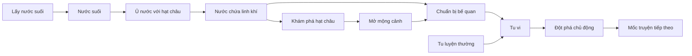

# GDD — Tiên Nghịch: Hành Trình Vương Lâm

> **Snapshot lịch sử — không phải luật hiện hành.** Giữ nội dung quyết định theo thời điểm nguồn; chỉ nhãn trạng thái và đường dẫn đọc được cập nhật khi rà soát ngày 08/10/2026. Hướng hiện hành: [GDD 0.28](../../GDD.md), [trạng thái dự án](../../PROJECT-STATUS.md) và [mục lục lịch sử](README.md).

**Phiên bản:** 0.24 — đã chọn pixel art chibi đầu lớn/thân gọn theo reference. Có mẫu Vương Lâm một hướng, 1 đứng + 4 pose đi bước nhỏ trong Three.js; chờ đánh giá. Năm bộ/116 frame trước giữ để đối chiếu và cần chỉnh tiếp. Bản thử dùng phiên tạm; tài khoản/lưu tiến trình/tu luyện chưa triển khai.  
**Ngày:** 07/10/2026.  
**Tên dự án:** tên làm việc nội bộ.  
**Mục tiêu tài liệu:** xác định trải nghiệm, luật chơi và phạm vi đủ nhỏ để một người có thể bắt đầu xây dựng.

## 1. Những gì đã chốt và những gì đang đề xuất

| Nội dung | Quyết định | Trạng thái |
| --- | --- | --- |
| Thể loại | MMORPG tu luyện có cơ chế idle, tài nguyên và đột phá | Người phát triển đã xác nhận muốn trải nghiệm giống MMORPG |
| Nền tảng đầu tiên | Web trình duyệt | Người phát triển đã chọn |
| Nhân vật và truyện | Người chơi tạo đệ tử riêng; Vương Lâm là NPC trung tâm của chính truyện Tiên Nghịch | Người phát triển đã chọn |
| Nhân lực | Một người phát triển | Người phát triển đã xác nhận |
| Hướng ART | Nhân vật trên map dùng pixel art chibi đầu lớn/thân gọn, nền map stylized 2D; portrait/truyện/UI tranh mực/giấy cổ | Người phát triển chọn học cả tỷ lệ reference ngày 07/10/2026; mẫu một hướng chờ đánh giá |
| Nguồn tạo hình nhân vật | Mô tả tiểu thuyết; thiết kế khuôn mặt/trang phục chi tiết riêng cho game | Người phát triển đã chọn ngày 07/10/2026; hồ sơ tách chi tiết có nguồn với phần ART đề xuất |
| Nhận diện Vương Lâm | Bộ tạo hình v2, mặt/tóc và trang phục | Người phát triển đã duyệt ngày 07/10/2026 |
| Ba nhân vật trọng tâm | Vương Lâm, Tư Đồ Nam, Lý Mộ Uyển | Người phát triển xác nhận; ưu tiên nhận diện bộ ba trước NPC phụ |
| Tạo hình Tư Đồ Nam | Giữ mặt/tóc v2; linh thể đứng lơ lửng cho tương tác | Concept đứng v3 và bốn mẫu tĩnh 64 × 96 tạm chấp nhận để tiếp tục thiết kế |
| Nhận diện Lý Mộ Uyển | V1 thời Hỏa Phần/Tu Ma Hải, áo tím/biến thể đỏ | Người phát triển chấp nhận nhận diện ngày 07/10/2026; mẫu tĩnh làm chuẩn đầu |
| Chân dung UI bộ ba | Vương Lâm áo xám, Tư Đồ Nam linh thể, Lý Mộ Uyển áo tím; ba cỡ 512/160/64 | Đã có bản đầu PNG/WebP và trang xem; hình mới chờ đánh giá |
| Động tác bộ ba | 44 frame core trong các bộ trước; ngân sách 108 cần xét lại theo chibi | Vương Lâm có mẫu chibi một hướng riêng; động tác Tư Đồ Nam/Lý Mộ Uyển chưa sản xuất |
| Lưới/bộ hình đầu tiên | Vương Lâm áo xám: 64 × 96, palette 24 mục, 4 đứng và 24 đi | Lấy làm chuẩn thử sau phản hồi tích cực của người phát triển |
| Hai mẫu người chơi | Đệ tử nam/nữ v2, áo xám đai xanh; mỗi mẫu 4 đứng giữ nguyên và 32 đi sửa | Đã dựng bộ thử native; chưa duyệt nhận diện/chuyển động |
| Cách chơi | Idle kết hợp một khu môn phái có nhân vật đi lại, gặp nhau; khu này là vùng khởi đầu của hướng MMORPG | Người phát triển đã chọn và làm rõ mục tiêu |
| Góc nhìn/dựng cảnh | 2D top-down ba phần tư, thấy mặt/thân nhân vật | Người phát triển đã chọn ngày 07/10/2026 |
| Lộ trình phát triển | Hoàn thành MVP A, sau đó mở rộng B có luyện thuật và giao đấu | Người phát triển đã chọn |
| Phạm vi MVP | Từ phàm nhân đến Ngưng Khí tầng 1 | Đã chọn phương án A |
| Map của MVP nhập môn | 9 node tham chiếu hành trình Vương Lâm; map đệ tử/khu chung cần điều chỉnh | Bản tham chiếu cũ, chờ biên tập online |
| Gặp gỡ của MVP nhập môn | Hổ và 2 thử thách thuộc chính truyện; nhiệm vụ người chơi có luật riêng | Chờ tách chính truyện và tuyến đệ tử |
| Nhân vật truyện | A: 7 người; sau B: 10; trục dài hạn 3 người | Ba trọng tâm đã xác nhận; phạm vi NPC A/B còn đề xuất |
| Asset đồ họa nhập môn | Dự toán cũ 20/22 nguồn cho portrait/minh họa; cần thêm map đi lại và animation | Cần lập lại sau khi chốt ART/góc nhìn/phạm vi |
| Lưu tiến trình | Tài khoản và tiến trình trên máy chủ; trình duyệt giữ tùy chọn/cache | Hệ quả của chế độ online đã chọn; hợp đồng chi tiết chờ thiết kế |
| Tiến trình khi đóng game | Tu luyện khi vắng mặt do máy chủ tính; đề xuất giới hạn 8 giờ mỗi quãng mất kết nối | Đề xuất cần đặc tả và thử nghiệm |
| Phát hành và doanh thu | Chưa chốt; prototype tập trung kiểm chứng cách chơi | Còn mở |
| Công nghệ client | TypeScript + Three.js | Người phát triển xác nhận ngày 07/10/2026 |
| Preview trước animation mới | Công cụ chung xem tại chỗ, map thử và sân chung online | Đã có ứng dụng; kiểm tra kỹ thuật, chất lượng motion chờ người phát triển xem |
| Công nghệ máy chủ | TypeScript + Node.js + Colyseus cho bản thử phòng | Người phát triển đồng ý đề xuất; đã triển khai đồng bộ di chuyển |
| Dữ liệu/đăng nhập | Cơ sở dữ liệu, tài khoản và tiến trình bền vững | Còn mở, thiết kế theo D-ON |

Mọi số liệu về thời gian, sức chứa, chi phí và phần thưởng bên dưới là **số liệu thiết kế game**, có thể thay đổi sau khi chơi thử. Các sự kiện nguyên tác có nguồn tham chiếu riêng ở mục 6.

Người phát triển đã chốt **A → B** ngày 06/10/2026. Phạm vi MVP hiện tại là A; B là giai đoạn tiếp theo sau khi A đạt tiêu chí hoàn thành trong [MVP-BACKLOG.md](MVP-BACKLOG.md). [WORLD-MAPS.md](../../WORLD-MAPS.md) ghi phạm vi từng giai đoạn; C có farm theo arc là hướng dài hạn chưa lên lịch. Các số liệu cân bằng và chi tiết triển khai vẫn cần prototype để kiểm chứng.

Giai đoạn làm việc hiện tại là **preview ART/chuyển động chạy được và backend online tối thiểu**. [PREVIEW-RUNBOOK.md](../../PREVIEW-RUNBOOK.md) hướng dẫn chạy, [BACKEND-PREVIEW.md](../../BACKEND-PREVIEW.md) ghi phạm vi/hợp đồng. Quy tắc gameplay tham chiếu vẫn nằm trong [MVP-A-SPEC.md](../../MVP-A-SPEC.md); luồng màn hình, wireframe và phản hồi người chơi nằm trong [UX-MVP-A.md](../../UX-MVP-A.md). Những phần gameplay tài nguyên/tu luyện/tiến trình chưa triển khai.

**Điều chỉnh ngày 06/10/2026:** [ONLINE-DIRECTION.md](ONLINE-DIRECTION.md) và [CHARACTERS.md](CHARACTERS.md) xác định hướng hiện tại. Các đặc tả, cảnh E01–E08, catalog/save và 14 bản phác v0.6 giữ làm tham chiếu; điều kiện/tác dụng dành cho Vương Lâm chưa được chuyển thành tuyến đệ tử người chơi. Phần 6–8 và các ví dụ cân bằng dưới đây chưa là luật runtime online. Preview dùng tạo hình đã có; tuyến P/chính truyện và UX gameplay cần được biên tập trước vòng tu luyện.

**Công nghệ và bước gần nhất:** [TECH-STACK.md](../../TECH-STACK.md) ghi client TypeScript + Three.js và backend bản thử TypeScript + Node.js + Colyseus đã chọn. [ANIMATION-PREVIEW-SPEC.md](../../ANIMATION-PREVIEW-SPEC.md) và [dữ liệu](../../data/client-tech-preview-design.json) dùng atlas đang có, camera orthographic và điểm chiếu chung. Preview cục bộ chạy độc lập backend; chế độ online dùng hai mẫu đệ tử và vị trí server xử lý. Sau đánh giá chuyển động sẽ đặc tả tài khoản/lưu tiến trình/tuyến P trước vòng tu luyện.

**Chân dung và động tác:** [trang UI](../../design/characters/core-ui-v1/index.html) bổ sung một biểu cảm cơ bản/người trên nền giấy/tối, thumbnail 64 px và hội thoại 160 px. [Kế hoạch động tác](../../CORE-CHARACTER-MOTION-PLAN.md) và [dữ liệu](../../data/core-character-motion-plan.json) tách frame đã có khỏi phần mới; giữ nguồn Tư Đồ Nam đứng v3 tạm chấp nhận. Trang phục/mốc theo cảnh, không dùng chân dung NPC cho đệ tử người chơi.

**Ưu tiên bộ ba:** [CORE-CHARACTER-VISUAL-SPEC.md](../../CORE-CHARACTER-VISUAL-SPEC.md) và [trang tạo hình](../../design/characters/core-trio-v1/index.html) bổ sung Tư Đồ Nam/Lý Mộ Uyển. Nguồn truyện được tách với lựa chọn ART; lần giới thiệu tiếng nói của Tư Đồ Nam khác trạng thái nguyên anh chương 112. Lý Mộ Uyển có biến thể áo đỏ/áo tím theo cảnh. Tạo hình sớm không tự đưa hai người vào A hoặc vào map môn phái.

Hướng ART đã được người phát triển chọn là tranh mực và giấy cổ. [ART-DIRECTION.md](../../ART-DIRECTION.md) và [UI-COMPONENTS.md](../../UI-COMPONENTS.md) chi tiết hóa hướng này; [thư viện bản phác](../../design/index.html) đặt bảng ART cạnh các snapshot UX. Màu/font/diện mạo cụ thể vẫn là đề xuất mỹ thuật.

**Làm rõ mục tiêu MMORPG:** [MMORPG-DIRECTION.md](MMORPG-DIRECTION.md) bổ sung map/NPC/nhiệm vụ, chiến đấu/trang bị và mở thế giới theo arc. Khu môn phái là vùng bắt đầu; phạm vi A/B cần xét lại. Sau [thử hai sprite Vương Lâm](../../design/characters/wang-lin-sprite-study/index.html), hướng hiện tại là nhân vật pixel art trên nền stylized 2D, cùng top-down ba phần tư. [WORLD-VISUAL-SPEC.md](../../WORLD-VISUAL-SPEC.md) ghi cách phối hợp; mẫu sân cũ giữ làm tham chiếu nền/bố cục. Lưới 64 × 96 của bộ Vương Lâm đã được áp dụng cho hai mẫu đệ tử thử theo [hồ sơ đệ tử](../../PLAYER-AVATAR-VISUAL-SPEC.md); xem [trang so sánh](../../design/characters/player-avatars-v2/index.html). Đây là chuẩn thử ART, chưa là lưới map/va chạm hay gameplay online.

Nghiên cứu ghép v1 (nguồn `design/world/hybrid-study/index.html` đã xóa; [hồ sơ reset](../../MAP-ASSETS-RESET.md)) đã có nền/sprite riêng, cỡ ảnh 80/96/112 px, cảnh 1×/2× và khung 360 px. Trang xem giữ PNG Vương Lâm gốc; ảnh ghép imagegen lưu riêng cùng prompt. Đây là thử hình trong GDD, chưa có di chuyển/animation hoặc lưới pixel sản xuất.

## 2. Ý tưởng cốt lõi

Người chơi tạo một đệ tử riêng, đi lại trong thế giới tu tiên, gặp NPC/đồng môn, nhận nhiệm vụ, chuẩn bị tài nguyên, học công pháp và tăng cảnh giới. Idle phục vụ tu luyện và chuẩn bị; hướng RPG bổ sung chiến đấu/trang bị khi phạm vi được biên tập. Chính truyện Vương Lâm vẫn mở theo chương cá nhân.

Điểm xuất phát của **Vương Lâm trong chính truyện** là một thiếu niên có gia đình đặt kỳ vọng, nhưng tư chất tu luyện hạn chế. Đây là nền tảng được giới thiệu trong [trang truyện người phát triển cung cấp](https://kenhtruyenfull.com/truyen/tien-nghich) và [giới thiệu của Wuxiaworld](https://www.wuxiaworld.com/novel/renegade-immortal). Đệ tử người chơi có xuất thân riêng, chờ biên tập tuyến P.

**Cảm giác muốn tạo ra:** “Mình hiểu cách dùng cơ duyên và tài nguyên để vượt qua trở ngại mà chỉ chờ đợi sẽ rất chậm.”

Người chơi điều khiển cách chuẩn bị và nhịp tiến triển của đệ tử mình. Các biến cố chính và quan hệ của Vương Lâm giữ theo nguyên tác; nhiệm vụ/khả năng của đệ tử mới được ghi rõ là nội dung chuyển thể của game. Hạt châu của Vương Lâm thuộc chính truyện; cách chuẩn bị linh khí cho đệ tử cần cơ chế riêng.

## 3. Người chơi và nhịp chơi dự kiến

- Người đọc Tiên Nghịch muốn trải nghiệm các mốc truyện qua cơ chế chơi.
- Người thích idle có tài nguyên, điều kiện mở khóa và mục tiêu rõ ràng.
- Một lượt tương tác thường dài 3–10 phút; có thể quay lại sau khi tích trữ hoặc bế quan.
- MVP hướng tới khoảng 30–45 phút đến lần đột phá đầu tiên khi sử dụng tốt hạt châu; đây là giả thuyết cần đo.
- Có thể hiểu mục tiêu hiện tại ngay cả khi chưa đọc tiểu thuyết. Thuật ngữ được giải thích tại lần xuất hiện đầu tiên.

## 4. Bốn nguyên tắc thiết kế

| Nguyên tắc | Biểu hiện trong game | Cách đánh giá |
| --- | --- | --- |
| Cơ duyên có cách sử dụng | Hạt châu cần tài nguyên và mốc khám phá để phát huy tác dụng | Người chơi giải thích được vì sao vẫn phải chuẩn bị nước chứa linh khí |
| Cốt truyện mở thêm cách chơi | Mỗi mốc quan trọng mở hoạt động, thay đổi trạng thái hoặc cho mục tiêu mới | Mỗi sự kiện của MVP có tác dụng cụ thể |
| Tu luyện có quyết định | Chọn tích trữ, tu luyện thường hoặc chuẩn bị bế quan; thấy trước chi phí và tốc độ | Người chơi biết lựa chọn hiện tại dẫn đến kết quả nào |
| Phạm vi phù hợp một người | Tái sử dụng màn hình và dữ liệu; ưu tiên chữ, số và hiệu ứng đơn giản | Hoàn thành vòng chơi trước khi sản xuất nhiều hình ảnh |

## 5. Vòng lặp chơi

### 5.1. Vòng lặp chính

**Đọc mục tiêu → chọn hoạt động → tích lũy/tiêu hao tài nguyên → hoàn thành điều kiện → đọc sự kiện → mở khả năng mới → chuẩn bị đột phá.**



Sơ đồ thể hiện luật tài nguyên đề xuất. Các hoạt động chỉ chạy sau khi mốc truyện tương ứng mở khóa.

### 5.2. Ba khoảng thời gian

| Khoảng | Người chơi làm gì? | Phản hồi |
| --- | --- | --- |
| 10 giây | Hoàn thành một chu kỳ hoạt động | Tài nguyên thay đổi; thanh tiến độ tiếp tục |
| 1–5 phút | Điều chỉnh hoạt động, chuẩn bị tài nguyên cho mốc tiếp theo | Thấy rõ điều kiện còn thiếu và thời gian ước tính |
| 30–45 phút trong MVP | Khám phá tác dụng hạt châu và đạt Ngưng Khí tầng 1 | Diễn biến truyện và thay đổi trạng thái nhân vật |

## 6. Chuyển thể giai đoạn đầu thành nội dung chơi

### 6.1. Ranh giới giữa nguyên tác và luật game

Giữ trình tự sự kiện và những trở ngại quan trọng. Đơn vị tài nguyên, bộ đếm thao tác, thời gian thực và ngưỡng tu vi là phần trừu tượng hóa để chơi được trên web.

Mỗi mốc dưới đây là một cụm sự kiện, không tương ứng một chương tiểu thuyết. Văn bản hiển thị được viết thành tóm tắt ngắn và lời dẫn riêng cho game; nguồn dùng để đối chiếu sự kiện.

| ID | Sự kiện giữ theo nguyên tác | Vai trò trong game | Nguồn đã đối chiếu |
| --- | --- | --- | --- |
| E01 | Gia đình đặt kỳ vọng và Vương Lâm có cơ hội đến Hằng Nhạc phái | Giới thiệu nhân vật, động lực và nút đọc tiếp | [Chương 1](https://www.wuxiaworld.com/novel/renegade-immortal/rge-chapter-1) |
| E02 | Không vượt qua các khảo nghiệm tuyển chọn | Thể hiện tư chất hạn chế; đây là diễn biến cố định | [Chương 3](https://www.wuxiaworld.com/novel/renegade-immortal/rge-chapter-3), [chương 4](https://www.wuxiaworld.com/novel/renegade-immortal/rge-chapter-4) |
| E03 | Trở lại tìm đường tu tiên, gặp nguy hiểm và có được hạt châu trong hang | Nhận vật phẩm cốt truyện; chưa mở mộng cảnh | [Chương 7](https://www.wuxiaworld.com/novel/renegade-immortal/rge-chapter-7), [chương 8](https://www.wuxiaworld.com/novel/renegade-immortal/rge-chapter-8) |
| E04 | Được nhập môn, làm việc lấy nước; nhận biết tác dụng của nước qua hạt châu | Mở hai hoạt động tài nguyên; kể ngắn sự biến đổi của châu đến bảy đám mây | [Chương 10](https://www.wuxiaworld.com/novel/renegade-immortal/rge-chapter-10), [chương 11](https://www.wuxiaworld.com/novel/renegade-immortal/rge-chapter-11), [chương 14](https://www.wuxiaworld.com/novel/renegade-immortal/rge-chapter-14) |
| E05 | Tôn Đại Trụ chú ý đến bầu nước và nhận Vương Lâm làm đệ tử; có công pháp nhập môn | Mở luyện thổ nạp và hồ sơ công pháp | [Chương 16](https://www.wuxiaworld.com/novel/renegade-immortal/rge-chapter-16), [chương 17](https://www.wuxiaworld.com/novel/renegade-immortal/rge-chapter-17) |
| E06 | Tu luyện bị cản trở; rời dược viên, lấy lại châu rồi giải trừ tác động của dược liệu làm tán linh khí | Kết thúc giai đoạn luyện thổ nạp chưa giữ được tu vi; châu đã có chín đám mây | [Chương 18](https://www.wuxiaworld.com/novel/renegade-immortal/rge-chapter-18), [chương 20](https://www.wuxiaworld.com/novel/renegade-immortal/rge-chapter-20), [chương 22](https://www.wuxiaworld.com/novel/renegade-immortal/rge-chapter-22) |
| E07 | Hoàn thành mười đám mây và khám phá không gian mộng cảnh | Mở bế quan trong mộng cảnh; sau biến đổi, không tiếp tục hiển thị mười đám mây như hình dạng hiện tại | [Chương 23](https://www.wuxiaworld.com/novel/renegade-immortal/rge-chapter-23), [chương 24](https://www.wuxiaworld.com/novel/renegade-immortal/rge-chapter-24) |
| E08 | Vương Lâm đạt Ngưng Khí tầng 1 | Đột phá đầu tiên và điểm kết thúc MVP | [Chương 25](https://www.wuxiaworld.com/novel/renegade-immortal/rge-chapter-25) |

### 6.2. Điều kiện và tác dụng của các mốc

Các con số trong bảng là thiết kế gameplay, không phải lượng tài nguyên trong truyện.

| ID | Điều kiện sau mốc trước | Tác dụng khi người chơi tiếp tục |
| --- | --- | --- |
| E01–E03 | Đọc tiếp lần lượt | Ghi nhận diễn biến, nhận hạt châu ở E03 |
| E04 | Hoàn thành E03 | Mở lấy nước và ủ nước; tu vi vẫn bằng 0 |
| E05 | Đã hoàn thành 6 chu kỳ lấy nước, 3 chu kỳ ủ nước và đang có ít nhất 1 linh dịch | Tiêu hao 1 linh dịch; nhận công pháp; mở luyện thổ nạp |
| E06 | Đã luyện thổ nạp 3 chu kỳ và có 6 linh dịch | Tiêu hao 6 linh dịch; giải trừ trạng thái cản trở; từ đây luyện thường giữ lại được tu vi |
| E07 | Có 6 linh dịch | Tiêu hao 6 linh dịch; mở mộng cảnh và chế độ chuẩn bị tự động |
| E08 | Hoàn thành E07, có 480 tu vi và chủ động chọn đột phá | Đạt Ngưng Khí tầng 1; hiện đoạn kết MVP |

Mốc đủ điều kiện hiện thông báo và nút tiếp tục. Người chơi có thể giữ hoạt động hiện tại cho đến khi chủ động mở cảnh hoặc đạt giới hạn. Mở mốc mới dừng hoạt động và hủy chu kỳ dở; chi phí/tác dụng của mốc chỉ áp dụng tại nút cuối sau khi kiểm tra lại điều kiện. Đọc xong giữ hoạt động dừng để người chơi chọn bước tiếp theo. Đọc lại lịch sử giữ hoạt động đang chạy. Các sự kiện không tự được đánh dấu đã đọc khi đóng game.

### 6.3. Nhân vật và thuật ngữ

Hồ sơ chính truyện ban đầu có 7 người: Vương Lâm, cha, mẹ, tứ thúc, Vương Trác, Trương Hổ và Tôn Đại Trụ. Catalog cũ gộp cha mẹ thành một hồ sơ, nên có 6 hồ sơ/nguồn chân dung. Đệ tử người chơi có hồ sơ riêng. Số người và kế hoạch B/dài hạn nằm trong [CHARACTERS.md](CHARACTERS.md) và [roster](../../data/character-roster.json).

Dùng tên “hạt châu bí ẩn” trong trải nghiệm đầu game. Tên đầy đủ, lai lịch và nhân vật liên quan được tiết lộ theo mốc truyện đã đối chiếu. Tên Việt trong tài liệu là tên làm việc; chuẩn hóa với bản dịch tiếng Việt được chọn khi biên tập nội dung.

MVP nén những quãng thời gian dài thành lời dẫn. Thời gian thực của người chơi và thời gian nội truyện được ghi riêng, tránh khiến 10 giây thao tác được hiểu là 10 giây trong đời Vương Lâm.

## 7. Hệ thống tài nguyên và hoạt động

### 7.1. Ba tài nguyên chính

| Tài nguyên | Tên trong dữ liệu | Nguồn | Nơi sử dụng | Giới hạn MVP |
| --- | --- | --- | --- | --- |
| Nước suối | `springWater` | Hoạt động lấy nước | Ủ nước cùng hạt châu | 120 |
| Nước chứa linh khí, gọi ngắn là linh dịch trên bảng số | `spiritWater` | Hoạt động ủ nước | Mốc truyện và chuẩn bị tu luyện mộng cảnh | 30 |
| Tu vi | `cultivation` | Tu luyện sau E06 | Điều kiện đạt tầng đầu tiên | 480 |

“Linh dịch” là nhãn giao diện cho nước chứa linh khí. Bộ đếm lấy nước, ủ nước và luyện thổ nạp dùng để hướng dẫn/mở mốc, không phải tiền tệ và không thể tiêu dùng.

Linh thạch, đan dược và các vật phẩm khác có thể được nhắc trong đoạn tóm tắt khi đúng mốc truyện. Kinh tế MVP chỉ mô phỏng ba tài nguyên trên.

### 7.2. Một hoạt động chính tại một thời điểm

| Hoạt động | Mở sau | Thời gian/chu kỳ | Chi phí | Kết quả |
| --- | --- | --- | --- | --- |
| Lấy nước suối | E04 | 10 giây | Không | +2 nước suối; +1 chu kỳ lấy nước |
| Ủ nước với hạt châu | E04 | 10 giây | 2 nước suối | +1 linh dịch; +1 chu kỳ ủ nước |
| Luyện thổ nạp/tu luyện thường | E05 | 10 giây | Không | Trước E06: +1 bộ đếm thổ nạp, tối đa 3; sau E06: +1 tu vi |
| Tu luyện trong mộng cảnh | E07 | 10 giây | 1 linh dịch | +10 tu vi |

Mỗi chu kỳ mộng cảnh đại diện một phiên chuẩn bị rồi tu luyện. Linh dịch được uống trước khi vào; game không thể hiện việc mang bầu linh dịch vào mộng cảnh.

Trong nguyên tác, thời gian bên trong mộng cảnh dài gấp mười lần bên ngoài, và không gian này không có linh khí tự nhiên để dùng tùy ý. Đây là cơ sở để đặt tốc độ tu luyện cao hơn nhưng vẫn cần nguồn linh khí bên ngoài. [Chương 23](https://www.wuxiaworld.com/novel/renegade-immortal/rge-chapter-23), [chương 24](https://www.wuxiaworld.com/novel/renegade-immortal/rge-chapter-24).

Luật hoàn thành chu kỳ:

1. Chỉ nhận kết quả và trừ chi phí khi hoàn thành đủ 10 giây.
2. Thiếu đầu vào hoặc không đủ chỗ chứa toàn bộ đầu ra thì hoạt động chờ, kèm lý do.
3. Lượng tu vi được chặn tại 480; chu kỳ cuối vẫn tốn toàn bộ chi phí thông thường.
4. Đổi hoạt động hủy phần tiến độ chưa đủ một chu kỳ, không làm mất tài nguyên.
5. Lưu/đóng/mở trang giữ phần thời gian đã chạy của hoạt động hiện tại.
6. Mở mốc truyện mới dừng hoạt động và hủy chu kỳ chưa hoàn thành; chi phí/phần thưởng mốc áp dụng một lần tại nút hoàn thành cuối cảnh.

Trước khi xử lý một thao tác, cập nhật thời gian tới lúc bấm. Chu kỳ vừa đủ 10 giây được nhận trước thao tác đó. Bấm lại hoạt động đang chạy giữ tiến độ. Nhánh tác dụng và địa điểm trong catalog chọn nhánh đầu tiên thỏa điều kiện. Hợp đồng đầy đủ và lý do chờ nằm trong [đặc tả hệ thống](../../MVP-A-SPEC.md).

Trước E06, giao diện báo “Đã luyện thổ nạp 0/3 lần — chưa giữ được linh khí”. Sau 3 lần, chỉ dẫn chuyển sang mốc truyện tiếp theo; hoạt động này chờ cho đến E06 để tránh chạy mà không có kết quả. Nguyên nhân cụ thể được giải thích khi truyện tiết lộ.

### 7.3. Chế độ chuẩn bị tự động

Mở sau E07. Đây là một chế độ cố định để giảm thao tác lặp; MVP chưa có trình biên tập hàng đợi.

Tại đầu mỗi chu kỳ, ưu tiên:

1. Nếu tu vi đã đạt 480: chờ người chơi đột phá.
2. Nếu có ít nhất 1 linh dịch: tu luyện mộng cảnh.
3. Nếu có ít nhất 2 nước suối: ủ nước.
4. Nếu còn chỗ chứa ít nhất 2 nước suối: lấy nước.
5. Nếu không có hành động hợp lệ: dừng và hiện lý do.

Chế độ tự động chỉ chạy hoạt động đã mở khóa. Người chơi vẫn có thể chọn lấy nước, tích trữ linh dịch hoặc luyện thường thủ công.

### 7.4. Ví dụ kiểm tra cân bằng

Sau khi mở mộng cảnh, bắt đầu với tài nguyên bằng 0:

- Lấy nước 10 giây: nhận 2 nước suối.
- Ủ nước 10 giây: đổi 2 nước suối thành 1 linh dịch.
- Tu luyện mộng cảnh 10 giây: đổi 1 linh dịch thành 10 tu vi.

Một vòng cần 30 giây để có 10 tu vi. Đạt 480 cần 48 vòng, tương đương **24 phút**, chưa tính thời gian mở khóa và đọc truyện.

Luyện thường từ 0 đến 480 cần **80 phút**. Chênh lệch này là giả thuyết cân bằng của prototype. Tốc độ thu tài nguyên làm hiệu quả toàn vòng nhỏ hơn hệ số thời gian trong mộng cảnh.

MVP dùng nhịp rõ ràng để kiểm chứng vòng chơi. Chiều sâu quản lý dài hạn cần được kiểm chứng ở bản mở rộng có thêm mục tiêu sử dụng tài nguyên.

## 8. Tu luyện và đột phá

### 8.1. Cấu trúc tiến triển

Ngưng Khí → Trúc Cơ → Kết Đan → Nguyên Anh → Hóa Thần là thứ tự các cảnh giới được giới thiệu trong giai đoạn đầu. [Chương 20](https://www.wuxiaworld.com/novel/renegade-immortal/rge-chapter-20).

| Phạm vi | Tiến triển | Công việc thiết kế |
| --- | --- | --- |
| MVP | Phàm nhân → Ngưng Khí tầng 1 | Có luật tài nguyên và điều kiện cụ thể trong tài liệu này |
| Bản mở rộng đầu tiên | Các tầng Ngưng Khí tiếp theo | Đối chiếu mốc truyện, công pháp và thuật pháp trước khi xác định giới hạn |
| Các bản về sau | Trúc Cơ và những cảnh giới cao hơn | Mỗi giai đoạn cần vòng chơi, tài nguyên và nội dung riêng |

### 8.2. Đột phá đầu tiên

Điều kiện: 480/480 tu vi và đã hoàn thành E07. Nút đột phá cho biết đầy đủ điều kiện còn thiếu.

Người chơi chủ động bấm đột phá để mở cảnh chuẩn bị E08. Nút cuối “Hoàn tất đột phá” kiểm tra điều kiện và áp dụng kết quả một lần, lưu trạng thái rồi hiện hiệu ứng/kết quả. Trước nút cuối, nhân vật vẫn là phàm nhân. MVP dùng kết quả chắc chắn khi đủ điều kiện; nhấn nhanh hoặc tải lại không nhận thêm phần thưởng.

Đột phá đổi trạng thái từ phàm nhân sang Ngưng Khí tầng 1. Sau E08, bản thử nghiệm giữ 480 tu vi và tài nguyên còn lại, dừng các hoạt động tiến triển, cho xem lại hành trình và hiện thông báo đã hoàn thành nội dung hiện có.

### 8.3. Ý tưởng cho các lần đột phá sau

Các giai đoạn sau có thể cần mức tu vi, hiểu công pháp và hoàn thành một biến cố truyện. Thiết kế thử thách và hệ quả theo từng mốc cụ thể; chưa gán xác suất thất bại hoặc lịch thiên kiếp chung cho mọi tầng.

## 9. Tiến trình khi người chơi đóng game

Trong bản online, đây là **tu luyện khi vắng mặt**. Máy chủ sở hữu trạng thái/thời gian. Các giới hạn bên dưới giữ làm đề xuất cân bằng; tuyến P phải được biên tập trước khi áp dụng.

### 9.1. Luật trải nghiệm

- Chỉ tiếp tục hoạt động hoặc chế độ tự động đã được người chơi chọn.
- Tối đa 8 giờ mỗi lần vắng mặt; hoạt động vẫn chịu giới hạn tài nguyên và ngưỡng tu vi.
- Gặp điều kiện chờ thì dừng tại đó. Tài nguyên hoặc thời gian đã bỏ lỡ không trở thành phần thưởng ở lần mở sau.
- Sự kiện truyện và đột phá chờ tương tác chủ động.
- Đang đọc mốc mới hoặc đã dừng chủ động thì không chạy hoạt động offline; mở lại giữ cảnh/đoạn đang đọc.
- Đóng trang không gây chết nhân vật, mất đồ hoặc bỏ lỡ sự kiện cốt truyện.
- Khi trở lại, hiện thời gian đã mô phỏng, tài nguyên nhận/tiêu hao và lý do dừng.

Ví dụ: chọn lấy nước với kho trống rồi đóng trang 8 giờ. Kho đạt 120 sau 10 phút, nên bản tổng kết cho biết nhận 120 nước và dừng vì kho đầy. Người chơi không nhận 8 giờ nước vượt kho.

### 9.2. Quy tắc mô phỏng

Luật khi có kết nối và khi vắng mặt dùng cùng một bộ xử lý chu kỳ trên máy chủ. Quãng mất kết nối được xác định từ phiên do máy chủ quản lý; tổng kết chỉ trình bày kết quả đã lưu.

```text
effectiveNow = max(serverNow, lastProcessedAt)
elapsedSeconds = min((effectiveNow - lastProcessedAt) / 1000, 8 * 60 * 60)
newState = advance(currentState, elapsedSeconds)
newState.lastProcessedAt = effectiveNow
commitServerState(newState)
```

`advance` giữ phần chu kỳ chưa hoàn thành, kiểm tra điều kiện hoạt động, giới hạn kho và cổng tu vi. Cập nhật `lastProcessedAt` đến thời điểm hiện tại kể cả khi mô phỏng dừng sớm, để lần mở tiếp không tính lại quãng vắng mặt.

Đồng hồ thiết bị không quyết định phần thưởng. Mẫu trên chỉ minh họa việc xử lý quãng vắng mặt; thời gian đang kết nối được xử lý theo phiên riêng. Hợp đồng phiên, lệnh và giao dịch cần hoàn thiện theo [ONLINE-DIRECTION.md](ONLINE-DIRECTION.md).

Đề xuất một phiên điều khiển mỗi đệ tử, do máy chủ xác nhận. Nhiều tab/thiết bị không được cộng thời gian hoặc phần thưởng nhiều lần.

## 10. Giao diện và thao tác

### 10.1. Năm khu vực

| Khu vực | Nội dung chính |
| --- | --- |
| Tu luyện | Cảnh giới, tu vi, ba tài nguyên, hoạt động hiện tại, tốc độ và điều kiện mục tiêu |
| Hạt châu | Khám phá đã mở, trạng thái biến đổi và cách sử dụng; chỉ hiện thông tin đã biết |
| Hành trình | Mốc hiện tại, sự kiện đã đọc, hồ sơ và hai chế độ xem Mốc truyện/Địa điểm; map có danh sách dọc trên màn hình nhỏ |
| Hành trang | Hạt châu, bầu nước, công pháp và túi trữ vật khi đúng mốc; MVP chưa có bộ trang bị ngẫu nhiên |
| Cài đặt | Tài khoản, kết nối/đồng bộ, cỡ chữ, âm thanh nếu có, giảm chuyển động |

### 10.2. Màn hình tu luyện

Thứ tự đọc:

1. Vương Lâm — cảnh giới hiện tại.
2. Mục tiêu hiện tại và điều kiện còn thiếu.
3. Nước suối, linh dịch, tu vi và sức chứa.
4. Hoạt động đang chạy, kết quả mỗi chu kỳ, nút đổi/dừng.
5. Nút tiếp tục sự kiện hoặc đột phá khi đủ điều kiện.

Ví dụ thẻ hoạt động sau E07:

> **Tu luyện trong mộng cảnh**  
> Mỗi 10 giây: dùng 1 linh dịch, nhận 10 tu vi.  
> Linh dịch hiện có: 6. Tu vi: 120/480.  
> Đủ cho 6 chu kỳ; sau đó cần chuẩn bị thêm linh dịch.

Hiển thị tên tài nguyên cùng biểu tượng; trạng thái thiếu tài nguyên có chữ giải thích. Khi ước tính thời gian, tính cả công đoạn chuẩn bị nếu đang bật chế độ tự động.

Ưu tiên trình duyệt desktop; bố cục vẫn đọc và thao tác được ở chiều rộng 360 px. Dùng nút bấm, không yêu cầu thao tác kéo hoặc phản xạ.

Danh mục màn hình, phác thảo desktop/mobile, trạng thái thẻ và lời hướng dẫn theo E01–E08 nằm trong [UX-MVP-A.md](../../UX-MVP-A.md). Hạt châu, Hành trang, Cài đặt, luồng nhập save, tổng kết offline và kết thúc được chi tiết ở [UX-SCREENS-AND-STATES.md](../../UX-SCREENS-AND-STATES.md). Các lớp đọc truyện, tổng kết offline và kết thúc dùng cùng 5 khu vực chính.

Bộ UX vừa dẫn là tham chiếu v0.6. Đề xuất online thay **Hạt châu → Công pháp**, đưa châu vào chính truyện, thêm tạo đệ tử/Đồng môn và thay nhập save bằng tài khoản/phiên. Tạo hình đệ tử và portrait Vương Lâm phải có nhãn vai trò rõ.

## 11. Mười phút đầu dự kiến

| Thời điểm dự kiến | Diễn biến và tương tác | Điều người chơi học |
| --- | --- | --- |
| 0–2 phút | Đọc các cụm E01–E04; đến giai đoạn làm việc lấy nước | Động lực Vương Lâm và hạt châu chưa phát huy hết tác dụng |
| 2–4 phút | Lấy nước, ủ nước, nhìn chi phí và kho | Có chuỗi tài nguyên; hoạt động vẫn tiếp tục khi không bấm |
| 4–6 phút | Hoàn thành E05, luyện thổ nạp và được chỉ dẫn sang E06 | Công pháp mở theo truyện; tư chất và trở ngại ảnh hưởng tiến triển |
| 6–10 phút | Chuẩn bị linh dịch cho E06 và E07 | Dùng tài nguyên để khám phá cơ duyên trước khi bế quan |
| Sau đó | So sánh luyện thường với mộng cảnh; bật chế độ tự động hoặc chọn tích trữ | Hiểu vòng chơi hoàn chỉnh và mục tiêu đột phá |

Đây là nhịp mong muốn, không phải lịch bắt buộc. Nếu người chơi cần đọc lâu hơn hoặc thiếu tài nguyên, chỉ dẫn tiếp tục giữ ở đúng mốc.

## 12. Phạm vi MVP

### 12.1. Nội dung cần có

| Hạng mục | Khối lượng |
| --- | --- |
| Nhân vật điều khiển | Đề xuất 1 đệ tử riêng/tài khoản, 2 mẫu hình lựa chọn |
| Mốc truyện | E01–E08 của Vương Lâm làm tham chiếu; tuyến đệ tử P01–P08 chờ biên tập |
| Địa điểm | 9 node truyện/6 nền tham chiếu; cần map đệ tử và khu môn phái chung |
| Gặp gỡ | 3 hồ sơ: hổ trắng, lực hút hang và khảo nghiệm kiếm linh; không có chỉ số combat ở A |
| Tài nguyên | 3 |
| Hoạt động | 4 loại; luyện thổ nạp đổi tác dụng sau E06 |
| Chế độ tự động | 1 quy tắc chuẩn bị và tu luyện cố định |
| Đột phá | 1 lần, đến Ngưng Khí tầng 1 |
| Hồ sơ nhân vật | 7 NPC ở A, gộp cha mẹ thành 1 chân dung; hồ sơ đệ tử riêng |
| Màn hình/khu vực | 5 khu vực ở mục 10; dùng chung thành phần giao diện |
| Tiến trình lưu | Tài khoản, nhân vật, trạng thái máy chủ và phiên điều khiển |
| Tương tác online A | Khu môn phái có đệ tử đi lại đã chọn; đề xuất tương tác NPC, hồ sơ đồng môn và lời chào |
| Phản hồi | Thanh chu kỳ, thông báo mốc, tổng kết khi trở lại |
| Asset dự kiến | Dự toán cũ 20/22 nguồn chưa gồm map đi lại/animation; ngân sách MMORPG cần lập lại |

### 12.2. Công việc để sau MVP

Chiến đấu tự động và luyện thuật thuộc giai đoạn B đã chọn sau A; luật và số liệu thử nghiệm nằm trong [ENCOUNTERS.md](../../ENCOUNTERS.md). B mở rộng tuyến truyện, thêm 4 địa điểm, 2 mục tiêu luyện thuật và 1 đối thủ giao đấu. Luyện đan, chế tạo pháp bảo, quản lý môn phái, thú nuôi, nhân quả nhiều nhánh và các cảnh giới cao hơn thuộc những gói sau.

Tài khoản, lưu máy chủ và tương tác đồng môn thuộc A online. PvP, tổ đội, bảng xếp hạng và giao dịch/kinh tế nhiều người cần phạm vi riêng sau A; B giữ mục tiêu luyện thuật/giao đấu và cần biên tập theo vai đệ tử.

## 13. Hướng mở rộng sau MVP

| Giai đoạn | Khả năng có thể thêm | Điều kiện bắt đầu |
| --- | --- | --- |
| Ngưng Khí tiếp theo | Mục tiêu học thuật pháp cạnh tranh tài nguyên/thời gian với tu luyện; công pháp mở theo truyện | Vòng đầu dễ hiểu, save và offline ổn định |
| Giai đoạn có giao đấu | Tự động chiến đấu; người chơi chuẩn bị thuật pháp và chiến thuật trước trận | Đã đối chiếu thời điểm Vương Lâm học và dùng từng thuật |
| Các arc tiếp theo | Đan dược, pháp bảo, nơi tu luyện và NPC liên quan | Mỗi hệ thống có vai trò trong arc và nguồn dữ liệu |
| Trúc Cơ trở lên | Điều kiện đột phá riêng, mục tiêu mới và thay đổi vòng tài nguyên | Chơi thử các tầng trước cho thấy quyết định có chiều sâu |

Không coi việc đổi tên tầng và tăng hệ số là đủ cho một giai đoạn mới. Mỗi giai đoạn cần ít nhất một quyết định hoặc khả năng làm thay đổi cách chuẩn bị.

## 14. Mỹ thuật, âm thanh và văn bản

- Giao diện nền giấy sáng, chữ mực rõ và điểm nhấn xanh ngọc cho linh khí theo hướng tranh mực/giấy cổ đã chọn.
- Hạt châu là điểm nhấn bằng hình đơn giản và hiệu ứng nhẹ; ưu tiên phân biệt trạng thái đã mở.
- Theo [hồ sơ Vương Lâm](../../WANG-LIN-VISUAL-SPEC.md), duyệt tuổi thể hiện, mặt/tóc, ba bộ đồ và thần thái theo cảnh trước mẫu pixel native; đối chiếu mẫu đệ tử để giữ khác nhận diện. Chân dung nguồn/nền game được sản xuất theo gói; prototype dùng hình đã duyệt hoặc hình tạm.
- Âm thanh tùy chọn cho nhận mốc và đột phá; có thể tắt hoàn toàn.
- Mỗi cụm sự kiện chia thành 1–3 đoạn ngắn; giữ động lực và quan hệ nhân vật, giải thích rõ khả năng vừa mở.
- Nhật ký cho đọc lại. Thông tin tương lai chỉ xuất hiện khi người chơi tới đúng mốc.

Danh mục, brief hạt châu/nhân vật/sinh vật, biến thể theo truyện, kích thước và ngân sách hình ảnh ở [ASSET-PLAN.md](../../ASSET-PLAN.md). Chốt vai trò asset trước; sản xuất hình theo gói nội dung đã chơi được.

Định hướng nét vẽ, palette, chữ, bố cục tranh và hiệu ứng nằm trong [ART-DIRECTION.md](../../ART-DIRECTION.md). Bộ thành phần, trạng thái nút và 14 bản phác UI nằm trong [UI-COMPONENTS.md](../../UI-COMPONENTS.md). Bảng ART hiện tại là nguồn tham chiếu phong cách; các nguồn game P0/P1 tiếp tục theo danh mục asset.

[Thư viện nhân vật](../../design/characters/index.html) giữ bộ Vương Lâm v2 theo [hồ sơ nguồn](../../WANG-LIN-VISUAL-SPEC.md), nhận diện đã được người phát triển duyệt làm tham chiếu. [Bộ đứng/đi đầu tiên](../../design/characters/wang-lin-gray-walk-v1/index.html) có 28 frame áo xám được giữ làm lịch sử. Preview dùng [bộ sửa tay/chân](../../GAIT-CORRECTION.md) cho Vương Lâm/hai đệ tử, mỗi bộ 36 frame, lưới 64 × 96, bốn hướng, palette 24 mục và điểm chân (32,88). Hình nguồn do imagegen vẽ; script chỉ chuẩn hóa/đóng gói, hình đứng giữ nguyên. Frame mới chờ đánh giá chuyển động/nhận diện. Preview chung đã có backend phòng thử; gameplay tu luyện/tiến trình chưa triển khai.

## 15. Cấu trúc dữ liệu và lưu tiến trình

Tách dữ liệu nội dung khỏi luật mô phỏng để thêm mốc truyện mà không phải viết lại giao diện.

Trong catalog thiết kế, các nhóm tương ứng dùng tên `events`, `storyScenes`, `locations`, `encounters`, `assets`, `balance`, `resourceDefinitions`, `itemDefinitions` và `characterEntries`. `systemPolicies` ghi các quy tắc chọn nhánh, hoàn thành mốc và lưu. Văn bản 23 đoạn của 10 cảnh là lời dẫn nháp viết riêng cho game, cần biên tập trước khi đưa vào prototype.

| Nhóm dữ liệu | Nội dung |
| --- | --- |
| `activities` | ID, điều kiện mở, thời gian chu kỳ, đầu vào, đầu ra, trạng thái chờ |
| `storyEvents` | ID, mốc trước, điều kiện, chi phí, tác dụng, văn bản, chương tham chiếu |
| `realmDefinitions` | Cảnh giới, tầng, ngưỡng tu vi và sự kiện đột phá |
| `itemDefinitions` | Tên, mô tả, mốc xuất hiện; đánh dấu vật phẩm cốt truyện |
| `characterEntries` | Hồ sơ và mốc được phép hiển thị |
| `mapDefinitions` | Khu vực, cảnh tiết lộ, hoạt động, gặp gỡ và bối cảnh địa điểm |
| `encounterDefinitions` | Loại gặp gỡ, cách giải quyết, luật lặp, nguồn và nơi cấp tác dụng |
| `assetDefinitions` | ID, nguồn hình, biến thể, mốc và nơi sử dụng |
| `balanceConfig` | Sức chứa, chi phí, tốc độ, thời gian offline tối đa |

Mẫu trạng thái v0.6 lưu các trường sau để tham chiếu bộ mô phỏng; bản online phải tách tiến trình đệ tử và tiến trình đọc chính truyện:

- `schemaVersion`, `contentVersion`, `runId`, `revision`, `lastProcessedAt`.
- Cảnh giới, tầng và ba tài nguyên.
- Bộ đếm hoạt động; mốc/cảnh đã mở và hoàn thành.
- Hoạt động/chế độ đang chọn và thời gian chu kỳ chưa hoàn thành.
- Node đã biết, node đang xem, cảnh truyện đang đọc và gặp gỡ đã hoàn thành; địa điểm hoạt động tính từ hoạt động và mốc truyện.
- Tùy chọn giao diện.

Khả năng đã mở, trạng thái cản trở tu luyện, hình dạng hạt châu, trang phục, vật phẩm và kết thúc A suy ra từ mốc/cảnh. Hợp đồng save và kiểm tra dữ liệu nằm trong [đặc tả hệ thống](../../MVP-A-SPEC.md); [save minh họa](../../data/mvp-save-example.json) biểu diễn trạng thái sau E07 và chưa bật tự động.

Máy chủ lưu giao dịch sau lệnh/sự kiện/đột phá và xử lý thời gian. Mỗi lệnh có ID để gửi lại không lặp tác dụng, cùng phiên bản tiến trình để xử lý nhiều thiết bị. Trình duyệt không có quyền nhập JSON để thay tiến trình hợp lệ. Catalog/save v0.6 mang trạng thái tham chiếu chờ chuyển online; [roster mới](../../data/character-roster.json) theo dõi người chơi/NPC và concept riêng.

## 16. Các vấn đề cần kiểm chứng

| Vấn đề | Cách xử lý ở bản đầu | Dấu hiệu cần thay đổi |
| --- | --- | --- |
| Chỉ chờ thanh tu vi | Các mốc mở cách dùng hạt châu và giải thích chuỗi tài nguyên | Người chơi không biết vì sao chọn hoạt động nào |
| Giai đoạn chưa giữ được tu vi gây khó hiểu | Giới hạn luyện thử 3 chu kỳ, hiện chỉ dẫn ngay | Người chơi tưởng game bị lỗi hoặc tiếp tục chờ vô ích |
| Cốt truyện dài vượt khả năng sản xuất | Giới hạn đến Ngưng Khí tầng 1; mỗi cụm có tác dụng gameplay | Một mốc tốn nhiều nội dung nhưng không đổi trải nghiệm |
| Mộng cảnh làm tài nguyên mất ý nghĩa | Cần linh dịch và thời gian chuẩn bị; đo hiệu quả toàn vòng | Người chơi có tài nguyên dư liên tục hoặc không bao giờ cân nhắc tích trữ |
| Offline sai khi kho đầy hoặc mở lại nhiều lần | Dùng một bộ mô phỏng, mốc thời gian được lưu và chỉ một tab ghi | Phần thưởng bị nhận lại hoặc kho vượt giới hạn |
| Trộn luật game với nguyên tác | Ghi nguồn sự kiện và đánh dấu số liệu cân bằng | Người đọc truyện nhầm số liệu game là chi tiết nguyên tác |

## 17. Tiêu chí hoàn thành bản thử nghiệm

1. Người chơi mới có thể đi từ E01 đến E08 bằng giao diện; không cần lệnh phát triển để vượt mốc.
2. E05, E06, E07 và E08 khóa/mở đúng điều kiện; chi phí và phần thưởng chỉ áp dụng một lần.
3. Thay hoạt động, lưu và mở lại không tạo tài nguyên âm hoặc vượt kho.
4. Mô phỏng cùng trạng thái và cùng thời gian cho kết quả tài nguyên giống nhau ở online và offline.
5. Đóng game tại kho đầy, chu kỳ dở hoặc tu vi đủ đột phá cho kết quả đúng khi trở lại.
6. Lưu máy chủ và kết nối lại giữ tiến trình; lệnh lặp/nhiều tab không tạo phần thưởng trùng; file JSON cục bộ không thay trạng thái gameplay hợp lệ.
7. Người chơi thấy rõ đã hoàn thành MVP khi đạt Ngưng Khí tầng 1.
8. Xem map không đổi hoạt động; gặp gỡ theo truyện chỉ giải quyết một lần và không tự chạy khi offline.
9. Các node, chân dung và vật phẩm dùng asset đúng mốc hoặc placeholder có tên/mô tả hợp lệ.
10. Hai tài khoản tạo đệ tử khác nhau, thấy nhân vật của nhau đi lại trong khu môn phái và tương tác; tài nguyên/chương truyện của mỗi người giữ riêng.

Các mục E01–E08 ở đây là tiêu chí tham chiếu; điều kiện tương ứng của tuyến P phải biên tập trước triển khai. Chưa có kết quả test online.

Chơi thử với khoảng 5 người, ưu tiên có cả người đã đọc truyện và người mới. Mục tiêu ban đầu: ít nhất 4 người tự mở được mộng cảnh và giải thích được vai trò của linh dịch. Ghi thời gian đến từng mốc, chỗ phải hỏi cách chơi và lý do đổi hoạt động. Các mục tiêu này chưa phải kết quả đã đo.

## 18. Thứ tự phát triển

### 18.1. Các mốc thiết kế GDD

| Mốc | Kết quả tài liệu | Trạng thái hiện tại |
| --- | --- | --- |
| D1 — Phạm vi và nội dung | Vòng idle, lộ trình A → B, map/gặp gỡ/asset và backlog | Đã lập tài liệu; A → B được người phát triển chọn |
| D2 — Đặc tả MVP A | Luật trạng thái, 10 cảnh, dữ liệu/save, UX, bộ UI và ART direction | Đã có bản đề xuất chi tiết, 14 bản phác UI và bảng ART; cân bằng/tương tác chờ prototype |
| D2p — Preview chung | TypeScript + Three.js, adapter atlas, xem animation và map thử | 5 bộ/116 frame và sân chung online; mẫu chibi riêng 5 frame, một hướng để đánh giá |
| D2a — Nhân vật online | Vai đệ tử, bộ ba trọng tâm, hồ sơ nguồn và mẫu người chơi | Nhận diện tham chiếu đã có; chân dung UI/bộ đi sửa chờ đánh giá, kế hoạch core 44 → 108; đệ tử có 72 frame thử |
| D2b — Điều chỉnh A online | Tuyến P/chính truyện, khu môn phái đi lại, UX thế giới/tài khoản và lưu máy chủ | Có định hướng, cần đặc tả trước prototype |
| D2c — Hướng MMORPG và ART trên map | Phạm vi A/B, góc nhìn, lưới, sprite/map và vòng RPG chiến đấu | Bộ Vương Lâm làm chuẩn thử; hai đệ tử thêm 56 frame, có trang so sánh/sân; nhận diện/motion đệ tử và phạm vi còn cần đánh giá |
| D3 — Đặc tả mở rộng B | Tầng tiếp theo, luyện thuật, chi phí, giao đấu và điểm nối save | Đã có phạm vi và combat thử; còn cần thiết kế chi tiết |
| D4 — Gói nội dung dài hạn | Mỗi arc có luật, map, đối thủ và ngân sách asset riêng | Có khung kế hoạch; chưa lên lịch sản xuất |

### 18.2. Các mốc lập trình dự kiến

0. **Preview và sân chung tối thiểu:** đã có xem animation/map cục bộ, hai client đệ tử, vị trí/va chạm server và phục hồi phiên tạm; chưa hoàn thành MVP A.
1. **Nền tảng online và bộ mô phỏng:** tài khoản, đệ tử, lưu lâu dài, máy chủ xử lý hoạt động/tài nguyên/thời gian; triển khai sau D2b.
2. **Hành trình:** tuyến P của đệ tử và E của chính truyện; điều kiện/thưởng riêng, chơi được đến tầng đầu.
3. **Lưu và vắng mặt:** kết nối lại, tổng kết, phiên điều khiển, lệnh xử lý một lần và tương tác hai tài khoản.
4. **Giao diện:** ghép các khu vực, chỉ dẫn, phản hồi khi chờ và bố cục màn hình nhỏ.
5. **Chơi thử A:** đo nhịp, chỉnh số liệu, biên tập tên và nội dung; kiểm tra điều kiện chuyển giai đoạn trong backlog.
6. **Mở rộng B:** biên tập tuyến truyện kế tiếp, thêm luyện thuật, 4 địa điểm và trận giao đấu đầu tiên.

Các bước là mốc bàn giao theo kết quả. Chưa gán thời hạn vì số giờ làm việc và kinh nghiệm công nghệ của người phát triển chưa được xác nhận.

Danh sách công việc cụ thể và điều kiện nghiệm thu nằm trong [MVP-BACKLOG.md](MVP-BACKLOG.md).

Kế hoạch nội dung chi tiết: [đặc tả A](../../MVP-A-SPEC.md), [UX A](../../UX-MVP-A.md), [asset](../../ASSET-PLAN.md), [map MVP/dài hạn và lộ trình phát triển](../../WORLD-MAPS.md), [quái/nguy hiểm/chiến đấu](../../ENCOUNTERS.md). [Catalog JSON phương án A](../../data/mvp-content-catalog.json) chứa điều kiện/tác dụng, cảnh, vật phẩm, hồ sơ và quan hệ tham chiếu để dùng khi triển khai, hiện là dữ liệu thiết kế đề xuất.
