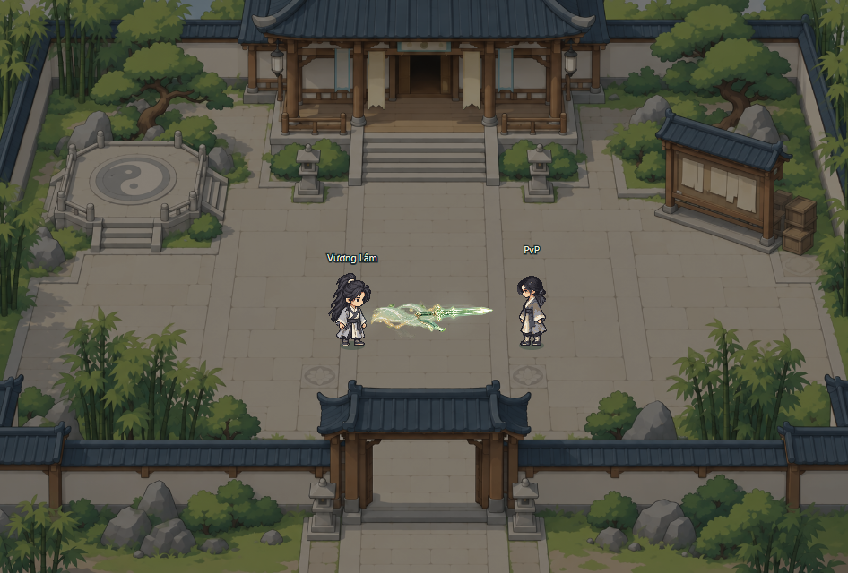

# Kiếm Khí Ngưng Khí — Vương Lâm chibi, preview v2

**Hồ sơ lịch sử v2. Bản hiện hành đã chuyển sang frame-by-frame:** [pipeline và nguồn 36 frame](frame-by-frame-r01/PIPELINE.md), [README](README.md), [preview](http://127.0.0.1:4185/kiem-khi-preview.html). Các thông số/giới hạn frame đứng dưới đây mô tả v2 cũ.

**Mã:** R01-SWORD · P1 · 07/10/2026.  
**Phạm vi:** ART/VFX tách lớp, đúng tỷ lệ game, chưa tích hợp combat.  
**Chuẩn:** [ART nhập môn](ngung-khi-approved-art-v1.png) · [kế hoạch cảnh giới](../../VFX-ART-PROGRESSION.md).  
**Mở:** [preview chuyển động](http://127.0.0.1:4185/kiem-khi-preview.html) · [nguồn và kết quả kiểm](README.md).

Người phát triển đã duyệt bảng timing v2, sau đó yêu cầu dùng main Vương Lâm chibi, thay kết thúc đánh bia bằng hiệu ứng dùng cho mọi mục tiêu và giữ đúng cỡ game. Preview v2 thực hiện ba điều chỉnh này; nhân vật/bia trong concept cũ chỉ còn là lịch sử tham chiếu. Mẫu thi triển Vương Lâm không thay đổi vai trò nhân vật trong cốt truyện/GDD.

## 1. Bốn nhịp hiện hành

| Nhịp | Khoảng ART | Keyframe xem thử | Hình ảnh |
| --- | --- | --- | --- |
| Tụ khí | 0,00–0,18 s | 0,10 s | Linh khí gọn ở socket tay, kiếm quang nhỏ thành hình |
| Xuất kiếm | 0,18–0,32 s | 0,26 s | Một kiếm quang thanh dài 96 world px, hai dư ảnh nhẹ và dải khí 36 px dày theo trục bay |
| Chạm | 0,32–0,40 s | 0,36 s | Lõi ngà/vàng lóe 52–62 px tại hit socket, khí hồi và mảnh sáng ma thuật |
| Dư khí | 0,40–0,68 s | 0,56 s | Kiếm mất hình, vài nét khí ngọc/mảnh sáng xoắn nhẹ quanh điểm hit rồi tắt; đường bay tan mỏng |

Không tạo đá vỡ, bụi đất, vết rạn hoặc bia trong gói chạm dùng chung. Khi hụt, chỉ tan kiếm và trail; không phát ánh chạm/dư khí trên mục tiêu. Phản hồi vật liệu riêng có thể bổ sung theo đối tượng môi trường khi combat yêu cầu.

Nhịp 0,32 s chỉ là thời điểm minh họa của đoạn bay mẫu. Runtime phải phát phần chạm từ hit event thực, kèm tọa độ/socket và hướng lực. Phần VFX ở tay, đường bay và mục tiêu có vòng đời riêng; không lấy khoảng sáng làm cooldown hay khóa điều khiển.

## 2. Cỡ và camera

Vương Lâm dùng sprite **64 × 96**, neo chân **32,88**, nearest sampling như renderer. Nền dùng sân game hiện có ở world **960 × 640**; camera tâm **480,320**, zoom **1/2/4**, DPR tối đa **2**. Ở 1×, world unit bằng CSS px. Thu hẹp viewport thay frustum và cắt map, không co sprite hoặc VFX theo toàn scene.

Cỡ cơ sở: kiếm 96, bề dày trail 36, contact 52–62, recoil 72, scatter 56, residue 46 world px. Kích thước nguồn atlas độc lập với kích thước hiển thị; không ép toàn chiêu vào frame nhân vật. Boss thay hit socket, không tự phóng to kiếm cơ bản. Đây là cỡ ART, không phải vùng gây sát thương.

Socket cast tạm `[16,-30]` theo điểm chân. Mẫu nhân vật/PvP có sprite; mẫu quái/boss là vùng chạm thử có nhãn. Chưa có sprite boss/quái hoặc pose bị đánh mới.

## 3. Ngôn ngữ và lớp nguồn

Giữ kiếm jian thanh, lõi ngà sắc, cạnh celadon, dải khí như thư pháp, điểm vàng dùng thưa. Dư ảnh chỉ là dấu tốc độ của một kiếm. Không biến kỹ năng nhập môn thành đội hình nhiều kiếm gây hit riêng.

| Lớp | Điểm neo / cách trình bày |
| --- | --- |
| Nhân vật | Frame native, chân ổn định; pose cast sẽ được vẽ riêng |
| Dấu tụ | Socket tay theo từng frame pose |
| Kiếm quang | Pivot thân kiếm, xoay theo trục cast |
| Trail / dư ảnh | Đoạn đường sau kiếm, chiều dài theo vị trí đầu kiếm |
| Contact | Hit socket thực và hướng lực; lóe cục bộ |
| Recoil / scatter / residue | Cùng điểm hit, mở/trôi nhẹ rồi tan; không phụ thuộc vật liệu đá |
| Nét tan khi hụt | Điểm cuối đường bay; không gắn vào mục tiêu |

Nguồn [FX kiếm](kiem-khi-r01-fx-v2.png) và [hit dùng chung](kiem-khi-r01-universal-hit-v1.png) có alpha. Preview không dùng vùng impact/dust cũ của atlas kiếm. [Metadata hiện hành](kiem-khi-r01-source-manifest.json) ghi source rect và cỡ; [prompt hit mới](kiem-khi-r01-universal-hit-v1.prompt.txt) lưu cách tạo bằng imagegen tích hợp.

## 4. Kiểm và bước còn lại

Đã xem trong trình duyệt bốn nhịp, các profile mục tiêu, hit/hụt, zoom 1/2/4 và khung 360 × 400. Cỡ frame tại các zoom lần lượt 64 × 96 / 128 × 192 / 256 × 384; khung hẹp vẫn giữ 64 × 96 ở 1×. Khung [chạm](kiem-khi-r01-wanglin-pvp-impact-v2.png) và [dư khí](kiem-khi-r01-wanglin-pvp-residue-v2.png) xuất trực tiếp từ canvas. Chi tiết kiểm và nguồn ở [README](README.md).

Vương Lâm mới dùng frame đứng. P1 còn pose kiếm chỉ native, frame chuyển/áo hồi lực, các hướng cần cho combat, flipbook nếu cần và kiểm chất lượng/hiệu năng trong game. Chưa sửa client/server, map runtime, manifest asset hoặc luật combat. Bản v1 và timing concept cũ được giữ làm lịch sử; không xem chúng là nguồn có pivot/frame chính xác.
